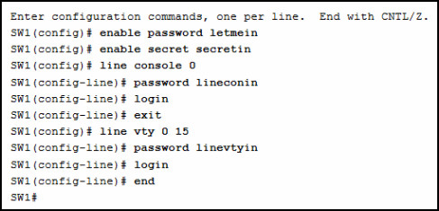
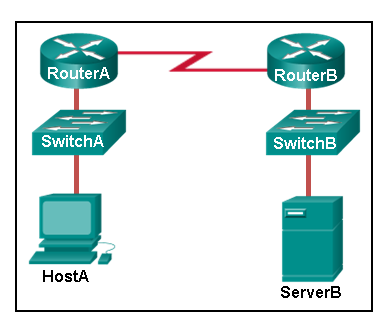
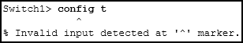

# CCNA Modules 1 - 3

1. **During a routine inspection, a technician discovered that software that was installed on a computer was secretly collecting data about websites that were visited by users of the computer. Which type of threat is affecting this computer?**
    - spyware
2. **Which term refers to a network that provides secure access to the corporate offices by suppliers, customers and collaborators?**
    - extranet
3. **A large corporation has modified its network to allow users to access network resources from their personal laptops and smart phones. Which networking trend does this describe?**
    - bring your own device
4. **What is an ISP?**
    - Its an organization that enables individuals and businesses to connect to the internet.
5. **Match the requirements of a reliable network with the supporting network architecture**
    - Fault tolerance - Provide redundat links and devices
    - Scalability - Expand the network without degrading the service for existing users.
    - Security - Protect the network from unauthorized access
6. **An employee at a branch office is creating a quote for a customer. In order to do this, the employee needs to access confidential pricing information from internal server at the head office. What type of network would the employeee access?**
    - An intranet

    **Explicación:**

    Una intranet es un termino utilizado para referirse a una conección privada de LAN y WANs que pertenece a una organización. Son diseñadas para ser accesibles solo para miembros de la organización u otros con autorización.

7. **Which statement describes the use of powerline networking technology?**
    - A device connects to an existing home LAN using an adapter and an existing electrical outlet.
8. **A networking technician is working on the wireless network at a medical clinic. The technician accidentally sets up the wireless network so that patients can see the medical records data of other patients. Which of the four network characteristics has been violated in this situation?**
    - security
9. **Match each characteristic to its corresponding Internet connectivity type.**
    - Not suited for heavly wooded areas
        - Satelite
    - Uses coaxial cable as a medium
        - cable
    - Typically has very low bandwith
        - Dialup telephone
    - High bandwith connection that runs over telephone line
        - DSL
10. **What two criteria are used to help select a network medium from various network media?**
    - The distance, the selected medium can successfully carry a signal
    - The environment where the selected medium is to be installed
11. **What type of network traffic requires QoS?**
    - Video conferencing
12. **A user is implementing security on a small office network. Which two actions would provide the minimum security requirements for this network?**
    - Implementing a firewall
    - Installing antivirus software

    **Explicacción:**

    Instalar un antivirus, un antimalware e implementar un firewall usalmente son el minimo de requerimientos para cualquier red.

13. **Passwords can be used to restrict access to all or parts of the cisco IOS. Select the modes and Interfaces that can be protected with passwords.**
    - VTY interface
    - Console Interface
    - Privileged EXEC mode
14. **Which interface allows remote management of a Layer 2 switch?**
    - The switch virtual interface

    **Explicación**

    En un switch capa 2, hay una interfaz virtual (SVI) que provee un medio para manejar al dispositivo remotamente.

15. **What function does pressing the Tab key have when entering a command in IOS?**
    - It completes the remainder of a partially typed word in a command.
16. **While trying to solve a network issue, a technician made multiple changes to the current router configuration file. The changes did not solve the problem and were not saved. What action can the technician take to discard the changes and work with the file in NVRAM?**
    - Issue the reload command without saving the running configuration.

    **Explicación**

    El técnico no quiere cometer ningún error, y siempre y cuando no guarde los cambios en la NVRAM el dispositivo regresara a la configuración original al siguiente encendido.

17. **An administrator uses the Ctrl-Shift-6 key combination on a switch after issuing the ping command. What is the purpose of using these keystrokes?**
    - To interrupt the ping process
18. **Refer to the exhibit. A network administrator is configuring access control to switch SW1. If the administrator uses a console connection to connect to the switch, which password is needed to access user EXEC mode?**

<p align="center">
  	
</P>

    - lineconin
19. **Which command or key combination allows a user to return to the previous level in the command hierarchy?**
    - exit
20.  **A technician configures a switch with these commands:**

    ```markdown
    SwitchA(config)# interface vlan 1
    SwitchA(config-if)# ip address 192.168.1.1 255.255.255.0
    SwitchA(config-if)# no shutdown
    ```

    **What is the technician configuring?**

    - SVI

    **Explicación**

    Para que un switch pueda tener una dirección IP y pueda ser manejado de manera remota, La *switch virtual interface* debe de ser asignada.

21. **What are two characteristics of RAM on a Cisco device?**
    - The configuration that is actively running on the device is stored in RAM.
    - The contents of RAM are lost during a power cycle.
22. **Which two host names follow the guidelines for naming conventions on Cisco IOS devices?**
    - RM-3-Switch-2A4
    - SwBranch799

    **Explicación:**

    Los nombres deben:

    - Empezar con una letra
    - No contener espacios
    - Terminar con una letra o dígito
    - Solo usar letras, dígitos y diagonales
    - Ser de menos de 64 caracteres
23. **How is SSH different from Telnet?**
    - SSH provides security to remote sessions by encrypting messages and using user authentication. Telnet is considered insecure and sends messages in plaintext.
24. **An administrator is configuring a switch console port with a password. In what order will the administrator travel through the IOS modes of operation in order to reach the mode in which the configuration commands will be entered?**
    1. User EXEC mode
    2. Privileged EXEC mode
    3. Global Configuration mode
    4. Line configuration mode
25. **What are three characteristics of an SVI?**
    - It is not associated with any physical interface on a switch
    - It provides a means to remotely manage a switch
    - It is associated with VLAN1 by default
26. **What command is used to verify the condition of the switch interfaces, including the status of the interfaces and a configured IP address?**
    - `show ip interface brief`
27. **Match the description with the associated IOS mode.**
    - User EXEC mode
        - Limited number of basic monitoring
        - The first entrance into the CLI of an IOS device
    - Privileged EXEC mode
        - Accessed by entering the `enable` command
        - Identified by a prompt ending with the # character
    - Global configuration mode
        - Changes made affect the operation of the device as a whole
        - accessed by entering the `configure terminal`
28. **Match the definitions to their respective CLI hot keys and shortcuts.**
    - Displays the next screen
        - space bar
    - Scrolls backwards through previously entered commands
        - UP Arrow
    - Provides context-sensitive help
        - ?
    - Completes abbreviated commands and parrameters
        - Tab
    - Aborts commands such as trace and pingt
        - Ctrl-Shift-6
29. **In the `show running-config` command, which part of the syntax is represented by a running-config?**
    - A keyword
30. **After making configuration changes on a Cisco switch, a network administrator issues a copy running-config startup-config command. What is the result of issuing this command?**
    - The new configuration will be loaded if the switch is restarted
31. **What command will prevent all unencrypted passwords from displaying in plain text in a configuration file?**
    - `(config)# service password-encryption`
32. **A network administrator enters the `service password-encryption` command into the configuration mode of a router. What does this command accomplish?**
    - This command prevents someone from viewing the running configuration passwords.
33. **What method can be used by two computers to ensure that packets are not dropped because too much data is being sent too quickly?**
    - flow control
34. **Which statement accurately describes a TCP/IP encapsulation process when a PC is sending data to the network?**
    - Segments are sent from the transport layer to the internet layer

    **Explicación**

    Cuando los datos son mandados de una PC a una red, La capa de transporte manda segmentos a la capa de internet. Esta manda los paquetes a la capa de acceso, la cual crea frames y convierte los frames a bits. Estos bits son mandados al medio de red.

35. **What three application layer protocols are part of the TCP/IP protocol suite?**
    - DHCP
    - DNS
    - FTP
36. **Match the description to the organization.**
    - This organization is responsable for overseeing and managing IP address allocation, domain name management, and protocol identifiers.
        - IANA
    - This organization is the largest developer of internacional standards in the world for a wide variety of products and services. It is known for its Open systems interconnection (OSI) reference model.
        - ISO
    - This organization promotes the open development evolution, and use of the internet throughout the world.
        - ISOC
37. **Which name is assigned to the transport layer PDU?**
    - Segment

    **Explicación:**

    Datos - el termino general para PDU en la capa de aplicación

    Segmento - PDU de la capa de transporte

    Paquete - PDU de la capa de red

    Frame - PDU de la capa de link de datos

    PDU: protocol data unit.

38. **When IPv4 addressing is manually configured on a web server, which property of the IPv4 configuration identifies the network and host portion for an IPv4 address?**
    - Subnet mask
39. **What process involves placing one PDU inside other PDU?**
    - Encapsulation
40. **What layer is responsible for routing messages through an internetwork in the TCP/IP model?**
    - Internet
41. **For the TCP/IP protocol suite, what is the correct order of events when a Telnet message is being prepared to be sent over the network?**
    1. The IP header added - third
    2. The TCP header is added - Second
    3. The Ethernet header is added - Fourth
    4. The Telnet-formatted data is provided to the next layer - First
42. **Which PDU format is used when bits are received from the network medium by the NIC of a host?**
    - frame
43. **Refer to the exhibit. ServerB is attempting to contact HostA. Which two statements correctly identify the addressing that ServerB will generate in the process?**

<p align="Center">
	
</p>

    - ServerB will generate a frame with the destination MAC address of Router B
    - ServerB will generate a packet with the destination IP address of HostA.
44. **Which method allows a computer to react accordingly when it request data from a server and the server takes too long to respond?**
    - Response timeout
45. **A web client is receiving a response for a web page from a web server. From the perspective of the client, what is the correct order of the protocol stack that is used to decode the received transmission?**
    - Ethernet, IP, TCP, HTTP
46. **Which two OSI model layers have the same functionality as a single layer of the TCP/IP model?**
    - Data link
    - Physical
47. **At which layer of the OSI model would a logical address be added during encapsulation?**
    - network layer
48. **What is a characteristic of multicast messages?**
    - They are sent to a select group of hosts.
49. **Which statement is correct about network protocols?**
    - They define how messages are exchanged between the source and the destination
50. **What is an advantage of network devices using open standard protocols?**
    - A client host and a server running different operating systems can successfully exchange data.
51. **Which device performs the function of determining the path that messages should take through internetworks?**
    - A router
52. **Open the PT Activity. Perform the tasks in the activity instructions and then answer the question.**

    **What is The IP address of the switch virtual interface (SVI) on Switch0?**

    - 192.168.5.10

    **Explicación**

    Después de que el comando de `enable` es usado, el comando `show running-configuration` mostrará las direcciones IP del dispositivo.

53. **Why would a Layer 2 switch need an IP address?**
    - To enable the switch to be managed remotely
54. **Refer to the exhibit. An administrator is trying to configure the switch but receives the error message that is displayed in the exhibit. What is the problem?**

<p align="Center">
	
</p>

    - The administrator must first enter privileged EXEC mode before issuing the command.
55. **What term describes a network owned by one organization that provides safe and secure access to individuals who work for a different organization?**
    - Extranet
56. **What term describes storing personal files on servers over the internet to provide access anywhere, anytime, and on any device?**
    - cloud
57. **What term describes a network where one computer can be both client and server?**
    - Peer-to-peer
58. **What term describes a type of network used by people who work from home or from a small remote office?**
    - SOHO network
59. **What term describes a computing model where server software runs on dedicated computers?**
    - client/server
60. **repetida**
61. **What term describes a technology that allows devices to connect to the LAN using an electrical outlet?**
    - Powerline networking
62. **What term describes a policy that allows network devices to manage the flow of data to give priority to voice and video?**
    - Quality of service
63. **What term describes a private collection of LANs and WANs that belongs to an organization?**
64. **What term describes the ability to use personal devices across a business or campus network?**
    - BYOD
65. **At which OSI layer is a source IP address added to a PDU during the encapsulation process?**
    - network layer
66. **At which OSI layer is a destination port number added to a PDU during the encapsulation process?**
    - transport layer
67. **At which OSI layer is a source IP address added to a PDU during the encapsulation process?**
    - application layer
68. **At which OSI layer is a source IP address added to a PDU during the encapsulation process?**
    - network layer
69. **repetida**
70. **repetida**
71. **At which OSI layer is a source MAC address added to a PDU during the encapsulation process?**
    - data link layer
72. **repetida**
73. **At which OSI layer is a destination MAC address added to a PDU during the encapsulation process?**
    - data link layer
