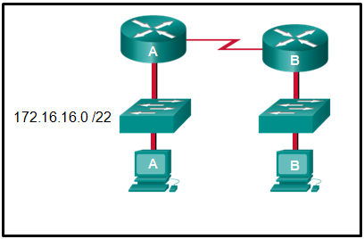
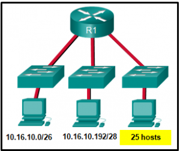
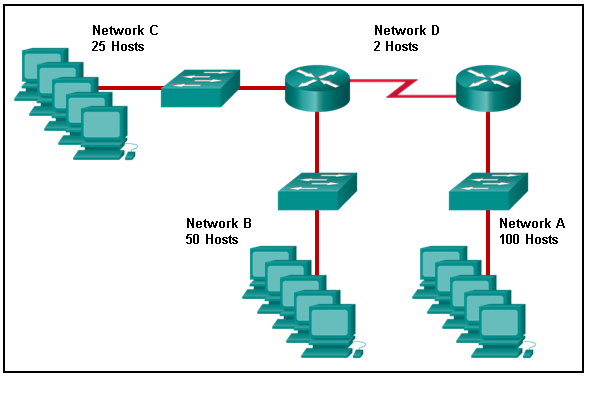
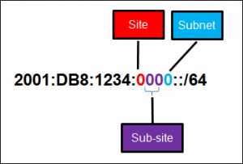
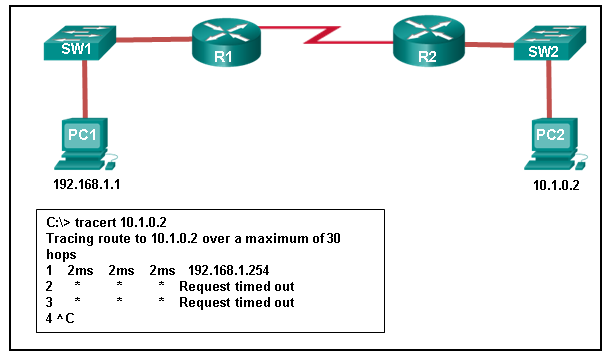

# Introduction to Networks - modules 11-13: IP addressing Exam

1. **What is the prefix length notation for the subnet mask 255.255.255.224?**
	* /27
> **Explicación:** El formato binario para 255.255.255.224 es 11111111.11111111.1111111.11100000.
La longitud de prefijo es el numero de 1s consecutivos en una máscara de subred.

2. **How many valid host addresses are available on an IPv4 subnet that is configured with a /26 mask?**
	* 62

3. **Whitch subnet mask would be used if 5 host bits are available?**
	* 255.255.255.255.224

4. **A network administrator subnets the 192.168.10.0/24 network into subnets with /26 masks.
How many equalized subnets are created?**
	* 4

5. **Match the subnetwork to a host address that would be included within the subnetwork. 
(not all options are used).**
	* 192.168.1.32/27 - 192.168.1.48
	* 192.168.1.64/27 - 192.168.1.68
	* 192.168.1.96/27 - 192.168.1.121

6. **An administrator wants to create four subnetworks from the network address 192.168.1.0/24.
What is the network address and subnet mask of the second useable subnet?**
	* subnetwork 192.168.1.64 Subnet mask 255.255.255.192

7. **How many bits must be borrowed from the host portion of an address to accommodate a router with
five connectef networks?**
	* tres

> **Explicación:** *Cada red que esta conectada directamente a una interfaz en un router requiere su 
propia subred.
La formula 2^n donde n es el numero de bits tomados, es usada para calcular el numero de 
subredes disponibles.*

8. **How many host addresses are available on the 192.168.10.128/26 network?**
	* 62

> **Explicación:** *un prefijo /26 tiene 6 bits de host, lo cual provee un total de 64  
direcciones, debido a que 2^6=64.
Restandole la dirección de red y la de broadcast tenemos 62 direcciones de host usables.*

9. **How many host addresses are available on the network 172.16.128.0 with a subnet mask
of 255.255.255.0?**
	* 1022

> **Explicación:** *Una máscara de 255.255.255.0 es igual a un prefijo /22.
Este provee 22 bits en la parte de red y 10 para la porción de host.
Estos 10 bits proveerán 1022 IP usables.*

10. **Match each IPv4 address to the appropiate address category. (not all options are used).**
	* Host address
		* 192.168.100.161/25
		* 203.0.113.100/24
	* network address
		* 10.10.10.128/25
		* 172.110.12.64/28
	* Broadcast address
		* 192.168.1.191/26
		* 10.0.0.159/27
11. **What three blocks of addresses are defined by RFC 1918 for privatr network use? (choosee
three)**
	* 10.0.0.0/8
	* 172.16.0.0/12
	* 192.168.0.0/16
> **Explicación:** *RFC 1918 define tres bloques de direcciones IPv4 para redes privadas
que deberían no ser ruteables en el internet público.*
> * 10.0.0.0/8
> * 172.16.0.0/12
> * 192.168.0.0/16

12. **Refer to the exhibit. 
An administrator must send a message to everyone on the router A network.
What is the broadcast address for network 172.16.16.0/22?**

	

* 172.16.19.255

> **Explanation:** *La red 172.16.16.0/22 tiene 22 bits en la porción de red y 10 bits en la 
porción de de host.
Convirtiendo la dirección de red a binario da una máscara de subred de 255.255.252.0.
El rango de direcciones en está red terminara con la última direccion disponible antes de 172.16.20.0.
Las direcciones de host validas para este rango de red son desde 172.16.16.1-172.16.19.254,
haciendo 172.16.19.255 la dirección broadcast.* 

13. **A site administrator has been told that a particular network at the site must accommodate 126 hosts.
Which subnet mask would be used that contains the required number of host bits?**
	* 255.255.255.128
> **Explicación:** *La máscara de subred de 255.255.255.0 tiene 8 bits de host.
La mascara 255.255.255.128 resulta en 7 host bits 2^7 = 128.*

14. **Refer to the exhibit.
Considering the addresses already usen and having to remain within the 10.16.10.0/24 network range,
whitch subnet address could be assigned to the network containing 25 hosts?**

	

	* 10.16.10.64/27

> **Explicación:** *Direcciones desde 10.16.10.0 hasta 10.16.10.63 son tomadas por la red de la izquierda.
Direcciones desde 10.16.10.192 hasta 10.16.10.207 son usadas por la red del centro.
El espacio de driecciones desde 208-255 asume una máscara de/28, que no permite suficientes 
bits de host para acomodar 25 direcciones de host.
Los rangos de direcciones que estan disponibles incluyen 10.16.10.64/26 y 10.16.10.128/26.
Para acomodar 25 hosts 5 bits son necesarios, así que una máscara /27 es necesaria.
Cuatro posibles subredes /27 podrían ser creadas con las direcciones disponibles entre
10.16.10.64 y 10.16.10.191:*
> * 10.16.10.64/27
> * 10.16.10.96/27
> * 10.16.10.128/27
> * 10.16.10.160/27

15. **What is the usable numbler of host IP addresses on a network that has a /26 mask?**
	* 62

16. **Which address prefix range is reserved for IPv4 multicast?**
	* 224.0.0.0 - 239.255.255.255

17. **Refer to the exhibit.
Match the network with the correct IP address and prefix that will satisfy the usable host addressing
requeriments for each network.**

	

* **Network A** - 192.168.0.128/25
* **Network B** - 192.168.0.0/26
* **Network C** - 192.168.0.96/27
* **Network D** - 192.168.0.80/30

18. **A high school in New York *(School A)* is using videoconferencing technology to establish student 
interactions with another high school *(school B)* in Russia.
The videoconferencing is conducted between two end devices through the internet.
The network administrator of school A configures the end device with IP address *209.165.201.10.*
The administrator sends a request for the IP address for the end device in schoool B and the response
is *192.168.25.10*.
Neither school is using a VPN.
The administrator knows immediately this IP will not work. Why?**
	* this is a private IP address

19. **Which three addresses are valid public addresses? (Choose three)**
	* 198.133.219.17
	* 128.107.12.117
	* 64.104.78.227
> **Explicación:** *El rango de IPv4 privadas es:*
> * 10.0.0.0 - 10.255.255.255
> * 172.16.0.0 - 172.31.255.255
> * 192.168.0.0 * 192.168.255.255

20. **A message is sent to all hosts on a remote network.
Whitch type of message is it?**
	* directed broadcast.
> **Explicación:** *Un bradcast dirigido es un mensaje mandado a todos los hosts en una red no local.
Un mensaje multicast es un mensaje mandado a una cantidad selecta de hosts que son parte de un grupo
multicast.
Un broadcast limitado es usado para una communicación que es limitada a los hosts de una red local.
Un mensaje unicast es un mensaje que es mandado de un host a otro.*

21. **A company has a network address of *192.168.1.64* with a subnet mask of 255.255.255.192.
The company wants to create two subnetworks that would contain 10 hosts and 18 hosts respectively.
Which two networks would achive that? (choose two)**
	* 192.168.1.64/27
	* 192.168.1.96/28

22. **Which address is a valid IPv6 Link-local unicast address?**
	* FE80::1:4545:6578:ABC1
> **Explicación:** *LLAs IPv6 están en el rango de fe80::/10.* 

23. **Which of these addresses is the shortest abbreviation for the IP addresss:
3FFE:1044:0000:0000:00AB:0000:0000:0057?**
	* 3FFE:1044:0:0:AB::57

24. **A network administrator has received the IPv6 prefix 2001:DB8::/48 for subnetting.
Assuming the administrator does not subnet into the interface ID portion of the address space,
how many subnets can the administrator create from the /48 prefix?**
	* 65536
> **Explicación:** *Con una red con un prefijo de 48, hay 16 bits disponibles para subnetear ya que 
la ID de interfaz empieza en 64.
2^16 = 65536 subredes.*

25. **Given IPv6 address prefix 2001:db8::/48, what will be the last subnet that is created if the subnet
prefix is changed to /52?**
	* 2001:db8:0:f000::/52
> **Explicación:** *La dirección 2001:db8::/48 tiene 48 bits de red y son igual a 3 hextetos.
Si la subneteamos en una /52 estamos tomando 4 bits en dirección a la derecha creando 16 subredes.
La primera subred seria 2001:bd8::/52 siendo los primeros 52 bits 2001:db8:0:(de aqui se toman 4 bits):.
La última subred seria 2001:db8:0:f000::/52, siendo los 4 bits que tomamos 1, dando a un cuato hexteto.
1111,0000 0000,0000.*

26. **Consider the following range of addresses:

2001:0DB8:BC15:00A0:0000::

2001:0DB8:BC15:00A1:0000::

2001:0DB8:BC15:00A2:0000::

…

2001:0DB8:BC15:00AF:0000::.**

	* The prefix-lengh for the range of addresses is: **/60**

> **Explicación:** *Todas las direcciones tienen en común 2001:0db8:bc15:00a.
Cada número o letra en la dirección representa 4 bits, dando un total de 60.*

27. **What type of IPv6 address is FE80::1?**
	* Link-Local

28. **Refer to the exhibit.
A company is deploying an IPv6 addressing scheme for its network.
The company design document indicates that the subnet portion of the IPv6 addresses is used for the new
hierarchical network sites of the company, the sub-site section to represent multiple campuses at 
each site, and the subnet section to indicate each network segment separated by routers.
With such a scheme, what is the maximum number of subnets archived per sub-site?**

	

	* 16
> **Explicación:** *Devido a que solo un caracter hexadesimal es usado para representar la subred, 
ese solo caracter puede representar 16 diferentes valores ya que 1 hex = 4 bits y 2^4 = 16.*

29. **What is used in the EUI-64 process to create and IPv6 interface ID on an IPv6 enabled interface?**
	* the MAC address of the IPv6 enabled interface.
> **Explicación:** *El proceso EUI-64 usa la dirección MAC de una interfaz para contruir una ID de interfaz.
Debido a que una dirección MAC tiene solo 48 bits, se necesitan 16 bits (FF:FE) estos seran añadidos a la
dirección MAC para crear una ID de interfaz de 64-bits.*

30. **What is the prefix for the host address 2001:db8:bc15:a:12ab::1/64?**
	* 2001:DB8:BC15:A

31. **An IPv6 enabled device sends a data packet with the destination address FF02::1.
What is the target of this paquet?**
	* all IPv6 enabled devices on the local link or network.

32. **Match the IPv6 address with the IPv6 address type. (not all options are used.)**
	* 2001:db8::baf:3f57:fe94 - global unicast
	* ff02::1 - all node multicast
	* ::1 - loopback
	* ff02::1:ffae:f85f - solicited node multicast

33. **Which IPv6 prefix is reserved for communication between devices on the same link?**
	* fe80::/10

> **Explicación:** *Las direcciones Link-Local IPv6 tienen el prefijo fe80::/10 y no son ruteables.
Son usadas solo para comunicaciones entre dispositivos en el mismo link.*

34. **Which type of IPv6 address refers to any unicast address that is assigned to multiple hosts?**
	* anycast.

35. **What are two types of IPv6 unicast addresses? (choose two)**\
	* loopback
	* link-local

36. **Which service provides dynamic global IPv6 addressing to en devices wihout using a server that keeps a 
record of available IPv6 addresses?**
	* SLAAC
> **Explicación:** *Usando stateless adress autoconfiguration (SLAAC), un PC puede solicitar a un router y 
recibir longitudes de prefijo de la red.
Con esta información una PC puede crear su propia GUA IPv6*

37. **Which protocol supports stateless address Autoconfiguration (SLAAC) for dynamic assignment of IPv6
Addresses to a host?**
	* ICMPv6
> **Explicación:** *SLAAC usa mensajes ICMPv6 cuando asigna dinamicamente una dirección IPv6 al host.
DHCPv6 es un método alternativo para asignar una dirección IPv6 a un host.*

38. **Three methods allow IPv6 and IPv4 to co-exist. 
Match each method with its description. (not all options are used.)**
	* The IPv4 packets and IPv6 packets coexist in the same network - dual-stack
	* The IPv6 packet is transported inside an IPv4 packet - tunneling
	* IPv6 packets are converted into IPv4 packets, and vice versa - translation

39. **A technician uses the ping 127.0.0.1 command. 
What is the technician testing?**
	* the TCP/IP stack on a network host

40. **Refer to the exhibit.
An administrator is trying to troubleshoot connectivity between PC1 and PC2 and uses the tracert command
from PC1 to do it.
Bases on the displayed output, where should thr administrator begin troubleshooting?**

	

 
* R1

41. **Which protocol us used by the traceroute command to send and receive echo-requests and echo-replies?**
	* ICMPP
> **Explicación:** *Traceroute usa peticiones echo ICMP para comunicarse con cada dispositivo*.

42. **Which ICMPv6 message is sent when the IPv6 hop limit field of a packet is decremented to zero and
the packet cannot be forwarded?**
	* time exceeded

43. **A user executes a traceroute over IPv6.
At what point would a router in the path to the destination device drop the packet?**
	* when the value of the hop Limit field reaches zero.

44. **What is the purpose of ICMP messages?**
	* to provide feedback of IP packet transmissions.
> **Explicación:** *El proposito de un mensaje ICMP es proveer retroalimentación sobre problemas que se 
relacionan con el procesamiento de paquetes IP.*

45. **What source IP address does a router use by default when the traceroute command is issued?**
	* The IP address of the outbound interface.
> **Explicación:** *Cuando se manda una petición echo, un router usará la dirección IP de la interfaz
de salida como la dirección IP de salida. 
Esta conducta puede ser cambiada usando un ping extendido y especificando una IP de salida.*

46. **Match each description with an appropiate IP address. (Not all options are used)**
	* A private address - 172.169.20.5
	* A loopback address - 127.0.0.1
	* An experimental address - 240.2.6.255
	* A Test-net address - 192.0.2.123
	* A Link-Local address - 169.254.1.5

47. **A user issues a ping 192.135.250.103 command and recives a responce that includes a code of 1.
What does this code represent?**
	* host unreachable

48. **Which subnet would include the address 192.168.1.96 as usable host address?**
	* 192.168.1.64/26
> **Explicación:** *Para la subred 192.168.1.6/26 hay 6 bits para direcciones de host, resultando en 
64 direcciones posibles. 
Sin embargo las demás opciones no alcanzan a llegar a la dirección 192.168.1.96.*

49. **Open the PT Activity. 
Perform the tasks in the activity instructions and then answer the question.**
**What are the three IPv6 addresses displayed when the route from PC1 to PC2 is traced? (Choose three.)**
	* 2001:db8:1:1::1 
	* 2001:db8:1:2::1 
	* 2001:db8:1:3::2 

> **Explicación:** *Usando el comando `ipv6config` en la PC2 muestra la dirección IPv6 de la PC2, que 
es 2001:db8:1:4::a.*

50. **A host is transmitting a broadcast.
Which host or hosts will receive it?**
	* all host in the same subnet.

51. **A host is transmiting a unicast. 
Which host or hosts will receive it?**
	* one epecific host.

52. **A user issues a ping 2001:db8:face:39::10 command and receives a response that includes a code of 3.
What does this code represent?**
	* address unreachable.

53. **A host is transmitting a multicast.
Which host or hosts will receive it?**
	* a specially defined group of hosts

54. **repetida**

55.**repetida**

56. **repetida**

57. **repetida**

58. **repetida**

59. **repetida**

60. **Which is the compressed format of the IPv6 address 2001:0db8:0000:0000:0000:a0b0:0008:0001?**
	* 2001:db8::a0b0:8:1

61. **Which is the compressed format of the fe80:09ea:0000:2200:0000:0000:0fe0:0290?**
	* fe80:9ea:0:2200::fe0:290

62. **Which is the compressed format of the 2002:0042:0010:c400:0000:0000:0000:0909?**
	* 2002:42:10:c400::909

63. **same**

64. **same**

65. **same**

66. **same**

67. **same**

68 **same**

69. **same**

70. **A user issues a ping 2001:db8:face:39::10 command and receives a response that includes a code of 2.
What does this code represent?**
	* beyond scope of the source address.

71. **A user issues a ping 192.168.250.103 command and receives a response that includes a code of 1.
What does this code represent?**
	* host unreachable.

72. **A user issues a ping fe80:65ab:dcc1::100 command and receives a response that includes a code of 3.
What does this code represent?**
	* address unreachable.

73. **A user issues a ping 10.10.14.67 command and receives a response that icludes a code of 0.
What does this code represent?**
	* network unreachable.

74. **A user issues a ping 198.133.219.8 command and receives a response that icludes a code of 0.**
	* network unreachable.

