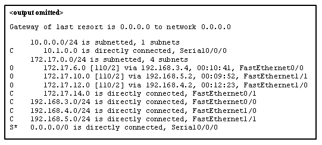
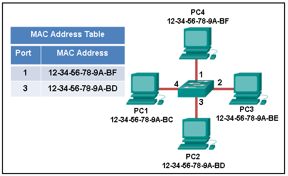
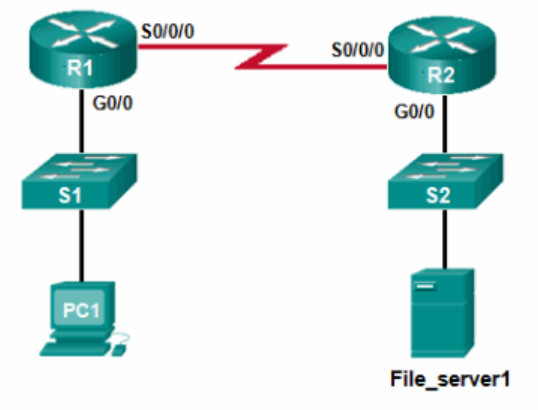
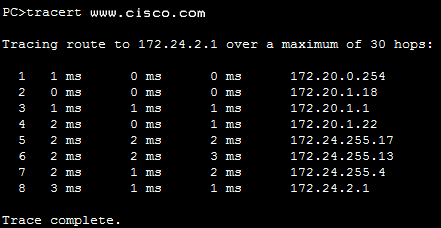
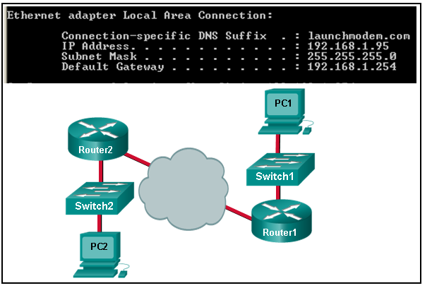

1. **Witch information is used by routers to foward a data packet toward its destination?**
	* Destination IP addres

2. **A computer has to send a packet to a destination host in the same LAN.
How will the packet be sent?** 
	* The packet will be sent directly to the destination host.

3. **A router receives a packet from the Gigabit 0/0 interface and determinces that the packet needs to be 
forwarded out the Gigabit 0/1 interface.
what will the router do next?**
	* Create a new Layer 2 Ethernet frame to be sent to the destination.

4. **Witch IPv4 address can a host use to ping the loopback interface?**
	* 127.0.0.1

5. **A computer can access devices on the same network but cannot acces devices on other networks.
What is the probable cause of this problem?**
	* The computer has an invalid default gateway address.

6. **Whitch statement describes a feature on the IP protocol?**
	* IP relies on upper layer services to handle situations of missing or out-of-order packets.

> **Explanation**: El protocolo IP es de tipo *connection-less*, considerado desconfiable en terminos de 
entrega de extremo a extremo. 
No provee conotrol de errores en casos como que los paquetes lleguen en desorden o que no lleguen.
Depende de servicios de las capas superiores como TCP para resolver estos problemas.

7. **Why is NAT not needed in IPv6?**
	* Any host or user can get a public IPv6 network address because the number or aviable IPv6 addresses is 
	extremely large.
> Nat es una herramienta para ayudar con el agotamiento de IPv4 públicas haciendo que varias IPv4 puedan compartir 
una IPv4 púiblica.

8. **Which parameter does the router use to choose the path to the destination when there are multiple routes 
availabe?**
	* the lower metric value that is associated with the destination network.

9. **What are two services provided by the OSI network layer?** (choose two)
	* Routing packets toward the destination.
	* Encapsulating PDUs from the transport layer.
> **Explanation**: La capa de red del modelo OSI provee algunos servicios para permitir la comunicación entre 
dispositivos:
>	* direccionamiento 
> 	* encapsulación 
> 	* enrutamiento
> 	* des-encapsulación
>
> Detección de errores, poner los frames en el medio y detección de coliciones son funciones de la capa de 
data-link.

10. **Within a production network, what is the purpose of configuring a switch with a default gateway address?**
	* The default gateway address is used to foward packets originating from the switch to remote networks.
> **Explicación**: La puerta de enlace permite a un switch encaminar paquetes que se originan en una red remota.
La puerta de enlace predeterminada en un switch no provee enrutamiento capa 3 para PCs que están conectadas a ese switch.
Pero puede ser accesible por telnet siempre y cuando la fuente de la conexión telnet sea en la red local.

11. **What is a basic characteristic of the IP protocol?**
	* Connectionless.
> **Explicación**: El *Internet Protocol* (IP) es un protocolo de la capa de red que no requiere un intercambio 
inicial para establecer una concección extremo a extremo antes de que los paquetes sean mandados.
Además de que IP es *conectionless* y no provee una entrega confiable de extremo a extremo. 
IP es independiente del medio. 
Segmentación de datos es un servicio dado por la capa de transporte.

12. **Which field in the  the IPv4 header is used to prevent a paquet form traversing a network endlessly?**
	* Time-to-live
> **Explicación**: el valor de el *time-to-live* (TTL) en el header IPv4 es usado para limitar el tiempo de vida
de un paquete. 
El host fuente manda un valor TTL inicial que deciende cada vez que el paquete es procesado por un router.
Si el valor deciende a 0 el router descarta al paquete y manda un ICMP *time exceeded* a la IP de donde viene.
El *differentiated Services* (DS) es un campo usado para determinar la prioridad de cada paquete.

13. **What is one advantage that the IPv6 simplified header offers over IPv4?**
	* Efficient paquet handling
> **Explicación**: El header IPv6 tiene ciertas ventajas sobre IPv4:
> * Mejor eficiencia en el routeo y en el manejo de paquetes para grandes redes.
> * No requiere checksums 
> * Headers simplificados y más efficientes.
> * Un campo de flujo para procesarlo sin necesidad de abrir el paquete.

14. **What IPv4 header field identifies the upper layer protocol carried in the packet?**
	* Protocol
> **Explicación:** El campo de protocolo en el header IP identifica el protocolo usado en la capa de arriba.
El campo de version identifica la versión IP.
*Diferential services* identifica la prioridad del paquete.
El campo de identificación es usado para reordenar paquetes.

15. Refer to the echibit. Match the paquets with their destination IP address to exiting interfaces on the router.
(not al targets are used.)
<p align="center">
	
</p>


> **Explicación:** 
>
> * Paquetes con un destino 172.17.6.15 son mandado por Fa0/0
> * Paquetes con un destino 172.17.10.5 son mandados por Fa1/1
> * Paquetes con un destino 172.17.12.10 son mandados por Fa1/0
> * Paquetes con un destino 172.17.14.8 son mandados por Fa0/1
> 
> Devido a que 172.17.8.0 no tiene una entrada en la tabla de enrutamiento.
estos tomaran la puerta de ultimo recurso, que es Serial0/0/0 con IP 0.0.0.0.
Debido a que esta puerta existe es que los paquetes no seran descartados.

16. **What information does the loopback test provide?**
	* The TCP/IP stack on the device is working correctly.

17. **What routing table entry has a next hop address associated with a destination network?**
	* remote routes.

18. **How do host ensure that their packets are directed to the correct network destination?**
	* They hace to keep their own local routing table that contains a route to the loopback interface, a local network route, and a remote default route.

19. **When transporting data from real-time applications, such as streaming audio and video, which field in the IPv6
header can be used to inform the routers and switches to maintain the same path for the packets in the same 
conversation?**
	* Flow lavel
> **Explicación:** La etiqueta de flow en el header IPv6 es un campo de 20 bits que provee un servicio especial para
aplicaciones en tiempo real.
Este puede ser usado para indicar a routers que mantengan el mismo camino para los paquetes, de esta manera no 
tendran que ser reordenados.

20. **What statement describes the function of the Address Resolution Protocol?**
	* ARP is used to discover the MAC  address of any host on the local network.

21. **Under which two circumstances will a switch flood a frame out of every port except the port that the frame 
was received on?** (choose two)
	* The frame has the broadcast address as the destination address.
	* The destination address is unknown to the switch. 

22. **Which statement describes the treatment of ARP request on the local link?**
	* They are received and processed by every device on the local network.
> **Explicación:** uno de los problemas con peticiones ARP es que son mandadas como un broadcast.
Esto significa que todos los dispositivos  en el link-local deben recibir y procesar la petición.

23. **Whitch destination address is used in an ARP request frame?**
	* FFFF.FFFF.FFFF
> **Explicación**: El proposito de una petición ARP es encontrar la dirección MAC de un host en una LAN ethernet.
Esta manda un broadcast de capa 2 a todos los dispositivos en la LAN.
EL frame contiene la dirección IP de el destino y la dirección broadcast MAC FFFF.FFFF.FFFF.
El host con la IP que coincide con la IP de la petición ARP respondera con un frame unicast que inclute su dirección MAC.

24. **A network technician issues the arp-d\* command on a PC after the router that is connected to the LAN is reconfigured.
What is the result after this command is issued?**
	* The ARP cache is cleared.
> **Explicación:** usar el comando arp -d\* en un PC borrara el cache de ARP. 
Esto es útil cuando un técnico quiere asegurarse de que el cache tiene información actualizada.

25. **Refer tho the exhibit. 
The exhibit shows a small switched network and the contents of the MAC address table of the switch.
PC1 has sent a frame addressed to PC3. 
What will the switch do with the frame?**

<p align="center">
	
</p>

* The Switch will fowart the frame to all ports exept port 4

> **Explicación:** La dirección Mac de PC3 no esta presente en la tabla MAC del swich.
Debido a que el swich no sabe a donde mandar el frame que va a PC3, este mandara el frame a todos los puertos,
exepto al puerto 4 que es de donde viene.

26. **Whitch two types of IPv6 messages are used in place of ARP for address resolution?**
	* neighbor solicitation
	* neighbor advertisement
> **Explicación:** IPv6 no usa ARP. 
En su lugar usa ICMPv6 *neighbor discovery* para mandar *neighbor solicitation* y *neighbor advertisement*.

27. **What is the aim of an ARP spoofing attack?**
	* To associate IP addreses to the wrong MAC adddress.

28. **Refer to the exhibit.
PC1 attemps to connect to File\_server1 and sends an ARP request to obtain a destination MAC address.
Which MAC address will PC1 receive in the ARP reply?**
<p align="center">
	
</p>

* the MAC address of G0/0 interface on R1.

29. **Where are IPv4 addres to Layer 2 address mapping maintained on a host computer?**
	* ARP cache

30. **What important information is examined in the Ethernet frame header by a Layer 2 devce in order to foward
the dadta onward?**
	* destination MAC address.
> **Explicación:** Dispositivos de capa 2 como los swich, usan la dirección MAC para determinar 
cúal camino (interfaz o puerto) deberia de ser usado para mandar datos a su destino.

31. **Match the commands to the correct actions (Not all options are used)**.

32. **A new network administrator has been asked to enter a banner message on a Cisco device.
What is the fastest way a network administrator could test wheter the banner is properly configured?**
	* Exit privileged EXEC mode and press enter.
> **Explicación:** Mientras estes en el modo privilegieado como Router#, escribe **Exit**, presiona enter
y el mensaje de banner aparecera.

33. **A network administrator requires access to manage router and switches locally and remotely.
Match the description to the access method. (Not all options are used)**
> **Explicación**: 
> * Ambos la consola y los puertos AUX pueden ser usados directamente en un dispositivo Cisco.
> sin embargoo es más comun usar el puerto de consola.
> * El puerto AUX es usado comúnmente para acceso remoto por linea telefonica.
> * SSH y Telnet son métodos de acceso remoto que dependen de una conección de red activa.
> * SSH usa una una autenticación por password más fuerte que telnet y también usa encripción en los datos.

34. **Match the phases to the functions during the boot up process of a Cisco router. (Not all options are used)**
> **Explicación:** Hay tres faces mayores en el proceso de inicio de un router cisco:
> * Hacer el *POST* y cargar el programa *bootstrap*
> * Localizar y cargar el IOS
> * Localizar y cargar el archivo de configuración de inicio.
> 
> Si un archivo de configuración de inicio no puee ser localizado, el router entrara en modo de configuración inical
mostrando el promt de configuración.

35. **Match the command with the device mode at whitch the command is entered. (Not all options are used)**
> **Explicación:**
> * El comando `enable` es intoducido en R1>.
> * El comando `login` es introducido en R1(config-line)# 
> * El comando `copy running-config startup-config` es introducido en R1#
> * El commando `ip address 192.168.4.4 255.255.255.0` es introducido en R1(config-if)# 
> * El commando `service password-encryption` es intoducido en el modo de configuración global.

36. **What are two functions of NVRAM? (Choose two.)**
	* to retain contents when power is removed
	* to store the startup configuration file.
> **Explicacioón:** NVRAM es una memoria permanente, el archivo de configuracción de inicio es guardado allí.

37. **Un router boots and enters setup mode. 
What is the reason for this?**
	* The configuration file is missing from NVRAM.

38. **The global configurarion command ip default-gateway 172.168.100.1 is applied to a switch. 
What is the effect of this command?**
	* The switch can be remotely managed from a host on another network.
> **Explicación:** Una puerta de enlace predeterminada es típicamente configurada en todos los dispositivos para 
permitirles comunicarse más allá de su red local.

39. **What happends when the transport imput shh command is entered on the switch vty lines?**
	* Communication between the switch and remote users is ecrypted.
> **Explicación:** El comando `transport input ssh` cuando es usado en una vty (virtual terminal lines) encriptará
todas las conecciones telnet entrantes.

40. **Refer to the exhibit. 
A user PC has successfully transmitted packets to www.cisco.com.
Which IP address does the user PC target in order to foward its data off the local network.**

<p align="center">
	
</p>	
	
* 172.168.20.0.254

41. **Match the configuration mode with the command that is available in that mode. (Not all options are used.)**
> **Explicación:** 
> * El comando `enable`es introducido en R1>.
> * El comando `login` es introducido en R1(config-line)#
> * El comando `copy running-config startup-config` es introducido en R1#
> * El comando `interface fastethernet 0/0` es introducido en R1(config)#

42. **Witch three comand are used to set up secure access to a router through a connection to the console interface?
(chose three)**
	* Line console 0
	* password cisco
	* login
> **Explicación:** Los tres comandos necesarios para protejer el puerto de consola son:
> * `line console 0`
> * `password cisco`
> * `login`
>
> El comando `interface fastinternet 0/0` es usado para acceder al modo de configuración de esa interfaz en especifico.
> 
> El comando `line vty 0 4` es usado para acceder a el modo de configuración de telnet.
El parametro 0 y 4 especifica puerto 0 a travez de 4 o un máximo de 5 conexiones simultáneas.
> 
> El comando `enable secret` es usado para aplicar un password para acceder al modo privilegiado.

43. **Refer to the exhibit. 
Consider the IP address configuration shown from PC1. 
What is a description of the default gateway address?**

<p align="center">
	
</p>
	* It is the IP address of the Router1 interface that connects the PC1 to Router1.

44. **Which two functions are primary funcrions of a router? (choose two.)**
	* paquet forwarding
	* path selection
> **Explicación:** Un router acepta un paquete y accede a su tabla de enrutamiento para determinar la interfaz
de salida apropiada basandose en la dirección de destino.
El router entonces manda el paquete por esa interfaz.

45. **What is the effect of using the Router# `copy running-config startup-config` command on a router?**
	* The contents of NVRAM will change.
> **Explicación:** El comando `copy running-config startup-config` copia la configuración actual de la RAM a la NVRAM
y la guarda como la configuración de arranque *startup-config*.
NVRAM es una memoria no volátil asi que será posible retener la configuración despues de apagarse.

46. **What will happen if the default gateway address is incorrectly configured on a host?**
	* The host cannot communicate with host in other networks.
> **Explicación:** cuando un host necesita mandar un mensaje a otro host en la misma red, este puede mandar el 
mensaje directamente.
Sin embargo, cuando un host necesita mandar un mensaje a una red remota, debe usar el router, también conocido como
puerta de enlace predeterminada (Default gateway).
Esto es debido a que la direccion del frame de datos de el destino remoto no puede ser usado directamente.
En su lugar el paquete tiene que ser mandado al router (defaut gateway) y el router mandara el paquete a su 
destino. 
Sin embargo si la puerta de enlace esta mal configurada el host no podra comunicarse con redes remotas.

47. **What are two potencial network problems that can result from ARP operation? (choose two)**
	* On largue networks with low bandwidth, multiple ARP broadcast could cause data communication delays.
	* Network atttackers could manipulate MAC address and IP address mappings in ARP messages wwith the intent
	of intercepting network traffic.
> **Explicación:** Números grandes de mensajes ARP broadcast podrían causar delays momentaneos de datos.
Atacantes podrian malipular mapeos de direcciones MAC e IP en mensaje ARP con la intención de interceptar 
trafico de red.
Peticiones y respuestas ARP causan entradas en la tabla ARP, sobrecargas de esta tabla son muy raras.

48. **Open the PT activity.
Perfrorm the tasks in the activity instructions and then answer the question.**

**Which interfaces in each router are active and operational?**
	* R1: G0/1 and S0/0/0
	* R2: G0/1 and S0/0/0
> **Explicación:** El comando usado para esta actividad es `show ip interface brief` en cada router.
Las interfaces activas y operacionales son representadas con el valor `up` en las columnas de status y protocol.

49. **Whitch term describes a field in the IPv4 paquet header used to identify the next protocol?**
	* Protocol.

50. **Witch term describes a field in the  IPv4 packet header that contains an 8-bit binari value used to determine
the priority of each packet**
	* differentiated services.

51. **Whitch term descrives a field in the IPv4 paquet header that contains a 32-bit binary value associated with
an interface on the sending device?**
	* source IPv4 address.

52. **Whitch term describes a field in the IPv4 packet header used to detect corruption in the IPv4 header?**
	* header checksum.

53. **Refer to the exhibit. 
A network administrator is connecting a new host to the Payroll LAN. 
The host needs to communicate with remote networks.
What IP address would be configured as the default gateway?**
```
RTR1(config)# interface gi0/1
RTR1(config-if)# description Connects to the Marketing LAN
RTR1(config-if)# ip address 10.27.15.17 255.255.255.0
RTR1(config-if)# no shutdown
RTR1(config-if)# interface gi0/0
RTR1(config-if)# description Connects to the Payroll LAN
RTR1(config-if)# ip address 10.27.14.148 255.255.255.0
RTR1(config-if)# no shutdown
RTR1(config-if)# interface s0/0/0
RTR1(config-if)# description Connects to the ISP
RTR1(config-if)# ip address 10.14.15.254 255.255.255.0
RTR1(config-if)# no shutdown
RTR1(config-if)# interface s0/0/1
RTR1(config-if)# description Connects to the Head Office WAN
RTR1(config-if)# ip address 203.0.113.39 255.255.255.0
RTR1(config-if)# no shutdown
RTR1(config-if)# end
```
* 10.25.14.148

54. **Which term describes a field in the IPv4 packet header that contains a unicast, multicast, or broadcast 
address?**
	* destination IPv4 address.

55. **Which term describes a field in the IPv4 paquet header used to limit the lifetime of a packet?**
	* TTL

56. **Which term describes a field in the IPv4 packet header that contains a 4-bit binary value set to 0100?**
	* version.

57. **Whitch term describes a field in the IPv4 packet header used to identify the next level protocol?**
	* protocol

58. **Repetida**

59. **What propety of ARP causes cached IP-to-MAC mapping to remain in memory longer?**
	* Entries in ARP table are time-stamped and are purged after the timeout expires.

60. **What propety of ARP allows MAC addresses of frequently used server to be fixed in the ARP table?**
	* A static IP-to-MAC address entry can be entered manually into an ARP table.

61. **What propety of ARP allows MAC addresses of frequently used server to be fixed in the ARP table?**
	* A static IP-to-MAC addres entry can be entered manually into an ARP table.

62. **What propety of ARP allows hosts on a LAN to send Trafic to remote networks?**
	* Local host learn the MAC address of the default gateway.

63. **Refer to the exhibit.
A network administrator is connecting a new host to the Registrar LAN.
The host needs to communicate with remote networks.
What IP address would be configured as the default gateway on the new host?**
```
Floor(config)# interface gi0/1
Floor(config-if)# description Connects to the Registrar LAN
Floor(config-if)# ip address 192.168.235.234 255.255.255.0
Floor(config-if)# no shutdown
Floor(config-if)# interface gi0/0
Floor(config-if)# description Connects to the Manager LAN
Floor(config-if)# ip address 192.168.234.114 255.255.255.0
Floor(config-if)# no shutdown
Floor(config-if)# interface s0/0/0
Floor(config-if)# description Connects to the ISP
Floor(config-if)# ip address 10.234.235.254 255.255.255.0
Floor(config-if)# no shutdown
Floor(config-if)# interface s0/0/1
Floor(config-if)# description Connects to the Head Office WAN
Floor(config-if)# ip address 203.0.113.3 255.255.255.0
Floor(config-if)# no shutdown
Floor(config-if)# end
```
* 192.168.235.234

64. **What property of ARP forces all Ethernet NICs to process an ARP request?**
	* The destination MAC address FF-FF-FF-FF-FF-FF appears in the header of the Ethernet frame.

65. **What propety of ARP causes a reply only to the source sending an ARP request?**
	* The source MAC address appears in the header of the Ethernet frame.

66. **What property of ARP causes the request to be flooded out all ports of a switch except for the port receiving
the ARP request?**
	* The destination MAC address FF-FF-FF-FF-FF-FF appears in the header of the Ethernet frame.

67. **What propety of ARP causes the NICs receiving an ARP request to pass the data portion of the Ethernet frame 
to the ARP process?**
	* The type field 0x806 appears in the header of the Ethernet frame.

68. **repetido**

69. **Refer to the exhibit.
A network administrator is connecting a new host to the service LAN.
The host needs to communicate with remote networks.
What Ip address Would be Configured as the default gateway of the new host?**
```
Main(config)# interface gi0/1
Main(config-if)# description Connects to the Service LAN
Main(config-if)# ip address 172.29.157.156 255.255.255.0
Main(config-if)# no shutdown
Main(config-if)# interface gi0/0
Main(config-if)# description Connects to the Engineering LAN
Main(config-if)# ip address 172.29.156.36 255.255.255.0
Main(config-if)# no shutdown
Main(config-if)# interface s0/0/0
Main(config-if)# description Connects to the ISP
Main(config-if)# ip address 10.156.157.254 255.255.255.0
Main(config-if)# no shutdown
Main(config-if)# interface s0/0/1
Main(config-if)# description Connects to the Head Office WAN
Main(config-if)# ip address 198.51.100.177 255.255.255.0
Main(config-if)# no shutdown
Main(config-if)# end
```
* 172.29.157.156

70. **Refer to the exhibit.
A network administrator is connecting a new host to the Medical LAN.
The host need to communicate with remote networks.
What IP address would be configured as the default gateway on the new host?**
```
BldgA(config)# interface gi0/1
BldgA(config-if)# description Connects to the Medical LAN
BldgA(config-if)# ip address 192.168.191.189 255.255.255.0
BldgA(config-if)# no shutdown
BldgA(config-if)# interface gi0/0
BldgA(config-if)# description Connects to the Client LAN
BldgA(config-if)# ip address 192.168.190.70 255.255.255.0
BldgA(config-if)# no shutdown
BldgA(config-if)# interface s0/0/0
BldgA(config-if)# description Connects to the ISP
BldgA(config-if)# ip address 10.190.191.254 255.255.255.0
BldgA(config-if)# no shutdown
BldgA(config-if)# interface s0/0/1
BldgA(config-if)# description Connects to the Head Office WAN
BldgA(config-if)# ip address 198.51.100.213 255.255.255.0
BldgA(config-if)# no shutdown
BldgA(config-if)# end
```
* 192.168.191.189

71. **repetida**

72. **Refer to the exhibit.
A network administrator is connecting a new host to the manager LAN.
The host needs to communicate with remote networks.
What IP address would be configured as the default gateway on the new host?**

```
Floor(config)# interface gi0/1
Floor(config-if)# description Connects to the Registrar LAN
Floor(config-if)# ip address 10.118.63.65 255.255.255.0
Floor(config-if)# no shutdown
Floor(config-if)# interface gi0/0
Floor(config-if)# description Connects to the Manager LAN
Floor(config-if)# ip address 10.118.62.196 255.255.255.0
Floor(config-if)# no shutdown
Floor(config-if)# interface s0/0/0
Floor(config-if)# description Connects to the ISP
Floor(config-if)# ip address 10.62.63.254 255.255.255.0
Floor(config-if)# no shutdown
Floor(config-if)# interface s0/0/1
Floor(config-if)# description Connects to the Head Office WAN
Floor(config-if)# ip address 209.165.200.87 255.255.255.0
Floor(config-if)# no shutdown
Floor(config-if)# end
```
* 10.118.62.196

73. **Refer to the exhibit.
A network administrator is connecting a new host to the store LAN.
The host need to comunicate with remote networks.
What IP address would be configured as the default gateway on the new host?**

```
HQ(config)# interface gi0/1
HQ(config-if)# description Connects to the Branch LAN
HQ(config-if)# ip address 172.19.99.99 255.255.255.0
HQ(config-if)# no shutdown
HQ(config-if)# interface gi0/0
HQ(config-if)# description Connects to the Store LAN
HQ(config-if)# ip address 172.19.98.230 255.255.255.0
HQ(config-if)# no shutdown
HQ(config-if)# interface s0/0/0
HQ(config-if)# description Connects to the ISP
HQ(config-if)# ip address 10.98.99.254 255.255.255.0
HQ(config-if)# no shutdown
HQ(config-if)# interface s0/0/1
HQ(config-if)# description Connects to the Head Office WAN
HQ(config-if)# ip address 209.165.200.120 255.255.255.0
HQ(config-if)# no shutdown
HQ(config-if)# end
```
* 172.19.98.230

