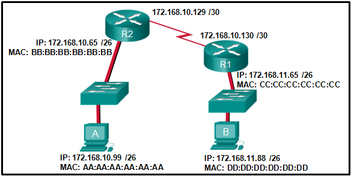

# Introduction to Networks - Final Exam

1. **What two ICMPv6 message types must be permitted through IPv6 access control list to allow resolution of
layer 3 addresses to layer 2 MAC addresses? (choose two)**
	* neighbor solicitations
	* neighbor advertisements

2. **Which range of Link-local addresses can be asigned to an IPv6-enabled interface?**
	* FE80::/10

3. **What wolud be the interface ID of an IPv6 enabled interface with a MAC address of 1c-6f-65-c2-db-f8 
when the interface ID is generated by using the EUI-64 process?**
	1e6f:65ff:fec2:dbf8

4. **An organization is assigned an IPv6 address block of 2001:db8:0:ca00::/56.
How many subnets can be created without using bits in the interface ID space?**
	* 256

5. **Refer to the exhibit. 
If host A sends an IP packet to host B, what will the destination address be in the frame when it leaves 
host A?**

	

	* BB:BB:BB:BB:BB:BB

> **Explicación:** *Cuando un host manda información a una red externa, el header del frame de capa 2 
tendrá la dirección MAC de salida y de destino. 
La dirección de salida será el host que origina el paquete, y está ser.*

6. **When a switch configuration includes a suser-defined error threshold on per-point basis, to which
switvhing method will the swith revert when the error threshold is reached?**
	* store-and-foward

7. **Which two statements are correct about MAC and IP addresses during data transmission if NAT is not 
involved? (choose two)**
	* Destination IP addresses in a packet header remain constant aling the entire path to a target host.
	* Destination and sourve MAC addresses have local significance and change every time a frame goes from
	one LAN to another.

