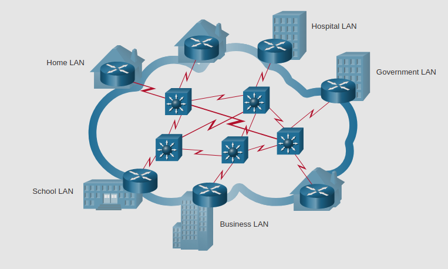

# Common Types of Networks

## 1.4.1 Networks of Many Sizes

Las redes vienen en todos los tamaños, desde dos computdoras conectadas a redes conectando millones de dispositivos.
* Simples redes familiares te permiten compartir recursos como: impresoras, documentos, imagenes y musica ademas de unos cuantos dispositivos finales.
* Pequeñas redes de oficina y _Home office_ (SOHO) permiten a las personas trabajar desde casa como una oficina remota.
* Newgocios y grandes organizaciones usan redes para proveer consolidacion, almacenamiento y acceso a informacion en los servidores de red. Redes proveen email, mensajeria instantanea y colaboración entre empleados.
* El internet es la red mas grande en existencia. El termino internet significa "red de redes". Es una colección de redes privadas y publicas interconectadas.

## 1.4.2 LANs and WANs

Los dos tipos de redes más comunes son las LANs (Local Area Networks) y las WANs (Wide Area Networks).
* Una **LAN** es una red que provee acceso a usarios y dispositivos en una area geografica pequeña.
	* Una lan es tipicamente usada en departamentos dentro de una empresa, un hogar, o una red pequeña de negocios.
* Una **WAN** es una red que provee acceso a otras redes a través de una ancha area geografica.
	* Tipicamente es propiedad y manejada por una corporación mas grande o una TSP.

**LANs**

Las LANs tienen caracteristicas especificas:
* Las LANs interconectan _End Devices_ en un area limitada.
* Una LAN es usualmente administradad por una sola organizacion o un unico administador.
* Las LANs proveen conectividad de alta velocidad a dispositivos internos y dispositivos intermediarios

**WANs**

Las WANs tienen caracteristicas especificas:
* Las WANs interconectan LANs através de largas areas geograficas como cidudades, estados, provincias, paises o contientes.
* Las WANs son usalmente administradas por multiples proveedores de servicios.
* Las WANs tipicamente proveen velocidades más lentas ataves de LANs

## 1.4.3 EL Internet

El internet es una colección global de redes interconectadas. En algunos de los ejemplos las LAN estan conectadas entre ellas a traves de WANs y las WANs estan conectadas entre ellas tambien.
Las WANs pueden conectarse a traves de cable de cobre, fibra optica y redes inlalambricas.

## 1.4.4 Intranet and Extranet

**Intranet** es un termino usado para referirse a una conección privada de LANs y WANs que pertenece a una organización y es diseñada para solo ser accesible por los miembros de la organización, empleados o otros con autorización.

Una organizacción probablemente use una **Extranet** para proveer acceso seguro a individuales que trabajan para una diferente organización pero requieren acceso a los datos de la organización.

Ejemplos de **Extranet:**
* Una compaǹia que provee acesso a proveedores y contratistas externos.
* Una oficina local de educación que provee presupuesto e información personal a las escuelas del distrito.

