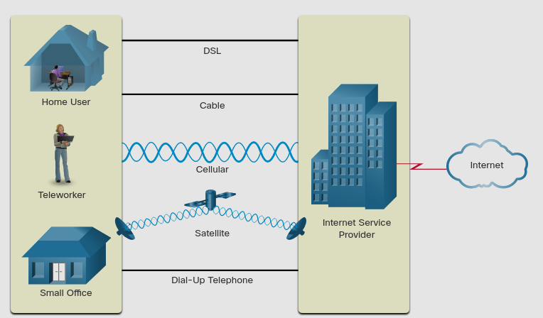
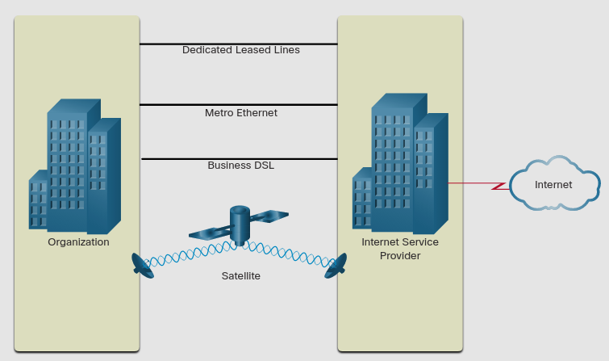

# Internet Connections

## 1.5.1 Internet Access Technologies

Usuarios de casa, Trabajadores remotos y oficinas pequeñas tipicamente requieren una coneccion a un ISP para acceder al internet.
Tipos de conección pueden variar dependiendo el ISP y la localización geografica. 
Las conecciones mas comunes incluyen: _Broadband cable_, _Broadband digital subscriber line_ **(DSL)**, WAN inlalambricas y servicios moviles.

Organizaciones usalmente necesistan acceder a otros sitios corporativos ademas del internet.
Conecciones rapidas son requeridas para soportar servicios empresariales incluyendo: 
_IP Phones, video conferencias, almacenamiento de datos._
ISPs ofrecen conecciones de clase empresarial, como: 
_DSL, Leased lines y Metro internet._

## 1.5.2 Home and Small Oficce Internet Connections

**Cable** - Tipicamente ofrecido por proveedores de televisión por cable, los datos de internet se transmiten por el mismo cable que entrega televisión. provee banda ancha y alta disponibilidad.

**DSL** - _Digital Subscriber Lines_ proveen tambien banda ancha, alta disponibilidad y _always-on_ connección a internet. DSL corre sobre las lineas de telefono. 

**Cellular** - EL acceso a internet a través de las redes que usa tu telefono celular, donde sea que tu tengas un telefono celular con señal puedes tener Internet, el rendimiento es limitado por las capacidades del telefono y de la torre celular a la cual te conectas.

**Satelite** - La disponivilidad del acceso a internet a través de satelite es un beneficio  en areas donde de otra forma no tendrias conección a internet. antenas de satelite necesitan un buen clima para funcionar optimamente.

**Dial-up-Telephone** - Una barata opcción que usa cualquier linea de telefono. La baja banda ancha proveída no es suficiente para enviar muchos datos, pero puede ser útil cuando se viaja. 

## 1.5.3 Businesses Internet Conections

Las conecciones corporastivas difieren de otras conecciones domesticas.
Negocios suelen requerir un ancho de banda mas alto, ancho de banda dedicado y servicios gestionaods.

**Dedicated Leased Line** - los enlaces dedicados son circuitos resevados dentro de la red del ISP que conectan geograficamente oficinas separadas para transmision privada de voz y/o datos. 
Son usalmente rentados mensualmente o anualmente.

**Metro Ethernet** - Tambien conocido coomo Ethernet WAN. Extiende el acceso LAN con WAN. 

**Business DSL** - el DSL empresarial esta disponible en varios formatos. Uno popular es DSL simetrico (SDSL) que es similar al DSL doemestico pero provee velocidades de subida y de bajada iguales.

**Satelite** - Los Satelites pueden proveer una conección cuando una conección por cable no es posible.

## 1.5.4 The Converging Network

Imagina una escuela contruida hace 30 años. En ese entonces, algunos salones de clase fueron cableados para Internet, Telefono y Televisión. 3 redes diferentes que no podian comunicarse entre si y usando tecnologias diferentes para transportar los datos.

**Redes Convergentes**

Hoy, los datos separados de Telefono y video convergen.
A diferencia de redes dedicadas, las redes convergentes son capaces de entregar datos, voz, y video a través de muchos diferentes tipos de servicios sobre la misma red.
Esta infrastructura de red usa las mismas reglas, arreglos y standares de implementacion.

