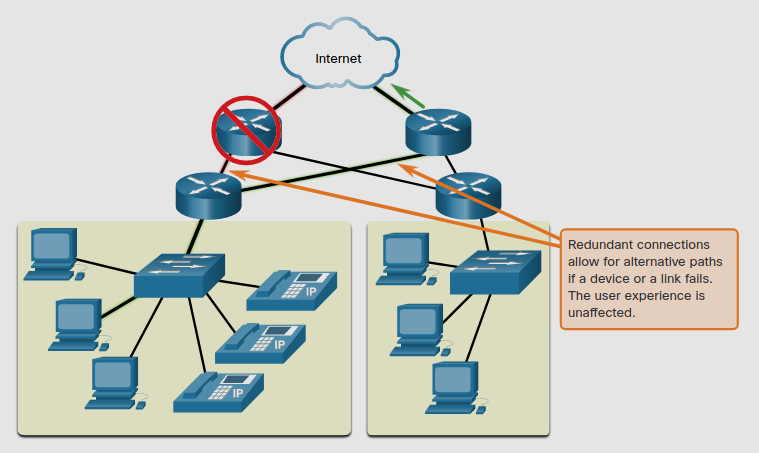

# Reliable Networks

## 1.6.1 Network Architecture
las redes deben de ser contruidas a partir de una arquitectura estandard.
Con el paso del tiempo hemos aprendido que hay 4 caracteristicas basicas que los arquitectos de redes deben de cumplir.
* Tolerancia a fallos
* Scalabilidad
* Calidad del servicio (QoS)
* Seguridad

## 1.6.2 Tolerancia a fallos

Una red con tolerancia a fallos es una que limita el numero de dispositivos afectados durante una falla.
Es construida para permitir una recuperación rápida cuando una falla ocurra.
Normalmente dependen en multiples caminos entre la fuente y el destino del mensaje, si un camino fallam el mensaje es mandado inmediatamente por otro.

Implementando una **Conmutación de paquetes** es una manera en la que se le puede proveer de redundancia a las redes.
La conmutación de paquetes divide el trafico en paquetes que son encaminados sobre una red compartida.
Un solo mensaje (que puede ser un email o un video) es dividido en multiples bloques de mensajes, llamados **Paquetes**.

Cada paquete tiene la información de dirección de la fuente y de su destino. 
Los routers dentro de la red conmutan los paquetes basados en la condición de la red en ese momento, lo cual significa que cada paquete puede tomar rutas muy diferentes para el mismo destino.

## 1.6.3 Scalability 

Una red scalable se expande rapidamente para soportar nuevos usaruarios y nuevas aplicaciones.
Lo Hace sin degradar el rendimiento de sus servicios.

## 1.6.4 Quality of Service

La calidad de servicio (QoS) es un requerimiento en aumento de las redes de hoy. 
Las nuevas aplicaciones disponibles sobre las redes, como conferencias de voz y video, crean altas expectativas de la calidad de los servicios entregados.

QoS se convierte en el mecanismo primario para manejar la congestion y asegurar la segura entrega de contenidos a todos los usarios.
La congestion ocurre cuando la demanda por ancho de banda exede la cantidad disponible. 

El ancho de banda se mide con el numero de bits que se pueden transferir en un solo segundo, **Bits per Second** (bps).

Cuando el volumen del trafico rebasa su capacidad maxima, los dispositivos mantendran los paquetes en memoria hasta que los recursos de red esten disponibles para transmitirlos otra vez. 

## 1.6.5 Network Security

La infraestructura de una red, sus sevicios y los datos que contiene en NaS son cruciales. 
Los administradores de red deben ocuparse de dos tipos de seguridad: 
**Seguridad de la infraestuctura y Seguridad de la informacion**

> Esto incluye asegurar físicamente los dispositivos que poveen conección de red y prevenir aceeso no autorizado al software de control dentro de ellos.

Administradores de red deben proteger tambien la información contenida dentro de los paquetes que son transmitidos dentro de la red.
Con tres requerimientos primarios:
* **Confidencialidad** - solo los recipientes autorizados pueden acceder a los datos.
* **Integridad** - Se asegura de que la informacion no ha sido alterada en el viaje de origen a destino.
* **Disponibilidad** - Se asegura de que los usuarios van a poder acceder al servicio en cualquier momento.

