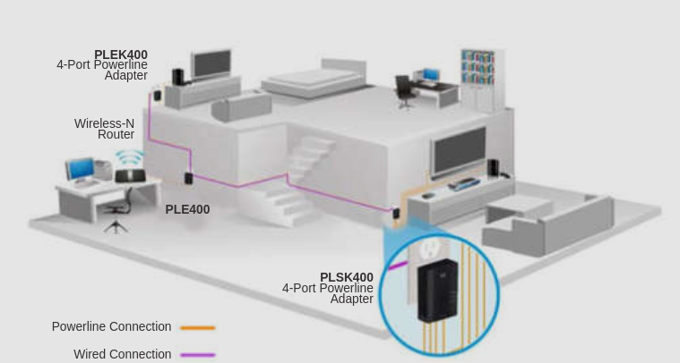

# Network Trends

## 1.7.2 Bring Your Own Device (BYOD)

Permite a los usuarios la libertad de usar sus dispositivos personales para acceder a la información y comunicarse a través de su empresa o campus.

## 1.7.2 Online Collaboration

Los individuales quieren conecctarse a la red, no solo para acceder a los datos y a las aplicaciones, 
también para colaborar unos con otros. 

## 1.7.6 Cloud Computing

El computo en la nube es una de las maneras en las que accedemos y guardamos datos.
Permite Guardar datos en servidores por toda internet.
Aplicaciones como procesado de palabras(?) y edición de fotos pueden ser usados en la nube.

El computo en la nube es posible gracias a los _data centers_. 
Los Data centers son facilidades usadas para almacenar sistemas computacionales y sus componentes

**Tipos de nube**

Tipos de nube| Descripción
-|-
Nubes Publicas | hechas para la población en general. Son gratis o con un modelo _Pay-per-use_
Nubes Privadas | son dirigidas a una organización especifica y puede ser establecidas usando la red pribada de una organización
Nubes Hibridas | hechas con parte privada y publica

## 1.7.8 Powerline Networking

Son redes para hogares las cuales ocupan la instalacción electrica para conectar dispositivos.

