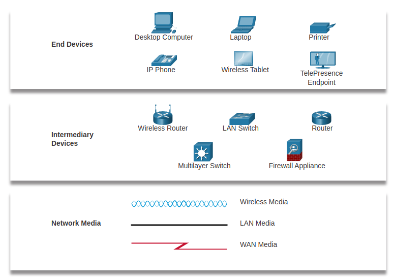
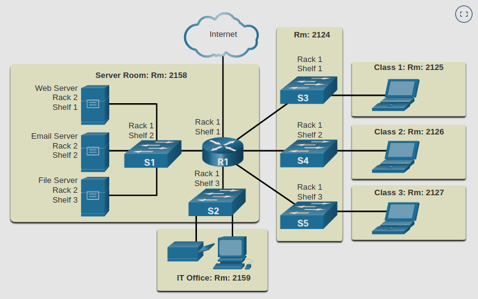
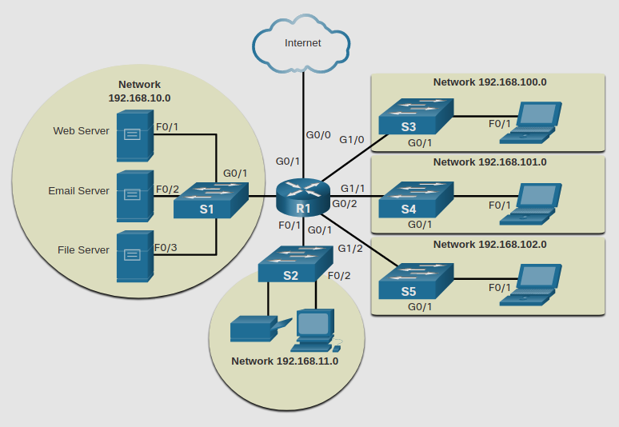

# 1.3.1 Network Representations

Arquitectos de redes y administradores deben de poder ver de manera fácil que componentes se conectan a otros componentes, donde van a estar localizados y como van a estar conectados. 

Los Diagramas usan simbolos como estos.

Ademas de estas representaciones, se usa terminología especializada para describir como cada uno de estos dispositivos se conectan entre ellos.
* **Network Interface Card (NIC)** - Un NIC conecta fisicamente el dispositivo final a la red.
* **Puerto fisico** - un conector o un _Outlet_ en un dispositivo de red donde el medio se conecta a un dispositivo final o algun otro dispositivo de red.
* **Interfaz** - puertos especializados en un dispositivo de red el cual se conecta a una red individual, _los puertos en un router son llamados interfaces de red._

# 1.3.2 Topology Diagrams

Los Diagramas de topologia son mandatorios para cualquiera que trabaje en una red. proveen un mapa visual de como una red es conectada.
Pueden ser:
* Físicos
* Lógicos

**Diagramas Físicos**

Ilustran la locación fisica de dispositivos intermediarios e instalacion de cables. 

**Topologia Lógica**

Ilustran dispositivos, puertos y es esquema de direcciones de la red.

