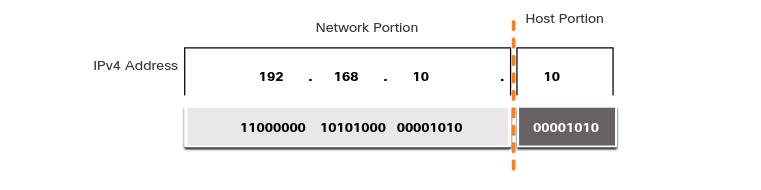
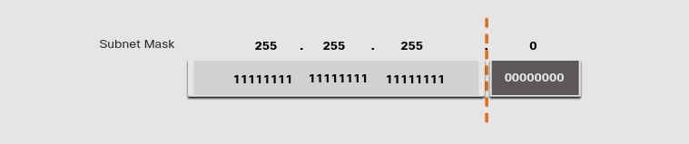
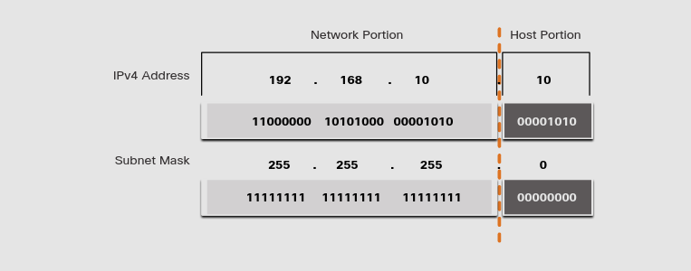
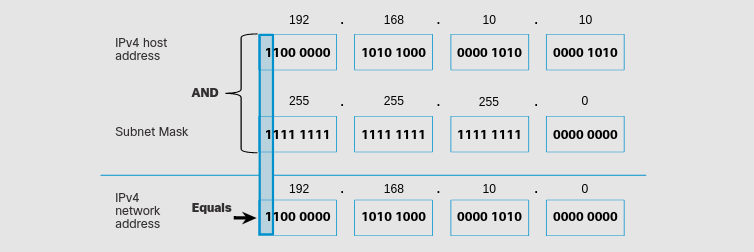
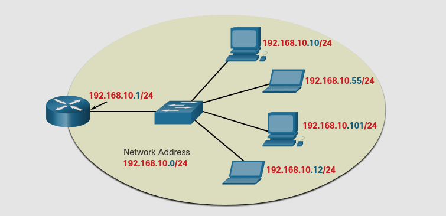
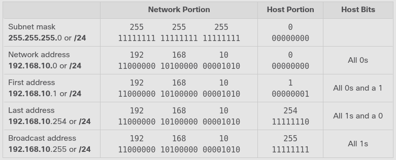

# IPv4 Address Structure
## 11.1.1 Network and Host Portions
Una dirección IPv4 es una dirección jerárquica de 32-bits que esta hecha de una porción de red y una de host.

>Los bits dentro de la porción de red deben de ser identicos para todos los dispositivos que esten dentro de la misma red.

> Los bits dentro de la porción de host deben de ser unicos para identificar el host específico dentro de la red.

## 11.1.2 The subnet Mask
Asignar una dirección IPv4 a un host requiere de:
* **IPv4 address** - Esta es la dirección unica del host.
* **Subnet Mask** - Es usada para identificar la porcion de Red/host de la IPv4.

> Una puerta de enlace determinada es requerida para alcanzar redes remotas y un servidor DNS IPv4 es requerido para traducir nombres de dominio a direcciones IPv4.

Para diferenciar la porción de red de la de host, la mascara de subred es comparada con la IP IPv4 bit por bit.

Notece que la mascara de subred no contiene la red o la porción de host de una IPv4, solo le dice a la computadora donde buscar cada parte.

## 11.1.3 The Prefix Length
Existe un metodo alternativo para identificar la mascara de subred, se llama la longitud del prefijo.
Este es el numero de bits 1 en la mascara de subred y es escrito en "slash notation". 

Subnet Mask|32-bit Address|Prefix Length
-|-|-
255.0.0.0|11111111.00000000.00000000.00000000|/8
255.255.0.0|11111111.11111111.00000000.00000000|/16
255.255.255.0|11111111.11111111.11111111.00000000|/24
255.255.255.128|11111111.11111111.11111111.10000000|/25
255.255.255.192|11111111.11111111.11111111.11000000|/26
255.255.255.224|11111111.11111111.11111111.11100000|/27
255.255.255.240|11111111.11111111.11111111.11110000|/28
255.255.255.248|11111111.11111111.11111111.11111000|/29
255.255.255.252|11111111.11111111.11111111.11111100|/30

**Ejemplo:** 192.168.10.10 255.255.255.0 **==>** 192.168.10.10/24

## 11.1.4 Dertermining the Network: Logical AND
El AND lógico es una comparacion de dos bits que producen los siguientes resultados.

1 AND 1 = | 1
-|-
0 AND 1 = | 0
1 AND 0 = | 0
0 AND 0 + | 0

**Ejemplo** 

Considere un host con IPv4 192.168.10.10 y una macara de subred 255.255.255.0

## 11.1.6 Network, Host, and Broadcast Addresses
Dentro de cada red hay tres tipos de IPs
* Dirección de red
* Dirección de host
* Dirección de Broadcast (transmisor)

**Direccion de red**

Una dirección de red es una dirección que representa una red especifica.
Un dispositivo pertenece a esta red si cumple esta criteria.
* Tiene la misma mascara de subred que la dirección de red.
* Tiene los mismos bits que la dirrección de red.
* Esta localizada en el mismo dominio de broadcast como otros hosts con la misma direccón de red.

Un host determina la dirrección de red haciendo una operacción AND entre la IPv4 y la mascara de subnet.

**Network, Host, and Broadcast Addresses**

**Host addresses**

Las dirrecciónes de host son direcciones que pueden ser asignadas a un dispositivo como una pc, laptop, router, etc.
La porción de host son los bits indicados por 0 en la mascara de subred.
> Todos los dispositivos dentro de una misma red deben tener la misma mascara de subred y los mismos bits de red.
> solo los bits de host difieren y deberán ser únicos.

En la tabla esta señalada la primera y la ultima dirección de host:
* **Primera dirección de host** - El primer host dentro de una red tiene todos sus bits 0s exepto el ultimo (de izq a der). 
En este ejemplo: 192.168.10.1/24
* **Ultima dirección de host** - El ultimo host dentro de una red, tiene todos sus bits 1 exepto el ultimo (de izq a derecha).
En este ejemplo: 192.168.10.254/24

Cualquier dirección entre e incluyendo 192.168.10.1/24 a 192.168.10.254/24 puede ser asignada a un dispositivo en la red.

**Broadcast address**

La dirección de transmisor es una dirección necesaria para alcanzar a todos los dispositivos en la una red IPv4.
En el ejemplo la dirección de Broadcast fue 192.168.10.255/24, esta no puede ser asignada a ningún dispositivo.

