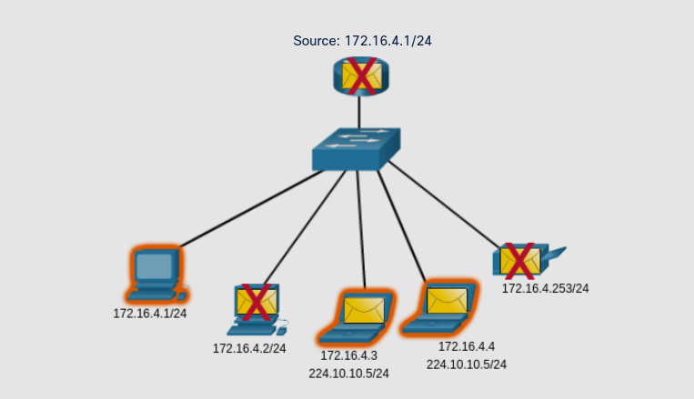

# IPv4 Unicast, Broadcast, and Multicast
## 11.2.1 Unicast

Hay diferentes maneras de mandar un paquete desde una dispositivo fuente, estas maneras afectan el destino de la dirección IPv4.

Un paquete *Unicast* tiene una dirección ip de destino que va a un solo destinatario.
Una IP fuente es unicast ya que el paquete solo puede salir de un único origen.

Las direcciones IPv4 unicast para host pueden ir en el rango de **1.1.1.1 a 255.255.255.255**. 
Pero, dentro de este rango hay muchas direcciones que estan reservadas para otros propositos.

## 11.2.2 Broadcast
Una transmision Broadcast se refiere a un dispositivo mandando mensajes a todos los disposittivos en la red.
>Un paquete broadcast tiene una IP de destino con solo unos (32 bits de 1) EJ: 255.255.255.255

Un paquete broadcast debe de ser procesado por todos los dispostivos en el mismo dominio broadcast.
Un dominio broadcast identifica a todos los host en el mismo segmento de red. 

Un broadcast puede ser direccionado o limitado:
* Un broadcast **direccionado** es mandado a todos los host en una red especifica
* un broadcast **limitado** es mandado a 255.255.255.255 

Por defecto, los routers no reenvian broadcast.

**Limited Broadcast**

Los broadcast usan recursos en la red y hacen que cada host en la red procese el paquete.
Asi que el traficoo broadcast debe de ser limitado parque no afecte el rendimiento de los dispositivos de red.

**IP Directed Broadcast**

Ademas de la dirección de Broadcast 255.255.255.255, hay una dirección broadcast IPv4 para cada red llamada broadcast dirigido, esta usa la dirección más alta en la red.

>Por ejemplo, la dirección broadcast dirijida para 192.168.1.0/24 es 192.168.1.255

Esta dirección permite la comunicacion a todos los host de la red.

## 11.2.3 Multicast
Una transmisión multicast reduce el trafico permitiendo a un host mandar un solo paquete a host selectos que pertenecen a un grupo multicast.

Un paquete multicast es un paquete con una IP de destino multicast. 
IPv4 ha reservado las direcciones desde **224.0.0.0 a 239.255.255.255** como rango multicast.

Hosts que reciben paquetes multicast son llamados clientes multicast. 
Los clientes multicast usan servicios requeridos por una cliente para suscribirse a un grupo multicast.

Cada grupo multicast es representado por un solo destino IPv4 multicast. 
Cuando un host IPv4 se suscribe a un grupo multicast, el host procesa los paquetes con dirección a esa dirección multicast.

Protocolos de enrutamiento como el **OSPF** usan transmisiones multicast.
Por ejemplo, la dirección reservada OSPF es 224.0.0.5. solo los dispositivos con OSPF activado procesaran los mensajes,todos los demas lo ignorarán.

El ejemplo de abajo muestra clientes aceptando paquetes multicast.

