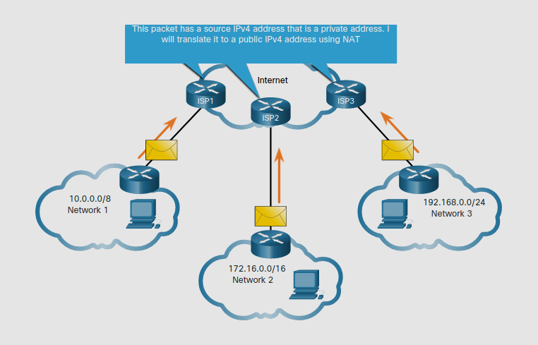
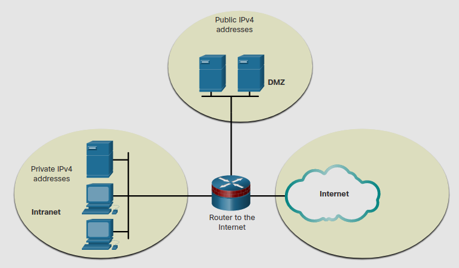
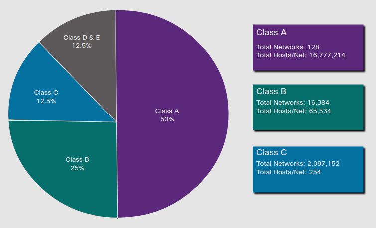
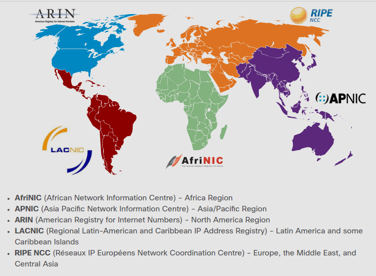

# Types of IPv4 Addresses
## 11.3.1 Public and Private IPv4 Addresses

Justo como hay diferentes maneras de transmitir un paquete IPv4, hay también diferentes tipos de direcciones IPv4.
Algunas IPv4 no pueden ser usadas para entrar a internet y otras son especialmente asignadas para entrar a internet.
Otras son usadas para verificar la conección y otras son autoasignadas.

Las IPv4 **publicas** son direcciones que son enrutadas globalmente entre las ISP. 
Pero, no todas las IPv4 puedes ser usadas en internet. 
Hay bloques de direcciones llamadas "direcciones privadas" que son usadas para asignar IPv4 a host internos en organizaciones.

**The Private Address Blocks**

**Direccion de red y prefijo** | **RFC 1918 rango de dirección privado**
-|-
10.0.0.0/8 | 10.0.0.0 - 10.255.255.255
172.16.0.0/12 | 172.16.0.0 - 172.31.255.255
192.168.0.0/16 | 192.168.0.0 - 192.168.255.255

> Direcciones privadas son definidas en el RFC 1918 y a veces referidas como: espacio de direcciones RFC 1918 

## 11.3.2 Routing to the Internet 
La mayoria de las redes internas, desde empresariales hasta domesticas, usan IPv4 para todos sus dispositivos internos(intranet) incluyendo Host y routers.

**Private IPv4 Addresses and Network Addresses Translation (NAT)**

En la figura, las redes 1,2 y3 estan mandando paquetes fuera de sus redes internas.

Antes de que una ISP pueda direccionar este paquete, debe traducir la IPv4 de origen, la cual es una dirección privada a una IPv4 pública usando la **Network Addresses Translation (NAT)**.

NAT es usada para traducir entre IPv4 privadas y publicas.
Esto usalmente ocurre en el router que conecta la red interna a la red de la ISP. 

IPv4 privadas en la intranet de la organización serán traducidas a IPv4 públicas antes de enrutarlas a Internet.

Organizaciones que tienen recursos a traves del internet, como servidores web, tambien tendran dispositivos que tienen IPv4 públicas.
Como muestra la figura esta parte de la red es conocida como **DMZ (Demilitarized zone)**.

El router en la figura no solo enruta, tambien actua como NAT y como un Firewall.

## 11.3.4 Special Use IPv4 Addreses

Hay ciertas direcciones, como la dirección de red y la de broadcast, que no pueden ser asignadas a hosts.
Tambien hay direcciones especiales que pueden ser asignadas a hosts, pero con restricciones en como estos hosts interactuan dentro de la red.

**Loopback addresses**

Las direcciones Loopback **(127.0.0.0/8 o 127.0.0.1 a 1277.255.255.255)** son comunmente conocidad como solo **127.0.0.1**.
Son direcciones espeicales usadas por un host para dirigir el trafico a el mismo. 
> Como ejemplo pueden ser usadas en un host para pobar si la configuración TCP/IP es funcional.

**Link-Local addresses**

Las direcciones de Enlace-Local **(169.254.0.0/16 o 169.254.0.1 a 169.254.255.254)** son más comunmente conocidas como
*Automatic Private Addressing* (APIPA) o *Self-assigned addresses*.
Son usadas por un client DHCP windows para auto-configurarse en el caso de que no haya servidor DHCP disponible.

## 11.3.5 Legacy Classful Addressing

En 1981, direcciones IPv4 eran asignadas usando una clausula definida en [RFC 790](https://tools.ietf.org/html/rfc790),
Asigned Numbers. A los Compradores eran asignadas direcciones de red basadas en una de las 3 clases A, B o C.
El RFC dividia los rangos Unicast en clases especificas.

* **Clase A (0.0.0.0/8 - 127.0.0.0/8)** - Diseñada para soportar redes extremadamente con más de 16 millones de direcciones host.
Usaba un prefijo fijo /8 fijo usando el primer octeto para indicar la dirección de red y los 3 restantes para la dirección de host.
* **Clase B (128.0.0.0/16 - 191.255.0.0/16)** - Diseñada para soportar las neceisdades de redes de tamaño medio a moderado, con hasta 65 mill direcciones de host.
Usaba un prefijo /16 fijo con dos octetos de alto-orden para indicar la dirección de red y los dos restantes para las direcciones de host.
* **Clase C (192.0.0.0/24 - 233.255.255.0/24)** - Diseñada para soportar redes pequeñas con un maximo de 254 hosts.
Usaba un prefijo /24 fijo con los primeros 3 octetos para indicar la red y el octeto faltante para el host.

A mediados de los 90s, con la intoduccion de la *Word Wide Web* (WWW), el direccionamiento por clase fue obsoleto para asignar de manera más eficiente el limitado espeacio de direcciones IPv4. 
El direccionamiento de clase fue remplazado por el direccionamiento sin clases, el cual es usado hasta hoy.
El cual ignora las reglas de las clases y cuyas direcciones son asignadas en el numero de direcciones que pueden ser justificadas.

## 11.3.6 Assignment of IP Addresses
Las IPv4 publicas son direcciones que son enrutadas globalmente por todo internet. 
IPv4 publicas deben de ser unicas.

IPv4 e IPv6 son gestionadas por la *Internet Assigned Numbers Authority* (IANA). 
IANA gestiona y asigna bloques de direcciones IP a las *Regional Internet Registries* (RIRs).

Las RIRIs Son responsables de asignar direcciones IP a las ISPs que proveen bloques de direcciones IPv4 a organizaciones e ISPs más pequeñas.

