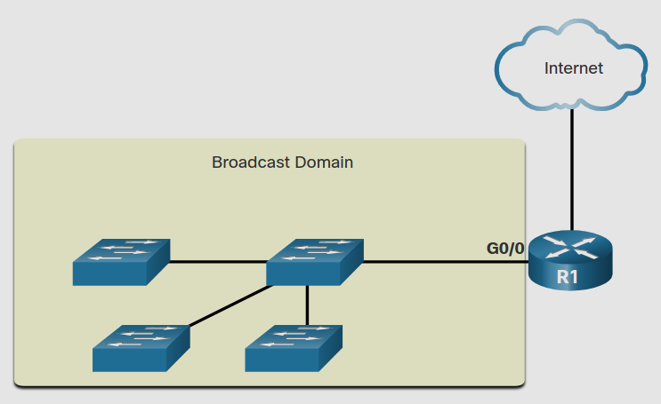
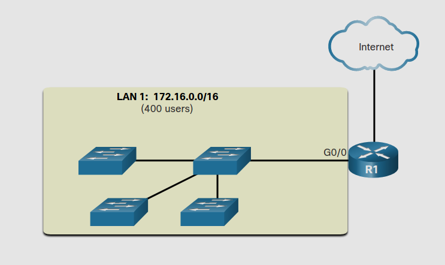
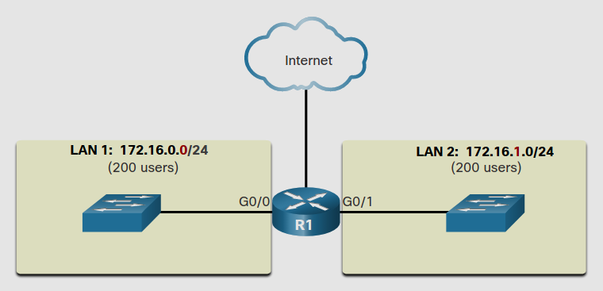
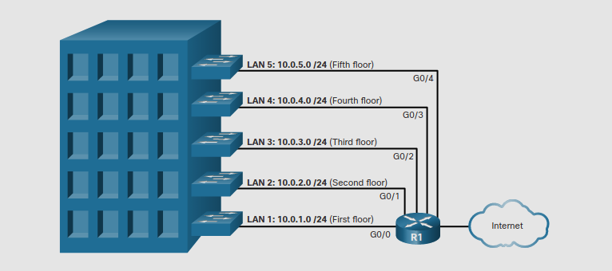
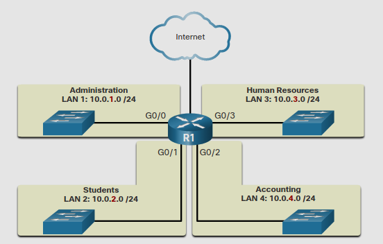
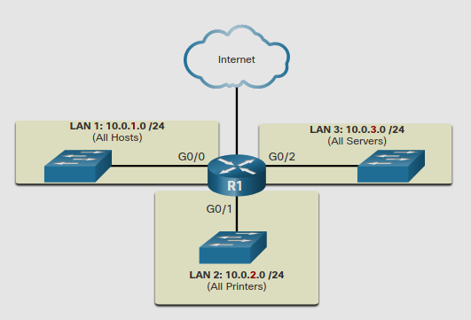

# Network Segmentation
## 11.4.1 Broadcast Domains and Segmentation

En una LAN ethernet, los dispositivos usan broadcast y el *Address Resolution Protocol* (ARP) para localizar otros dispositivos.

ARP manda Broadcast en la capa 2 a una dirección IPv4 conocida en la red local para descubrir la dirección MAC asociada ese host.
Dispositivos en ethernet LAN también localizan otros dispositivos usando servicios.

>Un host tipicamente adquiere la configuración de su dirección IPv4 usando el *Dynamic Host Configuration Protocol* (DHCP) el cual manda broadcast en la red local para localizar un servidor DHCP. 

Los switches propagan broadcast por todas las interfaces exepto en la interfaz en la cual se ha recibido.
Por ejemplo, si un swich en la figura fuera a recibir un proadcast, lo propagaria a los otros switches y routers conectados en la red.

**Routers Segmented Broadcast Domains** 

Los routers **no propagan broadcast**. 
Por lo tanto, cada router se conecta a un dominio broadcast y los broadcast solo son propagados dentro de el dominio broadcast.

## 11.4.2 Problems with Large Broadcast Domains

Un dominio broadcast grande es una red que conecta muchos hosts.
Un pronblema con esto es que estos hosts pueden generar broadcast exesivos y afectar negativamente en la red.

**A large Broadcast Domain**

La solución es reducir el tamaño de la red para crear dominios broadcast pequeños en un proceso llamado subneteo.
Estas redes más pequeñas son llamadas subredes.

En la figura de abajo, 400 usarios en la LAN 1 han sido dividos en dos subredes de 200 usuarios cada una. 
Con esto los broadcast son sólo propagados dentro de su respectivo dominio broadcast.

Nota como el prefijo cambio de /16 a dos de /24.
Esta es la base del subneteo: usar los bits del host para crear subredes.

## 11.4.3 Reasons for Segmenting Networks

El subneteo reduce el trafico de una red y mejora su rendimiento. 
También permite al administrador a implementar politicas de seguridad como que subreds estan permitidas o no a comunicarse entre ellas.

### Subneteando por locacion

### Subneteando por grupo o funcion

### Subnereando por tipo de dispositivo

