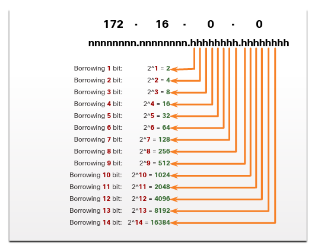
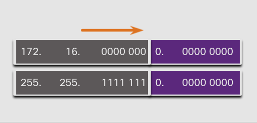
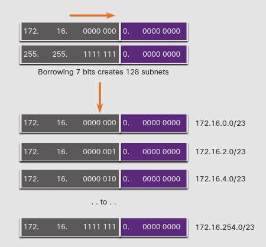
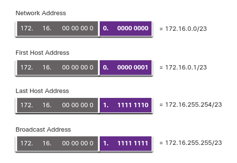

# Subnet a /16 and a /8 Prefix
## 11.6.1  Create Subnets with a /16 prefix
Algunas formas de subneteo son más fáciles que otras. En este capitulo explicaremos como crear subredes con igual numero de hosts

En una situacion en la que requiramos un numero más grande de subredes, en una red IPv4 es necesario que esten disponibles mas bits para tomar. 
Por ejemplo.

> La dirección de red 172.16.0.0 tiene la mascarad de subred 255.255.0.0 o /16.
Esta dirección tiene 16 bits en la porción de red y 16 en la de host.
Los 16 bits en la porción de host están disponibles para tomarlos y crear subredes.

La tabla muestra diferentes escenarios para subnetear un /16.

Prefix Length | Subnet Mask | Network Address (n = network, h = host) | # of subnets | # of hosts
-|-|:-:|:-|:-
/17 | 255.255.128.0 | nnnnnnnn.nnnnnnnn.**n**hhhhhhh.hhhhhhhh 11111111.11111111.**1**0000000.00000000 | 2 | 32766
/18 | 255.255.192.0 | nnnnnnnn.nnnnnnnn.**nn**hhhhhh.hhhhhhhh 11111111.11111111.**11**000000.00000000 | 4 | 16382
/19 | 255.255.224.0 | nnnnnnnn.nnnnnnnn.**nnn**hhhhh.hhhhhhhh 11111111.11111111.**111**00000.00000000 | 8 | 8190
/20 | 255.255.240.0 | nnnnnnnn.nnnnnnnn.**nnnnh**hhh.hhhhhhhh 11111111.11111111.**1111**0000.00000000 | 16 | 4094
/21 | 255.255.248.0 | nnnnnnnn.nnnnnnnn.**nnnnn**hhh.hhhhhhhh 11111111.11111111.**11111**000.00000000 | 32 | 2046
/22 | 255.255.252.0 | nnnnnnnn.nnnnnnnn.**nnnnnn**hh.hhhhhhhh 11111111.11111111.**111111**00.00000000 | 64 | 1022
/23 | 255.255.254.0 | nnnnnnnn.nnnnnnnn.**nnnnnnn**h.hhhhhhhh 11111111.11111111.**1111111**0.00000000 | 128 | 510
/24 | 255.255.255.0 | nnnnnnnn.nnnnnnnn.**nnnnnnnn**.hhhhhhhh 11111111.11111111.**11111111**.00000000 | 256 | 254
/25 | 255.255.255.128 | nnnnnnnn.nnnnnnnn.**nnnnnnnn.n**hhhhhhh 11111111.11111111.**11111111.1**0000000 | 512 | 126
/26 | 255.255.255.192 | nnnnnnnn.nnnnnnnn.**nnnnnnnn.nn**hhhhhh 11111111.11111111.**11111111.11**000000 | 1024 | 62
/27 | 255.255.255.224 | nnnnnnnn.nnnnnnnn.**nnnnnnnn.nnn**hhhhh 11111111.11111111.**11111111.111**00000 | 2048 | 30
/28 | 255.255.255.240 | nnnnnnnn.nnnnnnnn.**nnnnnnnn.nnnn**hhhh 11111111.11111111.**11111111.1111**0000 | 4096 | 14
/29 | 255.255.255.248 | nnnnnnnn.nnnnnnnn.**nnnnnnnn.nnnnn**hhh 11111111.11111111.**11111111.11111**000 | 8192 | 6
/30 | 255.255.255.252 | nnnnnnnn.nnnnnnnn.**nnnnnnnn.nnnnnn**hh 11111111.11111111.**11111111.111111**00 | 16384 | 2

Apesar de que no necesitas memorizar esta tabla, si necesitas tener un buen entendimiento de como cada valor es generado.

## 11.6.2 Create 100 Subnets with a /16 prefix
Considera una gran empresa que requiere al menos 100 subredes y ha elegido la dirección privada 172.16.0.0/16 como su dirección de red interna.

cuando tomas prestados bits de una dirección /16, empiezas en el tercer octeto, llendo de la izquierda a la derecha.
Toma un solo bit a la vez hasta que el llegues al numero de bits necesarios para crear 100 subredes.

Para cumplir el requerimiento de 100 subredes para la empresa, 7 bits (2^7 =128 subredes) serian necesarios.

### 172.16.0.0/23 Network

Recuerda que la máscara de subred debe cambiar para reflejar los bits tomados de la porción de host.

En este ejemplo, 7 bits fueron tomados, la mascara es extendida 7 bits dentro del tercer octeto.
En decimal, la mascara es representada como 255.255.255.254.0 o prefijo /23, debido a que el tercer octeto es 11111110  en binario y el cuarto octeto es 00000000 en binario.

La figura siguiente muestra las subredes resultante desde 172.16.0.0/23 hasta 172.16.254.0/23

### Resulting /23 Subnets

Después de tomar 7 bits de la subred, solo queda 1 bit restante en el tercer octeto y 8 bits de host restantes en el cuarto octeto, asi que quedan 9 bits sin ser usados.
2⁹ da como resultado 512 direcciones de host. 
La primera dirección reservada para la dirección de red y la ultima reservada a la dirección de broadcast.
Restando estas dos tenemos 510 direcciones de host disponibles.

### Address Range for 172.16.0.0/23

## 11.6.3 Create 1000 Subnets with a /8 prefix

