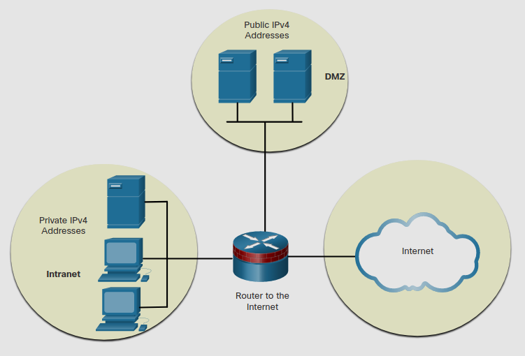
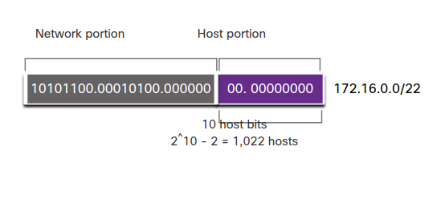
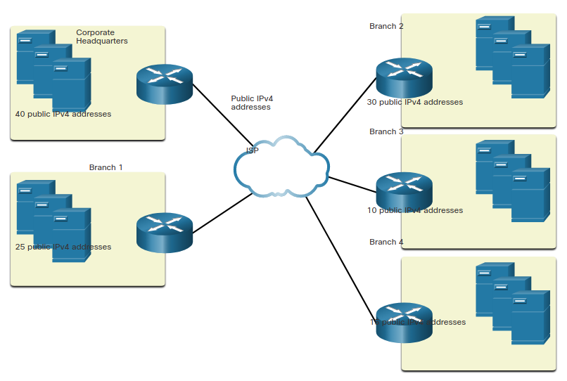
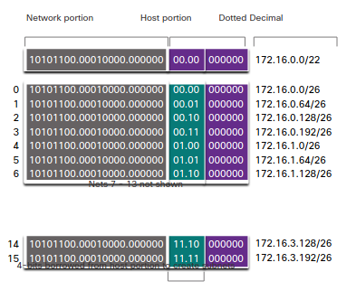
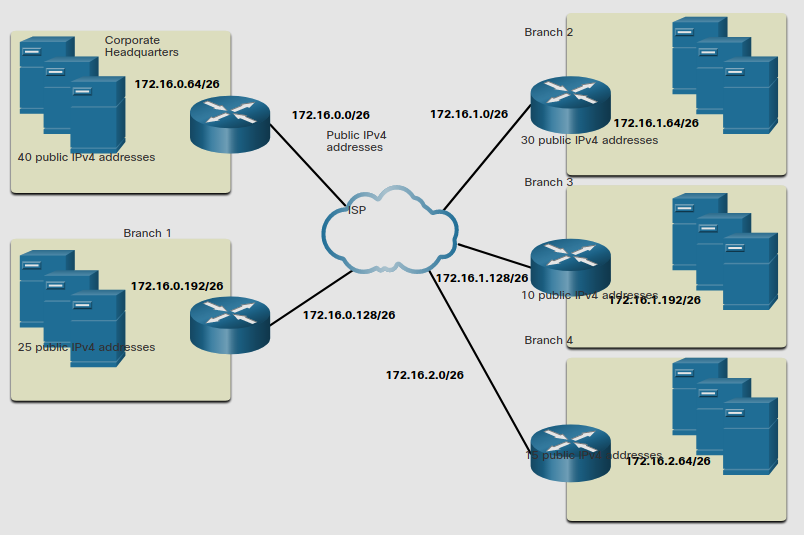

# Subnet to Meet Requirements
## 11.7.1 Subnet Private versus Public IPv4 Address Space 

Mientras es bueno segmentar una red en subredes, la red de tu organización probablemente use direcciones prvadas y publicas. 
Esto afecta como subnetearas tu red.

La siguiente figura muestra una red empresarial tipica:
* **Intranet** - Esta es la parte interna de la red de una compania, accesible solo desde dentro de la organización.
Dispositivos en la intranet usan IPv4 privadas.
* **DMZ** - Esta es una parte de la red de la compañia que contiene recursos disponibles a la intenet como un servidor web.
Dispositivos en la DMZ usan IPv4 publicas.

### Public and Private IPv4 Address Space 

La Intranet y el DMZ tienen su propios requerimientos de subneteo.

la intranet usa una dirección IPv4 privada. 
Esto permite a la organización usar cualquiera de las IPv4 privadas incluyendo 10.0.0.0/8 con 24 bits de host y mas de 16  millones de hosts.

Usar una dirección de red con 24 bits de host hace subnetear más facil y más flexible.

Como ejemplo, la dirección privada 10.0.0.0/8 puede ser subneteada usando un prefijo /16.

### Subneting Network 10.0.0.0/8 usando /16

Subnet Address (256 Possible Subnets) | Host Range (65,534 possible hosts per subnet) | Broadcast
-|-|-
10.0.0.0/16 | 10.0.0.1 - 10.0.255.254 | 10.0.255.255
10.1.0.0/16 | 10.1.0.1 - 10.1.255.254 | 10.1.255.255
10.2.0.0/16 | 10.2.0.1 - 10.2.255.254 | 10.2.255.255
10.3.0.0/16 | 10.3.0.1 - 10.3.255.254 | 10.3.255.255
10.4.0.0/16 | 10.4.0.1 - 10.4.255.254 | 10.4.255.255
10.5.0.0/16 | 10.5.0.1 - 10.5.255.254 | 10.5.255.255
10.6.0.0/16 | 10.6.0.1 - 10.6.255.254 | 10.6.255.255
10.7.0.0/16 | 10.7.0.1 - 10.7.255.254 | 10.7.255.255
... | ... | ...
10.255.0.0/16 | 10.255.0.1 - 10.255.255.254 | 10.255.255.255

Otra opción es usar la direccón privada 10.0.0.0/8 para subnetear usando un prefijo /24.

### Subnetting Network 10.0.0.0/8 using /24

Subnet Address (65,536 Possible Subnets) | Host Range (254 possible hosts per subnet) | Broadcast
-|-|-
10.0.0.0/24 | 10.0.0.1 - 10.0.0.254 | 10.0.0.255
10.0.1.0/24 | 10.0.1.1 - 10.0.1.254 | 10.0.1.255
10.0.2.0/24 | 10.0.2.1 - 10.0.2.254 | 10.0.2.255
… | … | …
10.0.255.0/24 | 10.0.255.1 - 10.0.255.254 | 10.0.255.255
10.1.0.0/24 | 10.1.0.1 - 10.1.0.254 | 10.1.0.255
10.1.1.0/24 | 10.1.1.1 - 10.1.1.254 | 10.1.1.255
10.1.2.0/24 | 10.1.2.1 - 10.1.2.254 | 10.1.2.255
… | … | …
10.100.0.0/24 | 10.100.0.1 - 10.100.0.254 | 10.100.0.255
... | ... | ...
10.255.255.0/24 | 10.255.255.1 - 10.2255.255.254 | 10.255.255.255

La dirección 10.0.0/8 puede ser subneteada usando cualquier otro numero de prefijo. 
Esto da a los administradores de red una amplia varidad de opciones.

#### what about the DMZ?

Devido a que estos servicios necesitan ser accesibles al publico desde el internet, los dispositivos en la DMZ requieren IPv4 publicas.
El agotamiento de el espacio de IPv4 publicas se convierte en un problema a mediados de los 90s.
Desde 2011, IANA y cuatro de las 5 RIRIs se han quedado sin direcciones IPv4.
Apesar de que las organizaciones estan haciendo la transicion a IPv6, el espacio IPv4 restante esta severamente limitado.
Esto significa que una organización debe maximizar su propio limitado numero de IPv4 publicas.
Para minimizar el numero de direcciones de host sin usar por subred,
se usa un metodo llamado *Variable Subnet Lenght Masking* **(VLSM)**.

## 11.7.2 Minimize Unused Host IPv4 Addresses and Maximize Subnets

Para minimizar el numero de direcciones IPv4 y maximizar el numero de subredes disponibles,
hay dos consideraciones cuando planeas subredes: el numero de direcciones de host requeridas para cada red y el numero de subredes individuales necesitadas.

La tabla muestra el subneteo de una red /24. 
Nota como el numero de subredes es inversamente proporcional al numero de hosts.

El numeo de direcciones de host requeridas en la subred más grande determinara cuantos bits deben quedar en la porción de host.
Recuerda que dos de las direcciones no pueden ser usadas.

### Subneting a /24 Network

refix Length | Subnet Mask | Subnet Mask in Binary (n=network, h=host) | # of subnets | # of hosts per subnet
-|-|-|:-|:-
/25 | 255.255.255.128 | nnnnnnnn.nnnnnnnn.nnnnnnnn.**n**hhhhhhh 11111111.11111111.11111111.**1**0000000 | 2 | 126
/26 | 255.255.255.192 | nnnnnnnn.nnnnnnnn.nnnnnnnn.**nn**hhhhhh 11111111.11111111.11111111.**11**000000 | 4 | 62
/27 | 255.255.255.224 | nnnnnnnn.nnnnnnnn.nnnnnnnn.**nnn**hhhhh 11111111.11111111.11111111.**111**00000 | 8 | 30
/28 | 255.255.255.240 | nnnnnnnn.nnnnnnnn.nnnnnnnn.**nnnn**hhhh 11111111.11111111.11111111.**1111**0000 | 16 | 14
/29 | 255.255.255.248 | nnnnnnnn.nnnnnnnn.nnnnnnnn.**nnnnn**hhh 11111111.11111111.11111111.**11111**000 | 32 | 6
/30 | 255.255.255.252 | nnnnnnnn.nnnnnnnn.nnnnnnnn.**nnnnnn**hh 11111111.11111111.11111111.**111111**00 | 64 | 2

Los administradores de red deberan ingeniar el esquema de direcciones de red para acomodar el maximo numero de hosts para cada res y el numero de subredes.
El esquema de red deberá permitir que el número de host y el número de subredes aumente.

## 11.7.3 Efficient IPv4 Subneting
En este ejemplo, a la sede de la corporación se le ha asignado la dirección pública 172.16.0.0/22 por su ISP.
Esta proveerá 1,022 direcciones.

> **Nota:** 172.16.0.0/22 es parte de el espacio privado IPv4.

### Network Address

La sede de la corporación tiene una DMZ y cuatro ramas de oficinas, cada una necesitando su propia IPv4 pública.

La topologia mostrada en la figura consiste de 5 sitios; una oficina corporativa y cuatro ramas.
Cada uno de los sitios necesita conección a internet y por lo tanto 5 conecciones a internet.

Esto significa que la organización requiere de 10 subredes de la dirección publica 172.16.0.0/22.

### Corporate Topology with Five Sites

La dirección de red 172.16.0.0/22 tiene 10 bits de host, como muestra la figura.
Debido a que la subred más grande requiere 40 hosts, un minmo de 6 bits de host son necesarios para proveer direcciones para 40 hosts.
> Esto es determinado ya que 2⁶-2 = 62 hosts y 2⁵-2 = 30 hosts necesitamos 6 bits de host para cumplir la demanda.

### Subnet Scheme 

Usando la formula para determinar subredes resulta en 16 subredes 2⁴ = 16.
porque el ejemplo de red requiere 10 subredes, esto cumplira los requerimientos y permitirá el crecimiento de la red.

Sin embargo, los primeros 4 bits de host pueden ser usados para almacenar subredes. 
2 bits de el tercer octeto y 2 del cuarto octeto serán tomados.
Cuando esto pasa el prefijo cambia a /26 con una máscara de subred 255.255.255.192.

Como muestra la figura, las subredes pueden ser assignadas a cadad locación y routeadas a la ISP.

### subnet Asssignments to each Site and ISP

