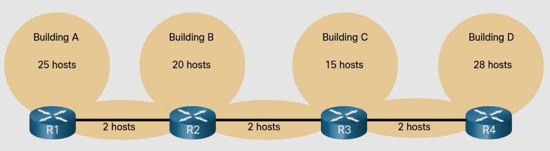
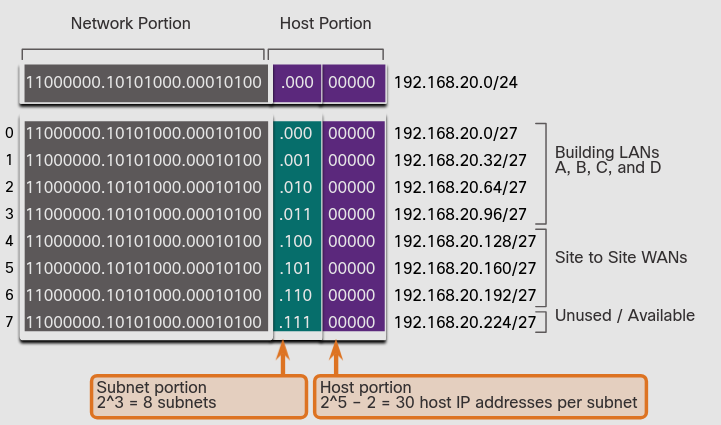
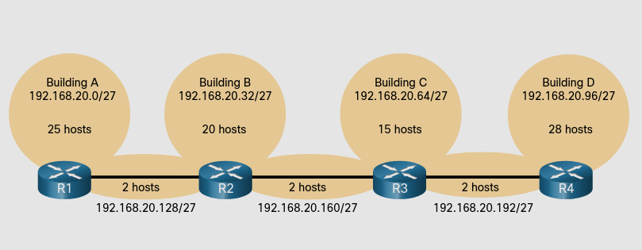
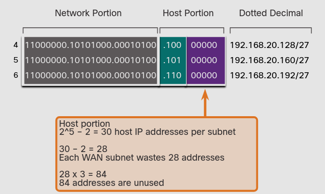
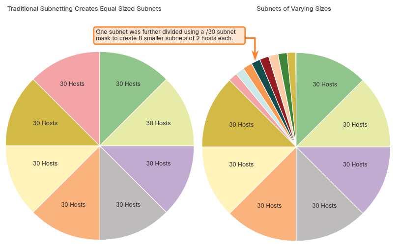
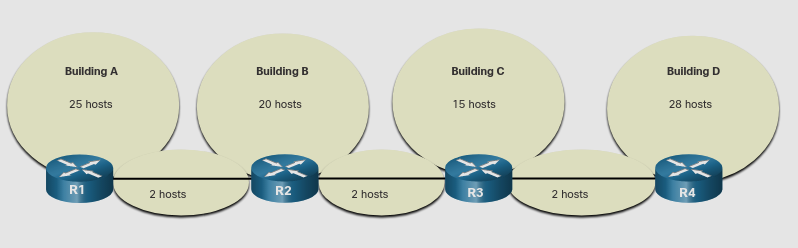
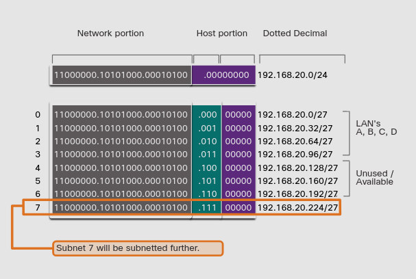
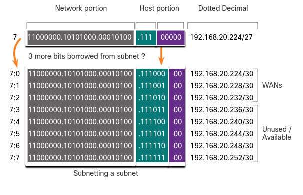
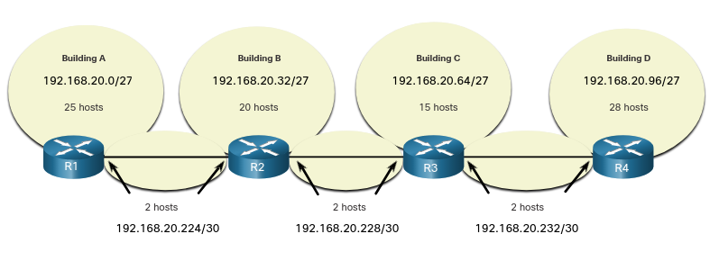
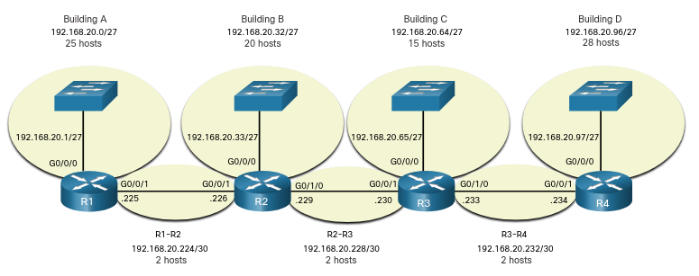

# VLSM
## 11.8.3 IPv4 Address Conservation
Debido a el agotamiento de IPv4 públicas, aprovechar el máximo las direcciónes host dispobibles es una prioridad en el subneteo.

Por ejemplo, la topologia mostrada en la figura requiere de siete subredes iguales, una por cada una de las 4 LANs
y una para cada una de las tres conecciónes entre routers.

Usando subneteo tradiccional con la dirección **192.168.20.0/24**, 3 bits pueden ser tomados de la porción de host enen el último coteto para cumplir los requerimientos de las siete subredes.

Como se muestra en la figura, tomando 3 bits creamos 8 subredes y dejamos 5 bits de host con 30 host con 30 direcciones usables por subred.

### Basic Subnet Scheme 

Estas siete subredes pueden ser asignadas a las LAN y WAN como muestra la figura.

Apesar de que este subneteo tradicional cumple los requerimientos, resulta en un desperdicio significante de direcciones sin usar.

Por ejemplo, solo dos direcciones son necesarias en cada subred para los tres enlaces WAN.
Hay 28 direcciones sin usar en cada una de estas subredes. 

### Unused Addresses on WAN Subnets

El **Variable-Lenght Subnet Mask (VLSM)** fue desarrollado para evitar desperdiciar direcciones permitiendonos subnetear una subred.

## 11.8.4 VLSM

En todos de los ejemplos de subneteo anteriores, la misma mascara de subred era aplicada para todas las subredes.
VLSM permite que las subredes puedan ser divididas en en partes desiguales.

VLSM es solo subnetear una subred. 
La misma topologia usada previamente es mostrada en la figura. 
Usaremos la direción 192.168.20.0/24 y subnetearemos siete subredes, una por cada una lde las LAN y una por cada conección entre routers.

La figura muestra como la red 192.168.20.0/24 es subneteada en ocho subredes de igual tamaño con 30 hosts usables por subred.

### Basic Subnetting Scheme

Las conecciones entre los routers requieren solo dos direcciones de host por subred.
Actualmente todas las subredes tienen 30 direcciones de host usables por subred.
Usaremos VLSM para crear subredes más pequeñas para las conecciones entre routers.

Para lograr esto, una de las subredes será dividida. 
En este ejemplo la última subred, 192.168.20.224/27, sera subneteada usando la máscara 255.255.255.252 o /30.

### VLSM Subneting Scheme

Por qué /30? recuerda que cuando el numero de direcciones de host es conocido, la formula 2n-2 (numero de hosts) puede ser usada.
Para proveer dos direcciones usables, dos bits de host deben ser dejados en la porción de host.

Debido a que hay cinco bits de host en la dirección subneteada 192.168.20.224/27, tres bits más pueden ser tomados.

El subneteo VLSM reduce el numero de direcciones por subred a un tamaño apropiado para lás redes que requieren menos subredes.
> **Nota** Cuando uses VLSM, siempre empieza por satisfacer los requerimientos de la red más grande y continua subneteando hasta que los requerimientos de la red pequeña sean cumplidos.

## 11.8.5 VLSM Topology Address Assignment
La figura muestra los asignamientos de direcciones IPv4 usando VLSM

Usando un esquema de direcciones común, la primera dirección de host IPv4 para cada subred es assignada a la interfaz LAN en el router.
Hosts en cada subred tendrán una dirección IPv4 de host en el rango de direcciones de host para esa subred y una máscara apropidada.
Los host usarán la dirección de el router al que esten conectados asi como la puerta de enlace predeterminada.

La tabla muestra las direcciones de red y el rango de direcciones de host para cada red. 

* | Network Address | Range of Host Addresses | Default Gateway Address
 -|-|-|-
Building A | 192.168.20.0/27 | 192.168.20.1/27 to 192.168.20.30/27 | 192.168.20.1/27
Building B | 192.168.20.32/27 | 192.168.20.33/27 to 192.168.20.62/27 | 192.168.20.33/27
Building C | 192.168.20.64/27 | 192.168.20.65/27 to 192.168.20.94/27 | 192.168.20.65/27
Building D | 192.168.20.96/27 | 192.168.20.97/27 to 192.168.20.126/27 | 192.168.20.97/27
R1-R2 | 192.168.20.224/30 | 192.168.20.225/30 to 192.168.20.226/30 | 
R2-R3 | 192.168.20.228/30 | 192.168.20.229/30 to 192.168.20.230/30	
R3-R4 | 192.168.20.232/30 | 192.168.20.233/30 to 192.168.20.234/30	

