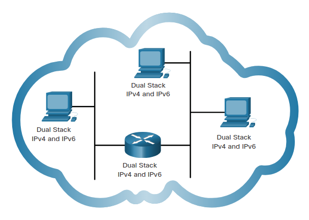
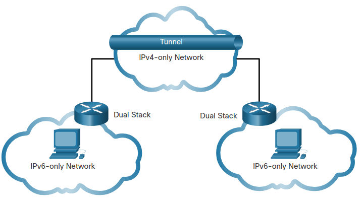
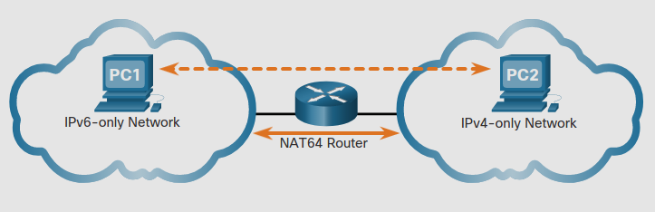

# IPv4 Issues
## 12.1.1 Need for IPv6
Como probablemente sabes, el espacio de direcciones públicas IPv4 se esta acaband. 
Este es el porqué necesitas aprender acerca de IPv6.

IPv6 esta diseñado para ser el sucesor de IPv4. 
IPv6 tiene un mucho más largo espacio de 128 bits, proveyendo 340 sextillones posibles direcciones.
Sin embargo, IPv6 es más que solo direcciones más grandes.

Cuando la IETF empezó a desarollar el sucesor de IPv4, usaron esa oportunidad para arreglar las limitaciones de IPv4 e incluir mejoras.

Un ejemplo es el *Internet Control Message Protocol Version 6* **(ICMPv6)**, el cual incluye resolución de direcciones y autoconfiguracion de direciones.

IPv4 tiene un máximo teorico de 4.3 millones de direcciones. 
Direcciones privadas en convinación con *Network Address Translation* (NAT) han sido útiles en alentar el agotamiento de las direcciones IPv4. 
Sin embargo, el NAT es problematico para muchas aplicaciones, crea latencia y tiene limitaciones que impiden severamente la comunicación peer-to-peer.

Con el nunca interminable numero de dispositivos moviles, los proveedores móvl han estado abriendo el camino a la tansición a IPv6.

La mayoria de las ISPs y proveedores de contenido como Youtube, Facebook y Netflix también han hecho la transición.
Muchas compañias como Microsoft, Facebook y Linkedin están transicionando a solo IPv6 internalmente.

### Internet of Things
El internet de el dia de hoy es muy diferente que el internet de decadas pasadas.
El internet evoluciona y se convierte en el internet de las cosas (IoT).
Ahora no solo hay computadoras conectandose a internet, tablets, smartphones. 
Los dispositivos con internet del futuro incluyen todo desde automobiles y dispositivos biomedicos.

## 12.1.2 IPv4 and IPv6 Coexistence

No hay fecha especifica para migrar a IPv6.
IPv4 e IPv6 coexistirán en el futuro cercano la transición tomara varios años.
la IETF ha creado varios protocolos y herramienas para ayudar a administradores de red a migrar a IPv6.

### Dual Stack
Dual stack permite IPv4 e IPv6 coexistir en el mismo segmento de red.
Dispositivos *Dual Stack* corren ambos protocolos simultaneamente.
Conocido también como IPv6 nativo, esto significa que la red de el cliente tiene una conección IPv6 a la ISP y es capaz de acceder al contenido de internet a través de IPv6

### Tunneling 
Este es un metodo que permite transportat un paquete IPv6 a través de una red IPv4.
El paquete es encapsulado dentro de un paquete IPv4, similar a otros tipos de datos.

### Translation
La *Network Address Translation 64* (NAT64) permite a dispositivos con IPv6 activado comunicarse con dispositivos IPv4 usando una tecnica de traduccion similar a NAT para IPv4.

>**Nota:** Tunneling y translation son para transicionar a IPv6 nativo y solo debería solo ser usado cuando se necesite.
La meta debería ser IPv6 nativo.

