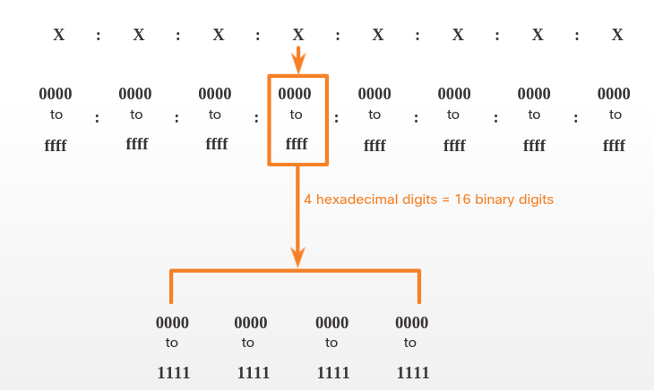

# IPv6 Address Representation
## 12.2.1 Addressing Formats
El primer paso para aprender sobre IPv6 es entender la manera en la que las direcciones IPv6 son escritas y formateadas.
Las direcciones IPv6 son mucho más grandes que direcciones IPv4, este es el poqué es menos probable que se agoten. 

Las direcciones IPv6 tienen una longitiud de 128 bits y son escritas como una cadena de valores hexadesimales.
Cada cuatro bits son representados por un solo digito hexagesimal; para un total de 32 valores hexagesimales, como se muestra en la figura.

### 16-bit Segments or Hextets

### Preferred Format
La figura anterior también muestra que el formato principal para escribir una dirección IPv6 es:
x:x:x:x:x:x:x, con cadada "x" siendo cuatro valores hexagesimales.
El termino octeto se refiere a las ocho bits de una IPv4.
En IPv6, un hexteto es la forma no oficial usada para referirse a un segmento de 16 bits, o cuatro valores hexagesimales.
Cada "x" es un solo hexteto el cual consiste en 16 bits o cuatro valores decimales.

El formato principal o preferido significa que escribes una IPv6 usando *todos* los 32 valores hexagesimales.
No significa necesariamente que sea el método ideal para representar una dirección IPv6.

Estos son algunos ejemplos de IPv6 en el formato preferido.
>2001 : 0db8 : 0000 : 1111 : 0000 : 0000 : 0000: 0200 

>2001 : 0db8 : 0000 : 00a3 : abcd : 0000 : 0000: 1234 

>2001 : 0db8 : 000a : 0001 : c012 : 9aff : fe9a: 19ac 

>2001 : 0db8 : aaaa : 0001 : 0000 : 0000 : 0000: 0000 

>fe80 : 0000 : 0000 : 0000 : 0123 : 4567 : 89ab: cdef 

>fe80 : 0000 : 0000 : 0000 : 0000 : 0000 : 0000: 0001 

>fe80 : 0000 : 0000 : 0000 : c012 : 9aff : fe9a: 19ac 

>fe80 : 0000 : 0000 : 0000 : 0123 : 4567 : 89ab: cdef 

>0000 : 0000 : 0000 : 0000 : 0000 : 0000 : 0000: 0001 

>0000 : 0000 : 0000 : 0000 : 0000 : 0000 : 0000: 0000 

## 12.2.2 Rule 1 - Omit Leading Zeros
La primera regla que para ayudar a reducir la notación de las direcciones IPv6 es omitir cualquier 0 a la izquierda en cualquier hexteto. 
Aqui algunos exemplos.

* 01ab puede ser representado como 1ab
* 09t0 puede ser representado como 9f0
* 0a00 puede ser representado como a00
* 00ab puede ser representado como ab 

Esta regla inlcuye solo a los ceros a la izquierda, de otra manera la dirección podria ser ambigua.

### Omitting Leading 0s

Type | Format
-|:-:
Preferred | 2001 : **0**db8 : **000**0 : 1111 : **000**0 : **000**0 : **000**0 : **0**200
No leading 0s | 2001 :  db8 :    0 : 1111 :    0 :    0 :    0 :  200
Preferred |  2001 : **0**db8 : **000**0 : **00**a3 : ab00 : **0**ab0 : **00**ab : 1234
No leading 0s | 2001 :  db8 :    0 :   a3 : ab00 :  ab0 :   ab : 1234
Preferred | 2001 : **0**db8 : **000**a : **000**1 : c012 : 90ff : fe90 : **000**1
No leading 0s | 2001 :  db8 :    a :    1 : c012 : 90ff : fe90 :    1

## 12.2.3 Rule 2 - Double Colon
La segunda regla para ayudar a reducir la notación de las direcciónes es que dos puntos dobles (::) pueden reemplazar cualquier cadena de ceros contiguos desde 0 a 16 bits.
Como ejemplo **2001:db8:cafe:0:0:0:1** puede ser representado como 2001:db8:cafe:1::1.

Las columnas dobles (::) pueden ser usadas solo una vez dentro de una dirección, de otra manera podria haber más de una posible dirección resultante. 
*Este es conocido como el formato comprimido.*

### Omitting Leading 0 and all 0 segments

Type | Format
-|-
**Preferred** | 2001 : **0**db8 : **000**0 : 1111 : **0000 : 0000 : 0000** : **0**200
Compressed/spaces | 2001 :  db8 :    0 : 1111 :                    :  200
Compressed | 2001:db8:0:1111::200
**Preferred** | 2001 : **0**db8 : **000**0 : **000**0 : ab00 : **0000 : 0000 : 0000**
Compressed/spaces | 2001 :  db8 :    0 :    0 : ab00 :: 
Compressed | 2001:db8:0:0:ab00::
**Preferred** | 2001 : **0**db8 : aaaa : **000**1 :** 0000 : 0000 : 0000 : 0000**
Compressed/spaces | 2001 :  db8 : aaaa :    1 ::
Compressed | 2001:db8:aaaa:1::

