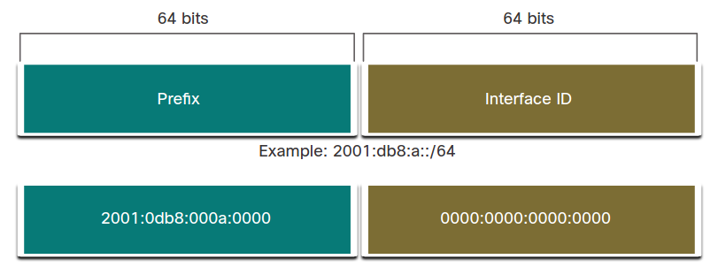
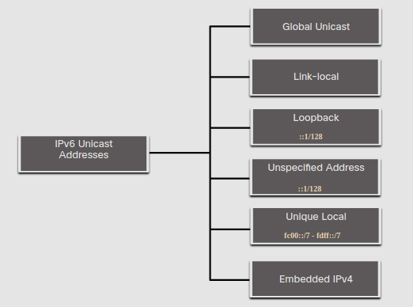
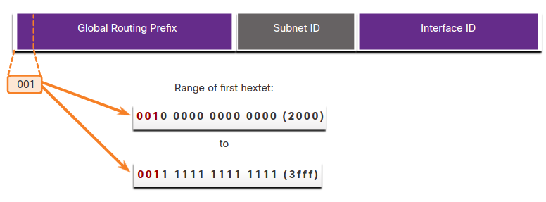
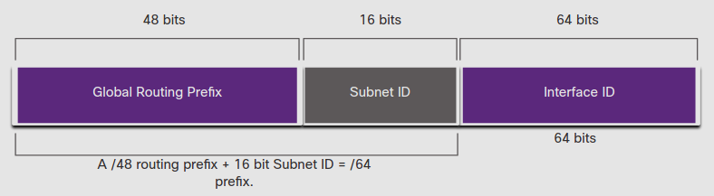
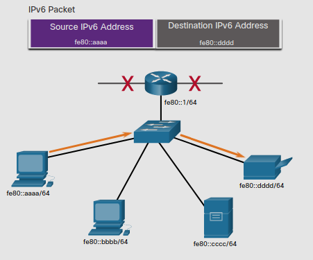
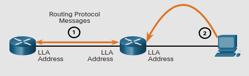

# IPv6 Address Types
## 12.3.1 Unicast, Mulicast, Anycast
Como con IPv4, hay diferentes tipos de direcciones IPv6. 
De hecho, hay tres categorias "broad" de las direcciones IPv6.
* **Unicast** - Una IPv6 unicast solo identifica una interfaz en un dispositivo con IPv6 activado.
* **Multicast** - Una IPv6 multicast es usada para mandar un solo paquete IPv6 a multiples destinos.
* **Anycast** - Una IPv6 anycast es cualquier IPv6 unicast que puede ser asignada a multiples dispositivos.
Un paquete enviado a una dirección anycast es ruteada al dispositivo más cercano con esa dirección.

A diferencia de IPv4, IPv6 no tiene dirección broadcast.
Sin embargo, hay una IPv6 multicast a todos los nodos que da el mismo resultado.

## 12.3.2 IPv6 Prefix Length
El prefijo, o la porcion de red de una IPv4 puede ser identificado por una mascara de subred o por el tamaño se su prefijo.

En IPv4 /24 es llamado prefijo. En IPv6 es llamado la longitud del prefijo.
IPv6 no usa una mascara de subred separada por puntos. 
Como IPv4, la longitud del prefijo es representado en una notacion **Slash** para indicar la porcion de red de una IPv6.

La longitud del prefijo puede ir desde 0 a 128. 
El prefijo recomendado para LANs y la mayoria de tipos de red es /64.

### IPv6 Prefix Length

> Interface ID = porción de host

ES recomendado usar una porción de host de 64-bits para la mayoria de redes. 
Estoo es debido a la *Stateless Address Autoconfiguration* (SLAAC) usan 64 bits para la porción de host.
También hacen el subneteo más fácil de hacer.

## 12.3.3 Types of IPv6 Unicast Addresses
Una dirección IPv6 unicast únicamente identifica una interfaz en un dispositivo con IPv6 activado.
Un paquete mandado a una dirección unicast es recibido por la interfaz asignada a esa dirección.
De manera similar a IPv4, una fuente IPv6 debe ser una dirección unicast.

### IPv6 Unicast Addresses

A diferencia de los dispositivos IPv4 que solo tienen una sola dirección, IPv6 tipicamente tienen dos direcciones unicast.

* **Global Unicast Address (GUA)** - Esta es similar a una IPv4 pública.
Estas son globalmente únicas y mundialmente ruteables.
Pueden ser configuradas estaticamente o assignadas dinamicamente.
* **Link-local Address (LLA)** - Estas son requeridas para cada dispositivo con IPv6 activado. 
Son usadas para comunicarse con otros dispositivos en el mismo link local. 
*En IPv6 el termino link se refiere a una subred.* 
LLAs son confinadas a un solo link porque no son routeables fuera de ese link.

## 12.3.4 A Note Abaut the Unique Local Address
Las *Unique local addresses* en el rango de (fc00::/7 a fdff::/7) no son comúnmente implementadas.
Por lo tanto, este modulo solo cubre GUA y LUA.
Sinembargo, las *unique local addresses* pueden ser usadas en dispositivos que podrían no ser accesibles desde afuera, como servidores internos e impresoras.

las direcciones únicas locales IPv6 tienen cierta similitud a las direcciones RFC 1918 para IPv4, con ciertas direrencias.
* Son usadas para direccionamiento local dentro de un sitio o entre un número limitado de sitios.
* Pueden ser usadas para dispositivos que nunca necesitarán acceso a otra red.
* no son ruteadas globalmente o traduccidas a IPv6 globales.

## 12.3.5 IPv6 GUA
las *global unicast addresses* (GUA) son únicas globalmente y routeables en internet.
Estas direcciones son equivalentes a IPv4 públicas.
El *Internet Comittee for Asigned Names and Numbers* (ICANN), el operador de IANA, asigna direcciones IPv6 a las cinco RIRs.
Actualmente solo GUAs con los primeros tres bits 001 o 200::/3 están siendo asignadas.

La figua muestra el rango de valores para el primer hexteto donde el primer digito hexadesimal empieza con 2 o 3. 
Este es solo 1/8vo de el espacio IPv6 disponible, excluyendo solo una pequeña porcion de otros tipos de direcciones unicast y multicast.

> **Nota:** la 2001:db8::/32 ha sido reservada para propositos de documentacion incluyendo su uso en ejemplos.

### IPv6 Address with a /48 Global Routing Prefix and /64 Prefix

Una GUA tiene tres partes:
* Prefijo de enrutamiento global
* ID de subred
* ID de interfaz

## 12.3.6 IPv6 GUA Structure
### Global Routing Prefix 
El prefijo de enrutamiento global es el prefijo o porción de red en la direccion que es asignado por el proveedor, como puede ser una ISP, a un cliente o sitio. 

Por ejemplo: 
Es común para una ISP asignar un prefijp /48 a sus clientes aunque puede variar dependiendo de las politicas de la ISP.

La direcciín 2001:db8:acad::/48 tiene un prefijo de enrutamiento global que indica que los primeros 48 bits (2001:db8:acad) es como la ISP conoce este prefijo. 

### Subnet ID
Esta es el area donde debes de tomar bits de la porción de host para crear subredes. 
IPv6 fue diseñado con las subredes en mente. 
La ID de subred usada por una organización para identificar subredes dentro de su sitio.

### Interface ID 
La ID de interfaz ers el equivalente de la porción de host de una IPv4. 
El termino 'ID de Interfaz' es usado porque un solo host puede tener multiples intefaces.
cada una teniendo una o más direcciones IPv6. 
La figura muestra un ejemplo de la estructura de una IPv6 GUA 

>**Nota:** En IPv6, las direcciones de host con todos 0s y todos 1s pueden ser asignadas a un disposotivo.
Las direcciones con todos 1s pueden ser usadas debido a que las direcciones de broadcast no son usadas dentro de IPv6.
Las direcciones con todos 0s pueden ser usadas tambien, pero son resevadas como una *Subnet-Router anycast address**, y solo deben de ser asignadas a routers.

## 12.3.7  IPv6 LLA 
Una IPv6 *Link-local adddress* (LLA) habilita a un dispositivo a comunicarse con otro dispositivo con IPv6 activado en la misma link y solo en esa link (subred). 
Paquetes con una fuente o destino LLA no puede rutearlos más allá de el link en el que el paquete fue originado.

GUA no es un requerimiento. 
Sin embargo, cada red con IPv6 activado debe tener LLA.

Si una LLA no es configurada manualmente en una interfaz, el dispositivo automaticamente creara la suya sin comunicarse con el servidor DHCP. 
Host con IPv6 activado crean una LLA IPv6 incluso si al dispositivo no se le ha asignado una dirección unicast global.
Esto permite a dispositivos IPv6 comunicarse con otros en la misma subred.
Esto incluye comunicación con la puerta de enlace predeterminada (router).

Las LLAS de una IPv6 estan en el rango de fe80::/10. 
/10 indica que los primeros 10 bits son 1111 1110 10xx xxxx.
El primer hexteto tiene un rango de 1111 1110 10**00 0000** (fe80) a 1111 1110 10**11 1111** (febf).

La figura muestra un ejemplo de comunicación usando LLAs IPv6.
La PC es capaz de comunicarse directamente con la impresora usando LLAs.

### IPv6 Link-Local Communications

La sigiente figura muestra algunos de los usos para IPv6 LLAs.

1. Ruteadores usan LLA del vecino para mandar actualizaciones.
2. Hosts usan LLA de un router local como la puerta de enlace predeterminada.

> **Nota:** Tipicamente es la LLA del router y no la GUA, la cual es usada como la puerta de enlace predeterminada para otros dispositivos en el link.

Hay dos maneras en las que un dispositivo puede obtener una LLA:
* **Statically** - Esto significa que el dispositivo ha sido manualmente configurado.
* **Dynamically** - Esto significa que el dispositivo crea su propia ID de interfaz usando valores aleatorios o usando el *Extended Unique Identifier* (EUI) que usa la MAC del cliente.
