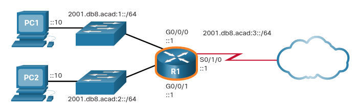
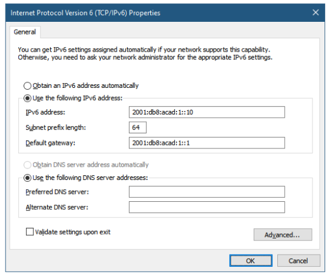
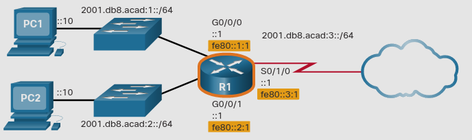

# GUA and LLA Static Configuration
## 12.4.1 Static GUA Configuration on a Router
Como haz aprendido en el tema pasado, IPv6 GUAs  son lo mismo que IPv4 publicas. 
Son globalmente unicas y ruteables en el interet IPv5. 
Una LLA IPv6 permite a dos dispositivos con IPv6 activado comunicarse entre ellos dentro de el mismo link(subred).
Es fácil configurar estaticamente GUAs y LLAs en routers para crear una red IPv6.

La mayoria de la configuración IPv6 t verificación en Cisco IOS son similares a sus contrapartes en IPv4.

LA configuracción de ejemplo usa la topologia mostrada en la figura con estas subredes IPv6.
* 2001:db8:acad:1/64
* 2001:db8:acad:2/64
* 2001:db8:acad:3/64

### Example Topology

El ejemplo muestra los comandos requeridos para configurar IPv6 GUA en las interfaces:
GigabitEthernet 0/0/0, GigabitEthernet 0/0/1, y Serial 0/1/0 en R1.
### IPv6 GUA Configuration on Router R1
```
R1(config)# interface gigabitethernet 0/0/0
R1(config-if)# ipv6 address 2001:db8:acad:1::1/64
R1(config-if)# no shutdown
R1(config-if)# exit
R1(config)# interface gigabitethernet 0/0/1
R1(config-if)# ipv6 address 2001:db8:acad:2::1/64
R1(config-if)# no shutdown
R1(config-if)# exit
R1(config)# interface serial 0/1/0
R1(config-if)# ipv6 address 2001:db8:acad:3::1/64
R1(config-if)# no shutdown
```
## 12.4.2 Static GUA Configuration on a Windows Host
Configurar Manualmente la dirección IPv6 de un host es similar a configurar una IPv4.
<p align="center">
	
</p>
Justo como con IPv4, configurar direcciónes estaticas en clientes no escala en ambientes más grandes. 
Por esta razón, la mayoría de los adinistradores de red en una red IPv6 activarán el assignamiento dinamico de direcciones IPv6.

Hay dos maneras en las que un dispositivo puede obtener una IPv6 GUA automaticamente.
* *Stateless Address Autoconfiguration (SLAAC)*
* Stateful DHCPv6

## 12.4.3 Static Configuration of a Link-Local Unicast Address
Configurar una LLA manualmente te permite crear una dirección que es reconocible y fácil de recordar. 
Typicamente, solo es necesario crear LLAs reconocibles en routers.
Esto es benefico porque routers LLA son usados como puertas de enlace predeterminadas y en mensajes de enrutamiento.

LLAs pueden ser configuradas manualmente usando el comando `ipv6 address (ipv6-link-local-address) link-local`.
Cuando una dirección empiezaz con un hexteto dentro de el rango de fe80 a febf, el parametro `link-local` debe seguir la dirección.

### Example Topology with LLAs
<p align="center">
	

El ejemplo muestra la configuración de una LLA en el router R1
```
R1(config)# interface gigabitethernet 0/0/0
R1(config-if)# ipv6 address fe80::1:1 link-local
R1(config-if)# exit
R1(config)# interface gigabitethernet 0/0/1
R1(config-if)# ipv6 address fe80::1:2 link-local
R1(config-if)# exit
R1(config)# interface serial 0/1/0
R1(config-if)# ipv6 address fe80::1:3 link-local
R1(config-if)# exit
```

> **Nota:** La misma LLA puede ser configurada en cada link siempre y cuando sea unica en ese link. 
Esto es debido a que las LLAs sólo tienen que ser unicas en ese link. 
Sin embargo, la practica común es crear diferentes LLAs en cada interfaz del router para identificar fácilmente el router y la interfaz especifica.

