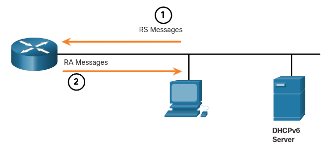
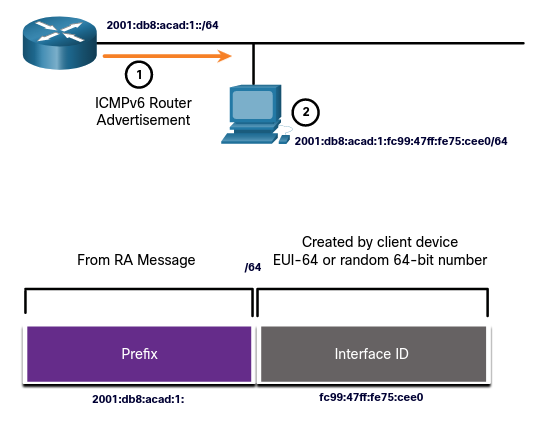
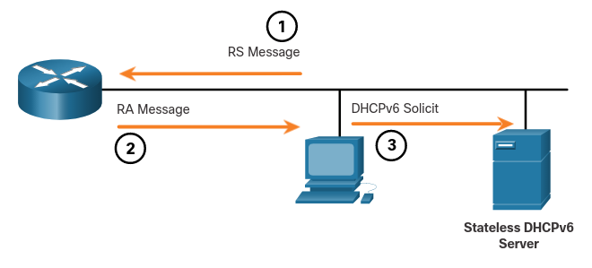
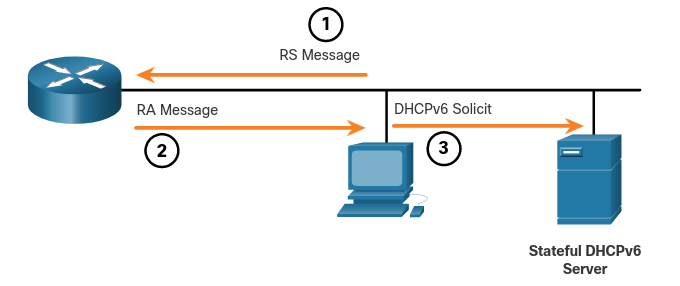
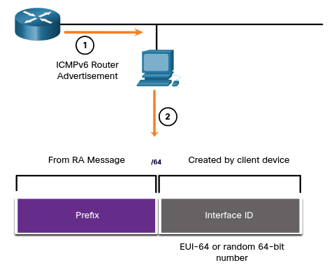
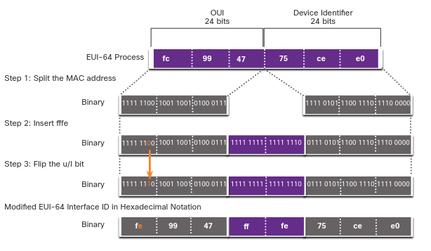

# Dynamic Addressing for IPv6 GUAs
## 12.5.1 RS and RS Messages
Si no quieres configurar estaticamente GUAs IPv6. 
La mayoria de los dispositivos obtienen sus GUAs IPv6 dinamicamente.
Este tema explica como este proceso ocurre usando *Router Advertisement* (RA) y *Router Solicitation* (RS). 
Este tema se vuelve bastante tecnico, pero cuando entiendes la diferencia entre los tres metodos que un mensaje de router puede usar, además de como la EUI-64 procesa como crear una ID de interfaz difiere de un método generado aleatorioamente, habrá dado un gran salto en su experiencia en IPv6!

Para una GUA, un dispositivo obtiene la direccion dinamicamente a travez de mensajes de el *Internet Control Message Protocol version 6* (ICMPv6).
Routers IPv6 periodicamente mandan mensajes ICMPv6 RA cada 200 segundos, a todos los dispositivos con IPv6 activado en la red. 
Un mensaje RA tambien será mandado en respuesta a un host mandando mensajes ICMPv6 RS, el cual es una petición para un mensaje RA. 
Ambos mensajes son mostrados en la figura.

### ICMPv6 RS and RA Messages
<p align="center"> 
	
</p>

1. Mensajes RS son mandados a todos los routers IPv6 por hosts pidiendo información de dirección.
2. Mensajes RA son mandados a todos los nodos IPv6. 
Si el método 1 es usado (SLAAC), el RA incluye el prefijo de red, la longitud del prefijo y la puerta de enlace predeterminada.


Los mensajes RA estan en la interfaz Ethernet del Router. 
Este tiene que tener activado IPv6, el cúal no esta activado por defecto.
Para activarlo el comando `ipv6 unicast-routing` debe de ser usado.


El mensaje RA ICMPv6 es una sugerencia a un dispositivo de como obtener su propia GUA IPv6.
La última desición depende del sistema operativo del dispositivo.

Un mensaje RA ICMPv6 incluye lo siguiente:
* **Network prefix and prefix length** - Esto le dice al dispositivo a que red pertenece.
* **Default gateway address** - Esta es una LLA IPv6, la dirección fuente de el mensaje RA.
* **DNS addresses and domain name** - Estas son las direcciones de los servidores DNS y el nombre del dominio.

Hay tres metodos para mensajes RA: 

* **Método 1: SLAAC** - Tiene todo lo que se necesita incluyendo el prefijo, la longitud del prefijo y la ruta de enlace predeterminada.
* **Método 2: SLAAC con un servidor DHCPv6 _stateless_** - Tiene toda la información necesaria pero necesita obtener información adicional como direcciones DNS de un servidor DHCP *stateless*.
* **Método 3: Statefull DHCPv6 (no SLAAC)** - Puede dar la puerta de enlace predeterminada. 
Pero necesitas preguntar a un servidor *statefull* DHCPv6 por toda la información faltante.

## 12.5.2 Method 1: SLAAC
SLAAC es un método que permite a un dispositivo crear su propia GUA sin los servicios DHCPv6.
Usando SLAAC, los dispositivos dependen en los mensajes ICMPv6 RA del router local para obtener la información necesaria.


Por defecto, los mensajes RA suguieren que el dispositivo receptor use la información en el mensaje RA para crear su propia GUA IPv6 y toda las demás información.
Los servicios de un servidor DHCPv6 no son requeridos.


SLAAC es *stateless*, lo cual significa que no hay servidor central (Por ejemplo un servidor DHCPv6) asignando GUAs y manteniendo una lista de dispositivos y sus direcciónes. 
Con SLAAC, el dispositivo cliente usa la informacion en el mensaje RA para crear su propio GUA. 
Como se muestra en la figura, las dos partes de la dirección son creadas asi:

* **Prefix** - Este es anunciado en el mensaje RA.
* **Interface ID** - Este usa el proceso EUI-64 o generando un numero aleatorio de 64-bits, dependiendo del IOS del dispositivo.
<p align="center">
	
</p> 

1. El Router manda un mensaje RA con el prefijo para la red local.
2. El PC usa SLAAC para obtener un prefijo de el mensaje RA y crea su propia ID de interfaz.

## 12.5.3 Method 2: SLAAC and Stateless DHCPv6
La interfaz de un router puede ser configurada para mandar un aviso usando SLAAC y stateless DHCPv6.

Como muestra la figura, con este método, los mensajes RA sugieren a los dispositivos que usen:
* SLAAC para crear su propia GUA IPv6
* La LLA del router la cual es la IPv6 de el emisor, como puerta de enlace predeterminada.
* Un servidor DHCPv6 para obtener otra informacion como un servidor DNS y un nombre de dominio.

> **Nota:** Un servidor DHCPv6 distribuye el servidor DNS y el nombre de dominio. 
No asigna GUAs
<p align="center">
	

</p>

1. La PC manda un RS a todos los routers IPv6, "necesito información de dirección."
2. El router manda un mensaje RA a todos los nodos IPv6 con el metodo 2 (SLAAC y DHCPv6) especificado. 
"aqui esta tu prefijo, la longitud del prefijo y la puerta de enlace predeterminada. pero necesitaras obtener la información de DNS de un servidor DHCPv6."
3. El PC manda una solicitud DHCPv6 a todos los servidores DHCPv6.
"Use SLAAC para crear mi dirección IPv6 y obtener mi puerta de enlace predeterminada, pero necesito otra información del servidor  stateless DHCPv6."

## 12.5.4 Method 3: Stateful DHCPv6
La interfaz de un router puede ser configurada para mandar un RA usando solo un stateful DHCPv6.

Stateful DHCPv6 es similar a DHCP para IPv4.
Un dispositivo puede automaticamente recibir su información de dirección incluyendo una GUA, longitud de prefijo y la dirección de un servidor DNS de un servidor DHCPv6 stateful.

En este metodo el RA suguier usar;
* La LLA del router, la cual es la dirección IPv6 del emisor RA, para la puerta de enlace predeterminada.
* Un servidor DHCPv6 stateful para obtener una GUA, la dirección del servidor DNS, nombre de dominio y otra información necesaria.
<p align="center">
	
</p>

1. El PC manda un RS a todos los servidores IPv6, "necesito informacion de direccionamiento"
2. El router manda un mensaje RA a todos los nodos con el metodo 3 (Stateful DHCPv6) especificado.
"Soy tu puerta de enlace predeterminada, pero necesitas preguntar a un servidor DHCPv6 stateful tu dirección IPv6 y otra informacion de direccionamiento."
3. El PC manda una solicitud DHCPv6 a todos los servidores DHCPv6.
"He recibido mi puerta de enlace predeterminada de un mensaje RA, pero necesito una dirección IPv6 y otra información de direccion de un servidor DHCPv6 stateful."

Un servidor DHCPv6 stateful asigna y mantiene una lista de que dispositivo recive que dirección IPv6.
DHCP para IPv4 es stateful.

> **Nota:** La puerta de enlace predeterminada solo puede ser obtenida dinamicamente de un mensaje RA. 
El servidor DCHPv6 stateless o estateful no provee la puerta de enlace predeterminada.

## 12.5.5 EUI-64 Process vs. Randonly Generated
Cuando el mensaje RA ya sea SLAAC o SLAAC con un DHCPv6 stateles, el cliente debe generar su propia ID de interfaz.
El cliente conoce la porción de prefijo de la durección del mensaje RA, pero debe crear su propia ID de interfaz. 
Esta puede ser creada usando el proceso EUI-64 o generando aleatoriamente un numero de 64-bits.
### Dynamically Creating an Interface ID
<p align="center">
	
</p>

1. El router manda un mensaje RA.
2. El PC usa el prefijo en el mensaje RA y usa EUI-64 o un numero random para generar una ID de interfaz.

## 12.5.6 EUI-64 Process
La IEEE define la *Extended Unique Identifier* (EUI) o el modificado EUI-64. 
Este proceso usa la dirección MAC Ethernet de 48-bits de un cliente y le inserta otros 16 bits en medio de la direccioón MAc de 48-bits para crear una ID de interfaz de 64 bits.

Las direcciones MAC son usalmente representadas en hexadesimal y consisten de dos partes:
* **Organizationally Unique Identifier (OUI)** - La OUI es codigo de proveedor asignado por la IEEE de 24 bits (6 digitos Hex).
* **Device Identifier** - El identificador de dispositivo es un valor unico de 24 bits que contiene una OUI común.

Una ID de interfaz EUI-64 es representada en binario y esta conformada por tres partes:
* 24-bit OUI de la dirección MAC del cliente, pero el septimo bit (El uiversal/local (U/L) bit) es invertido.
Esto significa que si el septimo bit es un 0, se convierte en un 1 y viceversa.
* El valor fffe (en hex)
* El identificador de dispositivo de 24-bits de la dirección MAC.

El proceso EUI-64 es ilustrado en la figura, usando la dirección MAC del R1 fc99:4775:cee0
<p align="center">
	
</p>

1. Divide la dirección MAC entre la OUI y el ID de dispositivo.
2. Inserta el valor hexagesimal `ffe` que en binario es `1111 1111 1111 1110`.
3. Convierte los primeros 2 valores hexagesimales de la OUI a binario y voltea la U/L (bit 7) 

El resultado es una EUI-64 generando una ID de interfaz de: ` fe99:47ff:fe75:cee0`.

> **Nota:** - El uso de U/L y la razon de invertir este valor son discutidas en el RFC 5342.


La salida de ipconfig muestra que la GUA IPv6 esta siendo dinamicamente creada usando SLAAC y el proceso EUI-64.
Una manera fácil de identificar que una dirección fue probablemente creada usando EUI-64 es buscando el fffe en medio de la ID de interfaz.

La ventaja de EUI-64 es que la dirección MAC Ethernet puede ser usada para determinar la ID de interfaz.
Tambíen permite a los administradores de red buscar más fácilmente una dirección IPv6 a un end-device usando la dirección unica MAC.
Sinembargo esto ha causado preocupaciones de seguridad para muchos usarios que estan preocupados que sus paquetes puedan ser rastreados a la computadora fisica. 
Debido a estas preocupaciones, una ID de interfaz generada de manera aleatoria puede ser usada en su lugar.

### EUI-64 Generates Interface ID
```
C:\> ipconfig
Windows IP Configuration
Ethernet adapter Local Area Connection:
   Connection-specific DNS Suffix  . :
   IPv6 Address. . . . . . . . . . . : 2001:db8:acad:1:fc99:47ff:fe75:cee0
   Link-local IPv6 Address . . . . . : fe80::fc99:47ff:fe75:cee0
   Default Gateway . . . . . . . . . : fe80::1
C:\>
```


## 12.5.7 Randomly Generated Interface IDs
Dependiendo del sistema operativo, un dispositivo puede  usar una ID de interfaz generada de manera aleatoria en lufar de uar la dirección MAC y el proceso EUI-64.
Empezando por windows vista, Windows usa una ID de interfaz generada aleatoriamente en lugar de una creada con EUI-64.
Windows XP y anteriores usaban EUI-64.

Despues de que la ID de interfaz es establecida, ya sea por EUI-64 o por generación random, puede ser convinado con un prefijo IPv6 en el mensaje RA para crear una GUA, como muestra la figura.

### Random 64-bit Generated interface ID
```
C:\> ipconfig
Windows IP Configuration
Ethernet adapter Local Area Connection:
   Connection-specific DNS Suffix  . :
   IPv6 Address. . . . . . . . . . . : 2001:db8:acad:1:50a5:8a35:a5bb:66e1
   Link-local IPv6 Address . . . . . : fe80::50a5:8a35:a5bb:66e1
   Default Gateway . . . . . . . . . : fe80::1
C:\>
```


> **Nota:** Para asegurarse del la unicidad de cualquier dirección unicast IPv6, el cleinte debe usar un proceso conocido como *Duplicate Address Detection* (DAD).
Este es similar a una petición ARP para su propia dirección. 
Si no hay respuesta, entonces la dirección es única.

