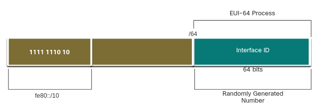
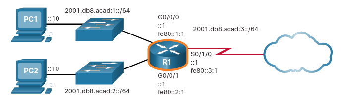

# Dynamic Addressing for IPv6 LLAs
## 12.6.1 Dynamic LLAs
Todos los dispositivos deben tener una LLA IPv6. 
Como GUAs IPv6, puedes tambíen crear LLAs dinamicamente.
Sin importar como creaste tus LLAs (y your GUAs), es importante que verifiques todas las configuraciones IPv6.
Este tema explica LLAs dinamicamente generadas y verificación de la configuración IPv6.

La figura muestra una LLA creada dinamicamente usando el prefijo fe80::/10 y la ID de interfaz usando el proceso EUI-64, o un numero generado aleatoriamente.

<p align="center">
	
</p> 

## 12.6.5 Dynamic LLAs on Windows
Sistemas operativos como Windows, típicamente usarán el mismo método para GUAs creadas con SLAAC y con LLAs dinámicamente asignadas.

### EUI-64 Generated Interface ID
```
C:\> ipconfig
Windows IP Configuration
Ethernet adapter Local Area Connection:
Connection-specific DNS Suffix . :
IPv6 Address. . . . . . . . . . . : 2001:db8:acad:1:fc99:47ff:fe75:cee0
Link-local IPv6 Address . . . . . : fe80::fc99:47ff:fe75:cee0
Default Gateway . . . . . . . . . : fe80::1
C:\>
```

### Random 64-bit Generated Interface ID
```
C:\> ipconfig
Windows IP Configuration
Ethernet adapter Local Area Connection:
   Connection-specific DNS Suffix  . :
   IPv6 Address. . . . . . . . . . . : 2001:db8:acad:1:50a5:8a35:a5bb:66e1
   Link-local IPv6 Address . . . . . : fe80::50a5:8a35:a5bb:66e1
   Default Gateway . . . . . . . . . : fe80::1
C:\>
```

## 12.6.3 Dynamic LLAs on Cisco Routers
Los Routers de cisco crean automaticamente una IPv6 LLA cuando una GUA es assignada a la interfaz.
Por defcto, Cisco IOS usa EUI-64 para generar la ID de interfaz para todos los LLAs en interfaces IPv6.

Para interfaces seriales, el router usará la dirección MAC de la interfaz Ethernet.
Recuerda que una LLA debe ser única en ese link. 
Sin embargo, la desventaja de usar LLAs asignadas dinamicamente es su ID de interfaz larga, que hace difícil identificar y recordar direcciónes asignadas.

El ejemplo muestra las direcciones MAC en la interfaz GigabitEthernet 0/0/0 del router R1.
### IPv6 LLA Using EUI-64 on Router R1
```
R1# show interface gigabitEthernet 0/0/0
GigabitEthernet0/0/0 is up, line protocol is up
  Hardware is ISR4221-2x1GE, address is 7079.b392.3640 (bia 7079.b392.3640)
(Output omitted)
R1# show ipv6 interface brief
GigabitEthernet0/0/0   [up/up]
    FE80::7279:B3FF:FE92:3640
    2001:DB8:ACAD:1::1
GigabitEthernet0/0/1   [up/up]
    FE80::7279:B3FF:FE92:3641
    2001:DB8:ACAD:2::1
Serial0/1/0            [up/up]
    FE80::7279:B3FF:FE92:3640
    2001:DB8:ACAD:3::1
Serial0/1/1            [down/down]
    unassigned
R1#
```


## 12.6.4 Verify Address Configuration
La figura muestra la topologia de ejemplo.
<p align="center">
	
</p> 

### Show IPv5 Interface Brief

El comando `show ipv6 interface brief`muestra la dirección MAC de la Interfaz Ethernet.
EUI-64 usa esta dirección MAC para generar la ID de interfaz de LLA.
De manera adicional el comando muestra un output abreviado de cada interfaz.

```
R1# show ipv6 interface brief
GigabitEthernet0/0/0   [up/up]
    FE80::1:1
    2001:DB8:ACAD:1::1
GigabitEthernet0/0/1   [up/up]
    FE80::1:2
    2001:DB8:ACAD:2::1
Serial0/1/0            [up/up]
    FE80::1:3
    2001:DB8:ACAD:3::1
Serial0/1/1            [down/down]
    unassigned
R1#
```

Nota que cada interfaz tiene dos direcciones IPv6. 
La segunda direccion de cadad interfaz s la GUA que fue configurada. 
la primera dirección (que empieza con fe80) es la dirección link-local unicast de la interfaz. 
Recuerda que la LLA es agregada automaticamente a la interfaz cuando la GUA es asignada.

Nota tambien que la interfaz Serial 0/0/1 LLA es la misma que GigabitEthernet 0/0/0. 
Interfaces seriales no tienen Direcciones MAC de ethernet. 
Asi que Cisco IOS usa la dirección Mac de la primera interfaz MAC disponible.
Esto es posible porque interfaces link-local solo tienen que ser unicas en ese link.

### Show IPv6 route
Como se muestra en el ejemplo, `show ipv6 route`puede ser usado para verificar que una red IPv6 y en especifico una interfaz ha sido instalada en la tabla de routeamiento de IPv6.
El comando `show ipv6 route` **solo** mostrará redes IPv6.
```
R1# show ipv6 route
IPv6 Routing Table - default - 7 entries
Codes: C - Connected, L - Local, S - Static, U - Per-user Static route

C   2001:DB8:ACAD:1::/64 [0/0]
     via GigabitEthernet0/0/0, directly connected
L   2001:DB8:ACAD:1::1/128 [0/0]
     via GigabitEthernet0/0/0, receive
C   2001:DB8:ACAD:2::/64 [0/0]
     via GigabitEthernet0/0/1, directly connected
L   2001:DB8:ACAD:2::1/128 [0/0]
     via GigabitEthernet0/0/1, receive
C   2001:DB8:ACAD:3::/64 [0/0]
     via Serial0/1/0, directly connected
L   2001:DB8:ACAD:3::1/128 [0/0]
     via Serial0/1/0, receive
L   FF00::/8 [0/0]
     via Null0, receive
R1#
```

Dentro de la tabla una **C** indica que es una red directamente conectada.
Cuando una interfaz de un router es configurada con una GUA y esta en el estado \"UP/UP\" el prefijo y la longitud del prefijo es agregado a la tabla de routamiento como una ruta conectada.

> **Nota:** - La **L** indica una ruta local, la dirección especifica IPv6 assignada a la interfaz.
Esta no es una LLA.
Estas no son inlcuidas en la tabla de enrutamiento del router porque no son direcciónes routeables.

### Ping
El comando `ping` para Ipv6 es identico a el comando usado con IPv4, exepto que una dirección IPv6 es usada.
Como se muestra en el ejemplo, el comando es usado para verificar la conectividad en la capa 3 entre R1 y PC1.
cuando se hace ping a una LLA de un router, Cisco IOS le dira al usario salir de la interfaz.
Esto porque la LLA de destino puede ser estar en una o más de las links de la red, el router necesita saber a cual interfaz mandar el ping.
```
R1# ping 2001:db8:acad:1::10
Type escape sequence to abort.
Sending 5, 100-byte ICMP Echos to 2001:DB8:ACAD:1::10, timeout is 2 seconds:
!!!!!
Success rate is 100 percent (5/5), round-trip min/avg/max = 1/1/1 ms
R1#
```

