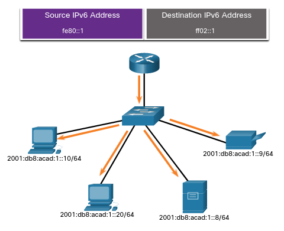

# IPv6 Multicast Addresses
## 12.7.1 Assigned IPv6 Multicast Addresses
Haz apredndido que que hay 3 categorias Broad en IPv6: Unicast, anycast y multicast.

Las direcciones multicast son similares a las direciones multicast de IPv4. 
Recuerda que una direccion multicast es usada para mandar un solo paquete a uno o más destinatarios.

> Direcciones IPv6 Multicast tienen el prefijo ff00:/8.

> **Nota:** - direcciones multicast sólo pueden ser direcciones de destino y no direcciones de emisor.

Hay dos tipos de direcciones multicast IPv6:
* Direcciones multicast
* Direcciones multicast solicitadas.

## 12.7.2 Well-known IPv6 Multicast Addresses
Estas direcciones son asignadas. 
Son reservadas para grupos predefinidos de dispositivos.
Una dirección multicast es una sola direccion usada para alcanzar un grupo de dispositvos que usan un protocolo o servicio en común.

Estos son dos grupos multicast comunes:
* **ff02::1 ALL-nodes Multicast group** - Este es un grupo al que todos los dispositivos IPv6 se unen.
Un paquete mandado a este grupo es recibido y procesado por todas las interfaces en la red.
Este grupo tiene el el mismo efecto que una direccion Broadcast en IPv4.
* **ff02 All-routers multicast group** - Este es un grupo al que todos los routers IPv6 se unen. 
Un router entra a este grupo con el comando `ivp6 unicast-routing` y los paquetes que son mandados a este grupo son procesados por todos los routers de la red.

### IPv6 All-Nodes Multicast: RA Message

	

Los dispositivos con IPv6 activado mandan mensajes ICMPv6 RS a la dirección multicast de todos los routers.
Este mensaje RS hace la petición a los routers IPv6 para ayudar en la configuraion de un nuevo dispositivo.
Los routers responden con un mensaje RA. 

## 12.7.3 Solicited-Node IPv6 Multicast Addresess
Una dirección multicast de "nodo-solicitado" es similar a la dirección multicast *all-nodes*. 
La ventaja de una dirección multicast *solicited-node*  es que esta es mapeada a una direcciíon Ethernet mulicast especial.

Esto permite al NIC Ethernet filtrar el frame examinando la dirección MAC de destino sin hacer el proceso para ver si el dispositvio es el objetivo del paquete IPv6.

	

