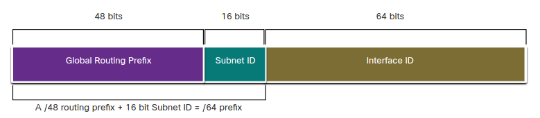
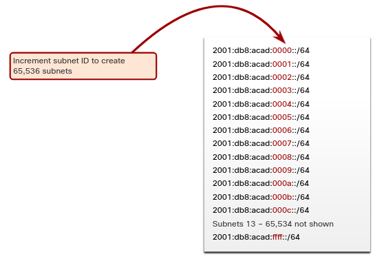
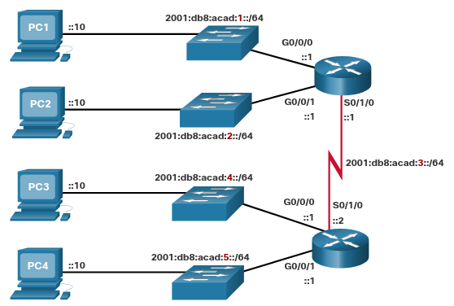
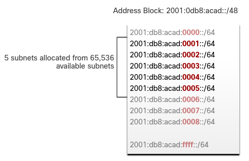

# Subnet and IPv6 Network
## 12.8.1 Subnet Using the Subnet ID
En la introducción de este módulo se menciono que subnetear una red IPV6 era más fácil que subnetear una IPv4.

Recuerda que en IPv4, se tenia que tomar prestados bis de la porción de host para crear subredes.
Sin embargo, IPv6 ha sido diseñado con el subneteo en mente. 
La ID de subred en una GUA IPv6 es usada para crear subredes. 

Como se muestra en la figura, la ID de subred es el area entre el Prefijo de enrutamiento global y la ID de intefaz.

### GUA with 16-bit Subnet ID
<p align="center">
	
</p>

El beneficio de tener una direccion con 128-bits es que puede soportar más que suficientes subredes y hosts para cada red.
Así que la consevación de direcciones no es un problema. 

## 12.8.2 IPv6 Subneting Examnple
Por ejemplo, asume que una organización le ha sido asignada la dirección 2001:db8:acad::/48 con una ID de subred de 16-bits.
Esto permititia a la organización crear 65,536 subredes /64.

Como se muestra en la figura, Nota como el prefijo de ruteo global es el mismo para todas las suberedes. 
Solo la ID de subred es incrementado en hexagesimal para cada subred.

<p align="center">
	
</p>

## 12.8.3 IPv6 Subnet Allocation
Con más de 65,536 subredes para elejir, la tarea del administrador de red se convierte en el que tiene que diseñar 
el schema local de direcciones de la red.

Como se muestra en la figura, la topologia de la figura requiere cinco subredes, una por cada LAN ademas de 
una para cada link serial entre R1 y R2. 

A diferencia de el ejemplo de IPv4, con IPv6 la subred del link serial tendrá el mismo prefijo que las LAN.
Puede parecer un desperdicio pero la conservación de direcciones no es un problema en IPv6.
### Topologia de Ejemplo
<p align="center">
	
</p>

Como se muestra en la siguente figura, las cinco subredes IPv6 fueron asignada, con el ID de subred de 0001 hasta
0005 usado para este ejemplo.
Cada una de las subredes /64 proveerá más direcciones que las que se necesitan.
<p align="center">
	
</p>

## 12.8.4 Router Configured with IPv6 Subnets
De manera similar a configurar una IPv4, el ejemplo muestra que cada una de las interfaces de los routers ha sido 
configurada para estar en una subred IPv6 diferente.
### IPv6 Addresss Configuration on Router R1
```
R1(config)# interface gigabitethernet 0/0/0
R1(config-if)# ipv6 address 2001:db8:acad:1::1/64
R1(config-if)# no shutdown
R1(config-if)# exit
R1(config)# interface gigabitethernet 0/0/1
R1(config-if)# ipv6 address 2001:db8:acad:2::1/64
R1(config-if)# no shutdown
R1(config-if)# exit
R1(config)# interface serial 0/1/0
R1(config-if)# ipv6 address 2001:db8:acad:3::1/64
R1(config-if)# no shutdown
```

