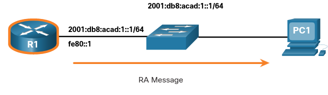
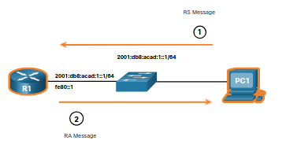
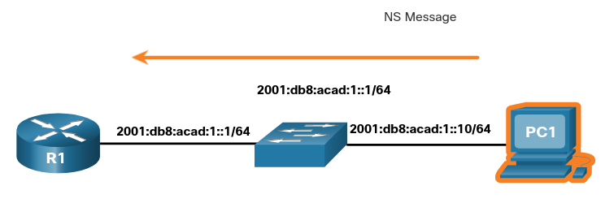
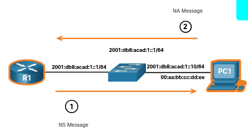

# ICMP Messages 
## 13.1.1 ICMPv4 and ICMPv6 Messages
En este tema, aprenderás sobre los diferentes tio de *Internet Control Message Protocols* (ICMPOs) y las herramientas que son usadas para mandarlos.

Apesar de que IP es un protocolo con más calidad, el juego TCP/IP proveee herramientas para mensajes de error y mensajes de información cuando uno se comunica con otro dispositivo IP.
Estos mensajes son usados usando los servicios ICMP. 

EL proposito de estos mensajes es proveer feedback sobre problemas relacionados con el procesamiento de paquetes de IP dentro de ciertas condiciones, no para hacer IP confiable.
Los mensajes ICMP no son requeridos y a veces no son permitidos en una red por motivos de seguridad.

ICMP esta disponible para IPv4 e IPv6. 
ICMPv4 es el protocolo de mensajes para IPv4
ICMPv6 provee los mismos servicios para IPv6 pero incluye funcionalidad adicional. 

En este curso el termino ICMP sera usado para referise a ambos ICMPv4 e ICMPv6.

## 13.1.2 Host Reachability
Un mensaje *echo* ICMP puede ser usado para probar la acesibilidad de un host en una red IP.
El host local manda una peticion *echo* ICMP aun host. 
Si el host esta disponible, el host de destino responde con una respuesta *echo*.

## 13.1.3 Destination or Service Unreachable
Cuando un host o una puerta de enlace recibe un mensaje que no puede entregar, puede usar un mensaje de *Destination Unreachable* para notificar que el destino o servicio no es accesible.

Algunos de los codigos para Destino no accesible para ICMOPv4 son:
* 0 - Red inaccesible
* 1 - Host inaccesible
* 2 - Protocolo inaccesible
* 3 - Puerto inaccesible

Algunos de los codigos para destino inaccesible para ICMPv6 son:
* 0 - no hay ruta al destino
* 1 - comunicación con el destino es prohibida (ej Firewall)
* 2 - más alla del alcance de la direccion de fuente
* 3 - dirección inaccesible
* 4 - puerto inaccesible

## 13.1.4 Time Exceeded 
Un mensaje ICMPv4 *time exceded* es usado por un router para indicar que un paquete no puede ser enrutado porque el *Time to Live* (TTL) del paquete ha decrementado a 0.
Si un router recive un paquete y se le acaba su TTL, descarta el paquete y manda un mensaje ICMP al host de origen.

ICMPv6 también manda un mensaje de tiempo expirado si el router no puede enrutar un paquete porque el paquete ha expirado. 
En lugar del TTL ICMPv6 usa el IPv6 *Hop Limit* para determinar si el paquete ha expirado.

> **Nota:** - Los mensajes de tiempo exedido son usados por Traceroute.

## 13.1.5 ICMPv6 Messages
Los mensajes de información y de errror encontrados en ICMPv6 son similares a los mensajes ICMPv4.
Sin embargo ICMPv6 tiene nuevas funcionalidades y funcionabilidad mejorada.
Mensajes ICMPv6 son encapsulados en IPv6.

ICMPv6 incluye cuatro nuevos protococlos como parte de el *Neighbor Discovery Protocol* (ND o NDP).

Mensajes entre un router IPv6 y un dispositivo IPv6, incluyendo la asignación de direcciones dinamicas como:
* Mensjajes Router Solicitation (RS) 
* Mensajes Router Advertisement (RA)

Mensajes entre dispositivos IPv6, incluyendo deteccion de direcciones duplicadas y resolucion de direcciones como:
* Mensajes *Neighbor Solicitation* (NS)
* Mensajes *Neighbor Advertisement* (NA)

### RA Message 
Los mensajes RA son mandados por routers IPv6 cada 200 segundos para proveer informacion de direccionamiento a hosts IPV6.

	

R1 manda un mensaje RA "hola a todos los dispositios IPv6. soy R1 y puden usar SLAAC para crear una GUA IPv6 y mi LLA como su puerta de enlace predeterminada".

## RS Message
Los routers IPv6 también mandarán un mensaje RS en respuesta a un mensaje RA.
En la figura PC1 manda un mensaje RS para determinar como recibir su informacion de direccionamiento dinamicamente.

	

R1 responde a al mensaje Rs con un mensaje RA:

1. PC1 manda un mensaje RS.
"hola, acabo de encender. Hay algún router IPv6 en la red? nececito saber como obtener mi informacion de direccionamiento."
2. R1 responde con un mensaje RA. 
"hola a todos los dispositivos IPv6. Soy R1 y pueden usar SLAAC para crear una GUA IPv6. El prefijo es 2001:db8:acad:1::/64. Usen mi LLA fe80::1 como su puerta de enlace predeterminada".

### NS Message 
Cuando a un dispositivo se le asigna una GUA IPv6 o una LLA correrá un proceso llamado *duplicate address detection* (DAD) para asegurarse de que una direción IPv6 es única. 
Para hacer esto, el dispositivo mandara un  mensaje NS con su propia IPv6 y si no obtiene una respuesta la dirección es única. 

> **Nota:** DAD no es requerido, pero RFC 4861 recomienda que DAD sea usado en direcciones unicast.

	

PC manda un mensaje NS para checar que la dirección sea única. 
"alguien tiene la direccción 2001:db8:acad:1::10? mandeme su dirección MAC"

## NA Message
La Resolución de direcciones es usada cuando un dispositivo en la LAN conoce la GUA IPv6 de un destino pero no conoce su dirección MAC.
Para determinar la dirección MAC del destino este mandará un mensaje NS al nodo solicitado. 

Este mensaje incluye la dirección IPv6 del objetivo. 
El dispositivo objetivo respondera con un mensaje NA que contiene su dirección MAC.

En la figura, R1 manda un mensaje NS a 2001:db8:acad:1::10 preguntando por su dirección MAC.

	

1. R1 manda un mensaje NS.
"Alguien tiene la dirección IPv6 2001:db8:acad:1::10?, mándeme su dirección MAC."
2. PC1 responde con un mensaje NA.
"soy 2001:db8:acad:1::10 y mi dirección MAc es 00:aa:bb:cc:dd:ee."
   
