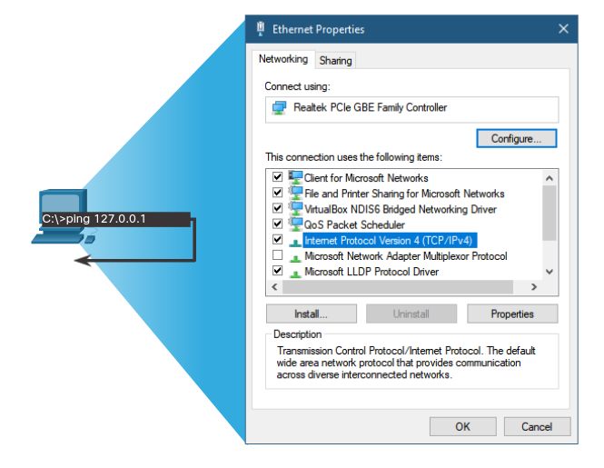
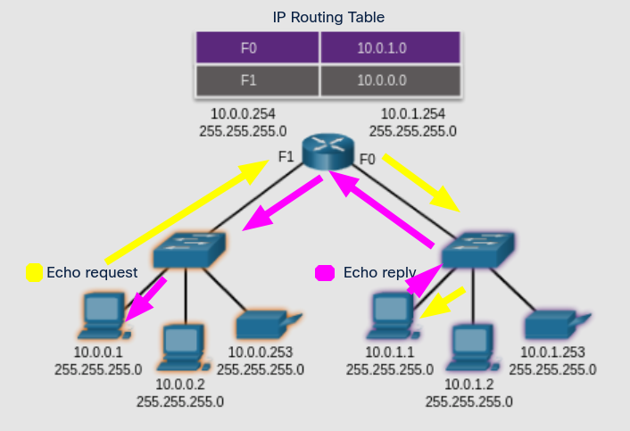

# Ping and Traceroute Test
## 13.2.1 Ping - Test Connectivity
En el tema anterior, se te introdujo a las herramientas **ping** y traceroute (**tracert**). 
En este aprenderas sobre las situaciones en las cuales cada herramienta es usada y como se usan.

 **Ping** es una herramienta de testeo para IPv4 e IPv6 que usa mensajes *echo* ICMP y responde a los mensajes para comprobar la conectividad ente estos dos.

si el host con la dirección especificada recibe la petición *echo*, responde con una respuesta *echo*.
AL hacer esto ping provee información sobre el tiempo en el que una petición ha sido enviada y una respuesta ha sido recibida para medir el rendimiento de una red.

Ping tiene un tiempo de espera para la respuesta. 
si una respuesta no es recibida, ping provee un mensaje indicando que una respuesta no fue recibida. 
Esto podria indicar que hay un problema, pero también podria indicar que hay medidas de seguridad bloqueando los mensajes de ping. 

Después de que todas las peticiones han sido mandadas, ping provee un resumen que incluye el ratio de éxito y el tiempo de el viaje al destino.

Los test de conectividad con ping usalmente incluyen:
* Ping a el local loockback
* ping a la puerta de enlace predeterminada
* Ping a un host remoto

## 13.2.2 Ping the Loopback
Ping puede ser usado para testear la configuración (IPv4 o IPv6) interna de un host local. 
Para hacer esto, debes hacer ping a la dirección loopback:
127.0.0.1 en IPv4 o ::1 para IPv6.

Una respuesta exitosa de indica que una IP es instalada de manera adecuada. 
Esta respuesta viene de la capa de red. 
Esta no es una señal de que las direcciones, mascaras o puertas de enlace están bien configuradas, ni tampoco indica nada sobre el estado de las capas más abajo de la capa de red. 
Esto solo indica si TCP/IP es operacional o no.

	

* Hacer ping a el localhost confirma que TCP/IP esta instalado y funcionando en el localhost.
* Ping 12.7.0.0.1 hace que un dispositivo se pinguee a si mismo.

## 13.2.3 Ping the Default Gateway
Puedes también usar ping para comprobar la disponibilidad de un host para comunicarse en la red local.
Esto se hace generalmente haciendo ping a la puerta de enlace predeterminada del host.

Un ping exitoso a la puerta de enlace predeterminada indica que el host y la interfaz del router que sirve como puerta de enlace predeterminada son operacionales en la red local.

Si la puerta de enlace predeterminada no respone al ping, se puede hacer ping a otra IP de otro host en la red local para saber si es operacional.

En el caso de que el ping a alguno de estos dos destinos sea exitoso, entonces el host puede comunicarse por la red local.
Si la puerta de enlace predeterminada no responde pero otro host externo si, esto puede indicar un problema con la interfaz del router que sirve como puerta de enlace predeterminada.

Hay varias posibilidades para esto ultimo, puede que la puerta de enlace predeterminada haya sido mal configurada en el host.
Otra posibilidad es que la interfaz del router sea operacional, pero tiene seguridad que no le permine responder al ping.

	

El host hace ping a la puerta de enlace predeterminada, mandando una petición ICMP *echo*, la puerta de enlace responde confirmando la conectividad.

## 13.2.4 Ping a Remote Host
Ping también puede ser usado para testear la disponibilidad de un host para comunicarse a través de una red.
El host local puede hacer ping a un host remoto o a una red remota.
El router ocupará la tabla de enrutamiento para direccionar los paquetes.

Si el ping es exitoso, la operación de una gran parte de la red puede ser verificada.
Confirmando la conumincaión a través de la red local.

Adicionalmente, la funcionalidad de la red en host remoto puede ser verificada. 
Con un ping exitoso a una dirección fuera de la red local.

> **Nota:** Muchos administradores de red limitaran o prohiran la entrada de mensajes ICMP a la red corporativa;
Por lo cual un ping fallido podria ser causado por medidas de seguridad de la red.

	

## 13.2.5 Traceroute - Test the Path
Ping es usado para comprobar la conectividad entre dos hosts pero no provee información sobre los dispositivos entre ambos dispositivos.
Traceroute (**tracert**) es una utilidad que genera una lista de paradas que fueron alcanzadas a través del camino del mensaje.

Esto es bastante importante ya que si llegara a haber un problema en el camino del paquete, la dirección de el ultimo router que respondio proveera una buena indicación de donde está el problema.

### Round Trip Time (RTT)
Usar traceroute provee un tiempo de ida y vuelta para cada parada en el camino e indica si una parada falla en responder.
El tiempo de ida y vuelta es el tiempo en el que un paquete tarda en alcanzar un host remoto y cuanto tarda en llegar esta respuesta.
Un asterisco (*) es usado para indicar que un paquete no ha sido respondido.

Si la respuesta muestra tiempos de respuesta altos o perdida de datos, es una indicación de que los recursos del router pueden estar agotados.

### IPv4 TTL and IPv6 Hop Limit
Traceroute usa una función del campo TTL en IPv4 y el campo de limite de parada en la capa 3 de IPv6 junto con el mensaje ICMP de tiempo expirado.

La primera secuencia de mensajes mandados por tracerooute tendra un TTL de 1.
Esto causa que el TTL haga *time out* del paquete IPv4 en el primer router. 
Este router después responde con un mensaje ICMPv4 de tiempo exedido. 
Haciendo que traceroute tenga la dirección de la primera parada.

Entonces progresivamente TTL se incrementa una vez por cada secuencia de mensajes. 
Esto proveee un trazo con las direcciones de cada parada cada vez que los paquetes hacen *time out* en el camino.

Después de que el destino es alcanzado, el host responde con un ICMP *port unreacheable* o con un *echo reply* en lugar de los *time exceeded* que fueron recibidos en cada parada.

