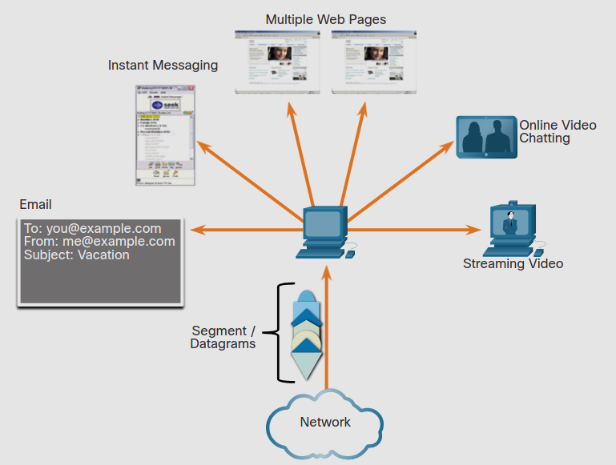

# Transportation of Data
## 14.1.1 Role of the Transport Layer
Programas en la capa de aplicación generan datos que deben de ser intercambiados entre destino y emisor.
La capa de transporte es responsable del las comunicaciones logicas entre aplicaciones en diferentes hosts.

Como se muestra en la figura, la capa de transporte es el link entre la capa de aplicación y las capas de abajo que son responsables de la comunicación en la red.

	

La capa de transporte no tiene conocimiento de el destino, el tipo de host o el tipo de paquete. 

La capa de transporte incluye dos protocolos:
* Transmission Control Protocol (TCP)
* User Datagram Protocol (UDP)

## 14.1.2 Transport Layer Responsabilities 
La capa de transporte tiene unas cuantas responsabilidades.

### Tracking Individual Conversations
En la capa de transporte, cada set de datos llendo desde el emisor y el destino es llamado conversación,
y es rastreado de manera separada.
La responsabilidad de la capa de transporte es mantener y rastrear esas comunicaciones.

Como se muestra en la figura, un host probablemente tendra multiples aplicaciones que se comunican a travez de la red de manera simultanea.

La mayoria de las redes tienen una limitación en la cantidad de datos que pueden ser incluidos en un paquete.
Sin embargo, los datos pueden ser divididos en pequeños paquetes. 

	

### Segmenting Data and Reassembling Segments
Es la responsabilidad de la capa de transporte dividir los datos de aplicación en bloques de tamaño apropiado que son más fáciles de administrar y de transportar. 
Dependiendo del protocolo de la capa de transporte, los bloques de la capa de transporte son llamados segmentos o datagramas. 

	

### Add header Information
La capa de transporte también agrega información de header que contienen datos binarios organzados en diferentes campos para cada bloque de datos. 
Son los valores en estos campos que activan varios protocolos para hacer diferentes funciones en la comunicación.

Por ejemplo, la información de header es usada por el host destino para re-ensamblar bloques de datos que reciben de la capa de aplicación.

La capa de transporte se asegura que incluso con muchas aplicaciones corriendo en un dispositivo,
todas reciban la información correcta.

	

### Identifying the Aplications
La capa de transporte debe de ser capaz de separar y organizar comunicaciones multiples con diferentes requerimientos.
Para hacer esto, esta identifica la aplicación objetivo usando un identificador llamado *numero de puerto*.

Cada proceso de cada programa necesita acceder a la red con su puerto asignado unico para cada host.

	

### Conversation Muliplexing
Mandar algunos tipos de datos a través de una red (ej. video streaming) puede consumir todo el ancho de banda.
Esto podria hacer que otro tipo de comuncación ocurriera al mismo tiempo e incluso dar errores a la hora de retransmitir datos dañados.

Como se muestra en la figura, la capa de transporte usa segmentación y multiplexación para permitir varias conversaciones al mismo tiempo en una red.

El chequeo de errores puede ocurrir en el mismo segmento, para determinar si el segmento ha sido alterado durante la transmision.

	

## 14.1.3 Transport Layer Protocols
IP es una preocupaciópn solo en la estructura, direccionamiento y enrutamiento de los paquetes.
IP no especifica como se entrega o se transportan los paquetes. 

Los protocolos de la capa de transporte especifican como se transfieren los mensajes entre hosts, y son responsables de manejar de manera confiable los requerimientos de una conversación.
Esto incluye a los protocolos **TCP** y **UDP**.

Diferentes aplicaciones tienen diferentes rerquerimientos para su transporte. 
Sin embargo TCP/IP provee dos protocolos de transporte, como se muestra en la figura.

	

## 14.1.4 Transmission Control Protocol (TCP)
IP no es responsable por la entrega de paquetes o por determinar si la conección entre el emisor y el destino necesita ser establecida.

TCP es considerado un protocolo confiable y lleno de herramientas, que se asegura de que todos los datos lleguen a su destino.
Esto requiere procesamiento adiccional por parte de los host que mandan y reciben paquetes.

> **Nota:** - TCP divide los datos en segmentos.

TCP provee confianza y control de flujo usando estas operaciones basicas:
* Numera y rastrea segmentos de data en un host especifico de una aplicación especifica.
* Reconoce los datos recibidos.
* Retransmite cualquier dato no reconocido después de un cierto tiempo.
* Enumera datos que podrian llegar en un orden distinto.
* Manda los datos a un ritmo eficiente que sea aceptable para el receptor.

Para hacer esto, TCP debe primero establecer una conección entre el emisor y el receptor.
Este es el porque TCP es conocido como un protocolo orientado a la conección.

## 14.1.5 User Datagram Protocol (UDP)
UDP es un protocolo de transporte más simple que TCP.
No provee confianza ni control de fluko.
por lo tanto necesita menos campos de encabezado.
Devido a esto los datagramas UDP pueden ser procesados más rapido que los segmentos TCP.
UDP provee funciones basicas para entregar datagramas de manera más simple y sin chequeo de datos.

> **Nota:** UDP divide los datos en datagramas a los que también se les llama segmentos.

UDP es un protocolo sin conexión.
No requiere una conección establecida. 
Porque UDP no rastrea información mandada o recibida entre el el cliente y el servidor, 
UDP es conocido también como un protocolo *sateless*.

Con UDP no hay garantia de que los datos fueron recibidos por el destino.
No hay procesos en la capa de transporte que informen de una entrega exitosa.

## 14.1.6 The Right Transport Layer Protocol for the Right Application

Algunas aplicaciones pueden tolerar algo de perida de datos durante la transmision de datos en la red.
Pero atrasos en la transmisión son incaceptables.
Para estas aplicaciónes UDP es una mejor alternativa porque requiere menos efuerzo de la red.
UDP es preferible para aplicaciones como Voice over IP (VoIP).

UDP es también usado en aplicaciones de *request-and-reply* donde los datos son mínimos y la retransimisión puede ser hecha de manera rápida. 
Por ejemplo, el *domain name service* (DNS) usa UDP para su propia transacción.

Por ejemplo, si uno o dos segmentos de un video en streaming fallan en llegar, creara una interrupción momentanea.
Y puede que no sea notable para el usuario. 

Para otras aplicaciones es importante que todos los datos lleguen y pueden ser procesados en secuencia.
Para este tipo de datos se usa TCP como protocolo de transporte. 

Aplicaciones como bases de datos, navegadores de internet y clientes de correo electronico requieren que los datos lleguen al destino de manera integra.
Cualquier dato faltante podria corromper la comunicación. 
Por ejemplo: es iportante cuando accedes a la información del banco que sea recibida y mandada de forma correcta.

Los desarrolladores deben elegir que protocolo de transporte es apropiado basado en los requerimientos de las aplicaciones. 
Video puede ser mandado por TCP o UDP. 
Aplicaciones que hacen stream de audio tipicamente usan TCP.
Esto para armar el buffer y tener un mejor control de datos para mejorar la experiencia de usario.

Streaming de video y voz usalmente usa UDP, pero podria usar TCP.
Pero por que muchos firewalls bloquean UDP, la aplicación podria ser mandada por TCP.

	

