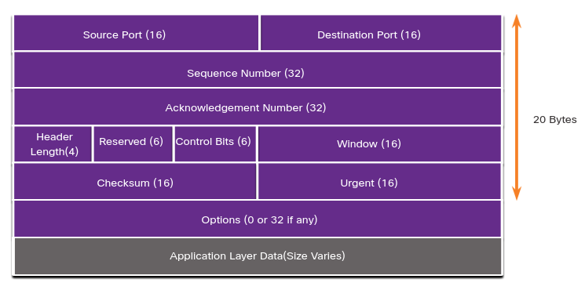
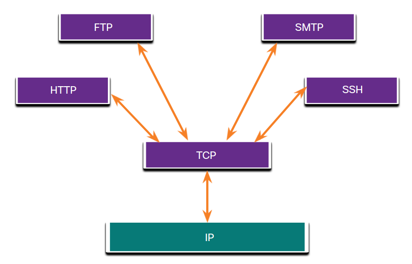

# TCP Overview
## 14.2.1 TCP Features
Para entender la diferencia entre TCP y UDP es importante entender como cada protocolo implementa funciones de confianza especificas y como cada protocolo rastrea conversaciones.

TCP provee los siguientes servicios:
* **Establishes a Session** - TCP es un protocolo orientado a la conexión y establece una conexión permanente (o sección) entre emisor y destino parara redireccionar el trafico.
A través de la sección, el dispositivo negocia la cantidad de trafico que puede ser direccionado en cierto tiempo.
* **Ensures Reliable Delivery** - Por muchas razones es posible para un segmento llegar a corromperse o perderse por completo mientras viaja por la red.
TCP se aseguta que cada segmento llegue integro a su destino.
* **Provides Same-Order Delivery** - Debido a que las redes pueden proveer multiples rutas que pueden tener diferentes velocidades, los paquetes pueden llegar en desorden.
TCP se asegura de que enumerar los paquetes para que sean reensamblados en el orden correcto.
* **Supports Flow Control** - Las redes tienen recursos limitados (ej Memoria y poder de procesamiento). 
Cuando TCP se da cuenta de que esos recursos están agotandose puede hacer que se reduja el flujo de datos.
Esto es posible ya que TCP puede regular la cantidad de datos que transmite. 

## 14.2.2 TCP Header
TCP es un protocolo *stateful* (con estados) que significa que mantiene un registro de el estado de la comunicación de la sesión.
Para hacer estro TCP guarda que informacion se ha mandado y que información se ha entregado.

Los campos en un header TCP son:

	

## 14.2.3 TCP Header Fields
La siguiente tabla identifica y describe los diez campos en un header TCP.

TCP Header Field | Description
:-|-
Source Port | A 16-bit field used to identify the source application by port number.
Destination Port | A 16-bit field used to identify the destination application by port number.
Sequence Number | A 32-bit field used for data reassembly purposes.
Acknowledgment Number | A 32-bit field used to indicate that data has been received and the next byte expected from the source.
Header Length | A 4-bit field known as ʺdata offsetʺ that indicates the length of the TCP segment header.
Reserved | A 6-bit field that is reserved for future use.
Control bits | A 6-bit field used that includes bit codes, or flags, which indicate the purpose and function of the TCP segment.
Window size | A 16-bit field used to indicate the number of bytes that can be accepted at one time.
Checksum | A 16-bit field used for error checking of the segment header and data.
Urgent | A 16-bit field used to indicate if the contained data is urgent.

## 14.2.4 Applications that use TCP
TCP es un buen ejemplo de como las diferentes capas de el protocolo TCP/IP para cumplir diferentes roles.
TCP se encarga de todas las tareas asociadas con dividir los datos en segmentos.
Liberando a las aplicaciones de hacer el este trabajo por ellas mismas.
Aplicaciones como las que se muestran en la figura, pueden simplemente mandar datos a la capa de transporte y usar los servicios de TCP.

	
</p.

