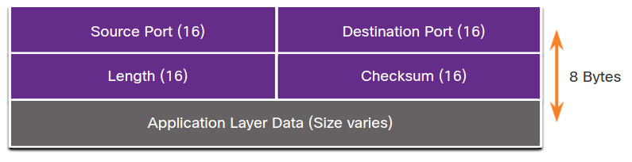
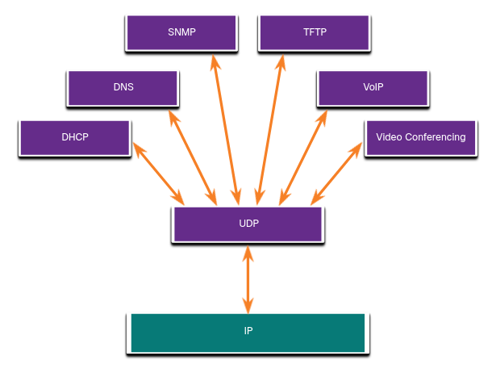

# UDP Overview
## 14.3.1 UDP Features
En este módulo se cubrira UDP, que hace? y cuándo es buena idea usarlo en lugar de TCP.

UDP es un protocolo de transporte ligero que ofrece la misma segmentacion de datos que TCP pero sin su seguridad y control de flujo.

UDP incluye:
* Los datos son reconstruidos en el orden que llegan
* Cualquier segmento que se ha perdido no se reenvia.
* No hay establecimiento de sección.
* El que envia no es informado de la disponibilidad de recursos.

## 14.3.2 UDP Header 
UDP es un protocolo sin estado lo que significa que ni el cliente ni el servidor rastrea el estado de la comnicación.
Si la fiablididad es requerida en UDP debe ser manejada por la aplicación.

Una de las cosas más importantes para entregar video y voz en vivo sobre la red es que los datos sean continuos y fluyan de manera rápida. 

Los bloques de comunicación en UDP son lamados datagramas o segmentos. 
Estos datagramas son mandados por el protocolo de la capa de transporte.

El header UDP es mucho más simple que el de TCP porque solo tiene cuatro campos y requiere 8 bites.

	

## 14.3.3 UDP Header Fields
Esta tabla identifica y describe los cuatro campos en un header UDP

UDP Header Field | Description
:-|-
Source Port | A 16-bit field used to identify the source application by port number.
Destination Port | A 16-bit field used to identify the destination application by port number.
Length | A 16-bit field that indicates the length of the UDP datagram header.
Checksum | A 16-bit field used for error checking of the datagram header and data.

## 14.3.4 Applications that use UDP
Hay tres tipos de aplicaciones que son óptimas para UDP
* **Live video and multimedia applications** - Estas aplicaciones pueden tolerar un poco de perdida de datos, pero requieren cero retrasos. 
Ejemplos incluyen VoIP y streaming de video.
* **Simple request and reply applications** - Aplicaciones con transacciones simples donde un host manda una peticion y puede recibir o no recibir una respuesta.
Ejemplos incluyen DNS y DHCP.
* **Aplications that handle reliability themselves** - Comunicaciones Unidireccionales donde el control de flujo, detección de errores y recuperación de errores no es requerida, o puede ser manejada por la aplicación. 
Ejemplos incluyen SNMP y TFTP.

La figura identidica aplicaciones que utilizan UDP.

	

Apesar de que DNS y SNMP usand UDP por defecto, ambas pueden también usar TCP.
DNS usara TCP si la petición  o respuesta DNS  es mayor que 512 bytes.

