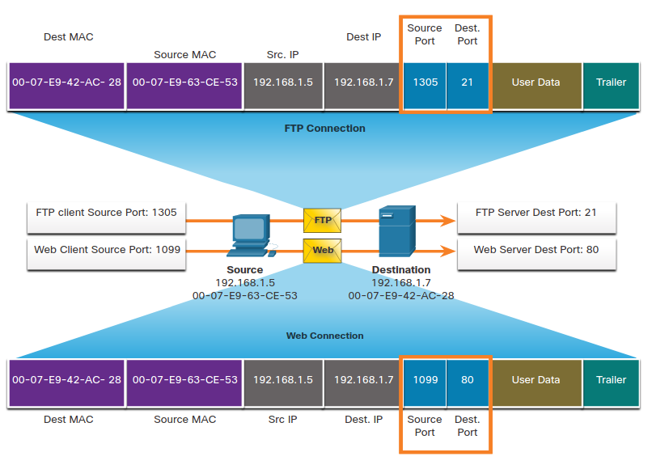

# Port Numbers
## 14.4.1 Multiple Separate Communications
Hay muchas situaciones en las cuales TCP es el protocolo correcto para el trabajo y otras en las cuales UDP debe de ser usado.
Sin importar que tipo de datos sea transportado, ambos protocolos usan numero de puertos.

Los protocolos de transportte usand los numeros de puertos para manejar conversaciones múltiples y simultaneas. 
Como se muestra en la figura, ambos protocolos identifican el numero de puerto de salida y de destino.

Source Port (16) | Destination Port (16) 
-|-

Por ejemplo, asumamos que un hosts esta iniciando una petición a una pagina web desde un servidor web.
Cada petición generada por un host usará una un numero de puerto dinamicamente creado. 
Este proceso es el que permite comunicaciones múltiples simultaneamente.

En la petición, el numero de puerto del destino es el que identifica el tipo de servicio que se esta requiriendo. 
Por ejemplo, si el cliente especifica el puerto 80 de destino, el servidor sabe que es un servicio web.

Un servidor puede ofrecer más de un servicio de manera simultanea como servicios web en el puerto 80 mientras ofrece *File Transfer Protocol* (FTP) en el puerto 21.

## 14.4.2 Socket Pairs
Los puertos de salida y de destino estan dentro de el segmento.
Los segmentos son encapsulados dentro de un paquete IP.
El paquete IP contiene la dirección IP de salida y de destino.
La convinación de la dirección IP y el puerto de salida, o de la IP de destino y el puerto de destino son conocidos como socket.

En la figura la PC esta pidiendo FTP y servicios web simulaneamente de el server de destino.

<p align="center">
	
</p>

En el ejemplo, la petición FTP generada por la PC incluyte la dirección MAC de la capa 2 y la IP de la capa 3.
La petición tambien identifica el numero de puerto de salida 1305 (dinamicamente generado por el host) y el puerto de destino, identificando los servicios FTP en el puerto 21. 
El host también realizo la petición de una página web de un servidor usando las mismas direcciónes de la capa 2 y 3.
Usando el puerto de salida 1099 (generado dinamicamente) y el puerto de destino 80 identificando el servicio como servicio web.

El soket es usado para identificar el servidor y el servicio siendo pedido por el cliente. 
Un socket luce asi: 1099 representando el numero de puerto 192.168.1.5:1099

El soquet de un servicio web seria: 192.168.1.7:80

Juntos, se conbinan resultando en una *pareja de sockets*: 192.168.1.5:1099, 192.168.1.7:80

Sockets permiten procesos múltiples, corriendo en un cliente diferenciarse unos de otros.

El puerto de salida actua como una dirección de retorno para la aplicación que da la petición. 
la capa de transporte mantiene registro de este puerto y de la aplicacion que ha iniciado la petición para que si hay una respuesta, esta sea retornada a la aplicación correcta.

## 14.4.3 Port Number Groups
La *Internet Assigned Numbers Authority* (IANA) es la organizacion encargada de asignar diversos estandares de direccionamiento, incluyendo los puertos de 16-bits. 
Los 16-bits son usados para identificar el numero de puerto de salida y de destino proveen un rango de 0  a 65535.

La IANA ha dividido el rango de números en los siguientes tres grupos:

* **Well-known Ports** (0 al 1,023)
	* Estos números de puertos estan reservados para aplicaciones comunes como navegadores de red, clientes de correo y clientes remotos
	* Puertos bien conocidos para aplicaiones de servidor que son fácilmente identificables con el servicio que proveen
* **Registred Ports** (1,024 al 49,151)
	* Estos numeros son asignados por la IANA por una petición para procesos especifícos o aplicaciones.
	* Estos procesos son principalmente aplicaciones que el usuario decide instalar y no son tan comunes.
	* Por ejemplo cisco ha registrado el puerto 1812 para su proceso de autenticacione de servidores de radio.
* **Private** and/or **Dynamic Ports** (49,152 al 65,535)
	* Estos puertos son conocidos como puertos efímeros.
	* El SO del cliente usualmente asigna numeros de puertos de manera dinamica cuando la conección a un servicio es activada.
	* El puerto dinamico es usado para identificar la comunicacion de laa aplicación del cliente.

> **Nota**: Algunos OS del cliente puede que usen numeros de puertos registrados en lugar de numeros de puerto dinamicos para asignar puertos de salida.

La siguiente tabla muestra algunos numeros de puerto bien conocidos y sus apliaciones asociadas.

### Well-known Port Numbers
Port Number | Protocol | Application
-|-|-
20 | TCP | File transfer protocol (FTP) - Datos
21 | TCP | File transfer protocol (FTP) - Control
22 | TCP | Secure Shell (SSH)
23 | TCP | Telnet
25 | TCP | Simple mail transfer protocol (SMTP)
53 | UDP, TCP | Domain Name Service (DNS)
67 | UDP | Dynamic host configuration Protocol (DHCP) -Server
68 | UDP | Dynamic host configuration Protocol (DHCP) - Cliente
69 | UDP | Trivial File Transfer Protocol (TFTP)
80 | TCP | Hypertext Transfer Protocol (HTTP) 
110 | TCP | Post Office Protocol version 3 (POP3)
161 | UDP | Simple Network Management Protocol (SNMP) 
443 | TCP | Hypertext Transfer Protocol Secure (HTTPS) 

## 14.4.4 The netstat Command
Concecciones TCP sin explicación pueden llegar a ser una amenaza de seguridad grande. 
Pueden indicar que algo o alguien esta conectado a el host local. 
Algunas vecs es necesario conocer que conexiones TCP estan abiertas y corriendo en una red. 
Netstat es una utilidad de red importante porque puede ser usada para verificar esas conexiones.

Como se muestra abajo, ingresar el comando netstat listara los protocolos en uso, la dirección local y el numero de puertos, la direccion extrangera y sus numeros de puertos.
```
C:\> netstat
Active Connections
Proto  Local Address         Foreign Address            State
TCP    192.168.1.124:3126    192.168.0.2:netbios-ssn    ESTABLISHED
TCP    192.168.1.124:3158    207.138.126.152:http       ESTABLISHED
TCP    192.168.1.124:3159    207.138.126.169:http       ESTABLISHED
TCP    192.168.1.124:3160    207.138.126.169:http       ESTABLISHED
TCP    192.168.1.124:3161    sc.msn.com:http            ESTABLISHED
TCP    192.168.1.124:3166    www.cisco.com:http         ESTABLISHED
```


> Por defecto, netstat intentara resolver las IP en el nombre de domino y su numero de puertos de aplicaciones bien conocidas. 
El argumento -n puede ser usado para mostrar las direcciones IP y sus numeros de puerto es su forma númerica.

