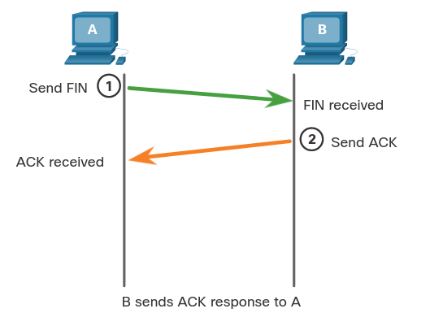
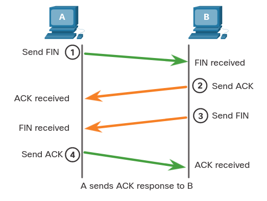

# TCP Commonication Process
## 14.5.1 TCP Server Processes
Ya conociendo las fundamentales de TCP. 
Entender el rol de los numeros de puerto te ayudara a entender los detalles de la comunicación TCP.

Cada aplicación corriendo en un servidor esta configurada para usar un numero de puerto. 
Este numero es automaticamente asignado o de manera manual por el administrador.

Un solo servidor no puede tener dos servicios assignados al mismo puerto dentro de la misma capa de transporte. 
Por ejemplo, un host corriendo una aplicación web y una transferencia de acrhivos no puede tener configurados el mismo puerto como el TCP 80.

Una aplicación activa asignada a un puerto especifico es considerada abierta.
Esto significa que la capa de transporte acepta y procesa segmentos direccionados a ese puerto.
Cualquier petición del cliente direcionada al puerto correcto es acpetada, y los datos son entregados a la aplicación.

Pueden haber muchos puertos abiertos simultaneamente en un servidor, uno por cada aplicación activa.

Algunos de los servicios de servidor TCP son:

### Clients Sending TCP Request
El cliente 1 esta pidiendo servicios web y el cliente 2 esta pidiendo un servicio de e-mail usando sus puertos determinados.

	

### Request Destination Ports
Peticiones generan dinamicamente un numero de puerto de salida. 
En este caso el cliente 1 esta usando el puerto de salida 49152 y el cliente 2 está usando el puerto de salida 51152,

	

### Request Source Ports
Cuando el servidor responde a el cliente las peticiones, este invierte los puertos de destino y de salida de la petición inicial.

	

### Response Destination Ports
Nota como la respuerta del servidor a la petición web ahora tiene un puerto de destino 49152 y la respuesta de e-mail ahora tiene el puerto de destino 51152.

	

### Response Source Ports
El puerto de salida en el servidor responde a el puerto de destino original en la petición inicial.

	

## 14.5.2 TCP Connection Establishment
En las conecciónes TCP, el cliente host establece la coneccion con el servidor usando un "apreton de manos de tres pasos"
*three way hanshake process.

### Step 1. SYN
El liente inicia una petición *client-to-server* para iniciar una sessión con el servidor.

	

### Step 2. ACK and SYN
El servidor reconoce la comunicación *client-to-server* y hace una petición *server-to-client*.

	

### Step 3. ACK
El liente reconoce la comunicación *Server-to-client*.

	

Un *three-way handshake* valida que el host de destino este disponible para la comunicación.
En este ejemplo el host A valido que el host B está disponible.

## 14.5.3 Session Termination
Para cerrar una coneccion, la bandera *finish* (FIN) debe ser mandada en el header del segmento.
Para cada una de las secciones TCP *one-way*, un *handshake* *two-way*, consistiendo de un segmento *FIN* y un 
segmento *Acknowledgment* (ACK).
Sin embargo para terminar una sola coversación soportada por TCP, cuatro intercambios son necesarios para terminar ambas seciones. 
El cliente o el servior pueden iniciar el fin de la sección.

Por ejemplo, los terminos de clientes y servidor son usados como referencia por simplicidad, pero cualquiera de los dos host que tienen una sección abierta puede iniciar el proceso de fin de sección.

### Step 1. FIN
Cuando el cliente ya no tiene más datos para mandar.
Manda un segmento con la bandera FIN.

	

### Step 2. ACK
El servidor manda un *ACK* para reconocer el recibo de el *FIN* para terminar la sección desde el cliente al server.

	

### Step 3. FIN
El servidor manda una *FIN* al cliente para terminar la sección *client-to-server*.

	

### Step 4. ACK
El cliente responde con un *ACK* para reconocer la *FIN* del servidor.

	

> Cuando todos los segmentos son reconocidos, la sección es cerrada.

## 14.5.4 TCP Three-way Handshake Analysis
Los host mantienen su estado, rastrean cada segmento de data dentro de una sección, intercambian información sobre que datos son recibidos usando la informacción en el header TCP.
TCP es un protocolo doble, donde cada uno de las conecciones representa dos secciones de un solo sentido (*one-way)*.
Para establecer la conección, los host performan un *three-way handshake*.

Las funciones de un *three-way handshake* son:
* Establece que el dispositivo de destino está en la red.
* Verifivca que el dispositivo de destino tiene un servicio activo y acepta request de el numero de puerto de destino.
* Informa al dispostitivo de destino que el cliente intenta establecer una sección de comunicación en ese número de puerto.

Después de que la comunicación es completada la secciónes son cerradas, y la conección es terminada.
Los mecanismos de conexión y sección son los que le dan confianza a TCP.

### Control Bits Field

	

Los seis bits en el campo de *Control Bits* en el heaader son también conocidos como banderas.
Una bandera es un bit que puede estar encendido o apagado.

Las seis banderas son:
* **URG** - Campo de puntero urgente.
* **ACK** - Bandera e reconocimiento usada en el establecimiento y finalización de conección.
* **PSH** - Función de Push.
* **RST** - Resetea la conexión cuando un error o un *timeout* ocurren.
* **SYN** - Sincroniza los números de secuencia usados en el establecimiento de conección.
* **FIN** - No más datos de la fuente y es usado en la finalización de la sección.

