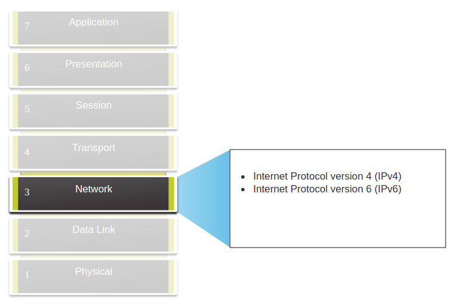
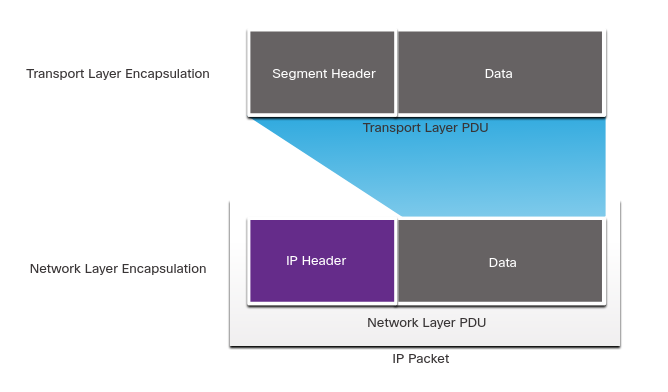
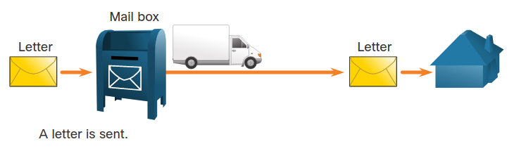
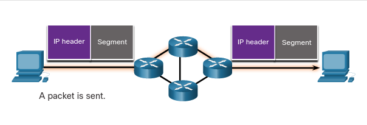
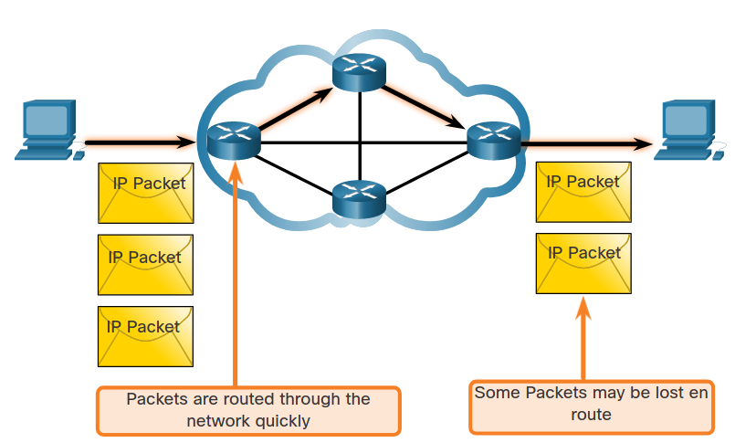
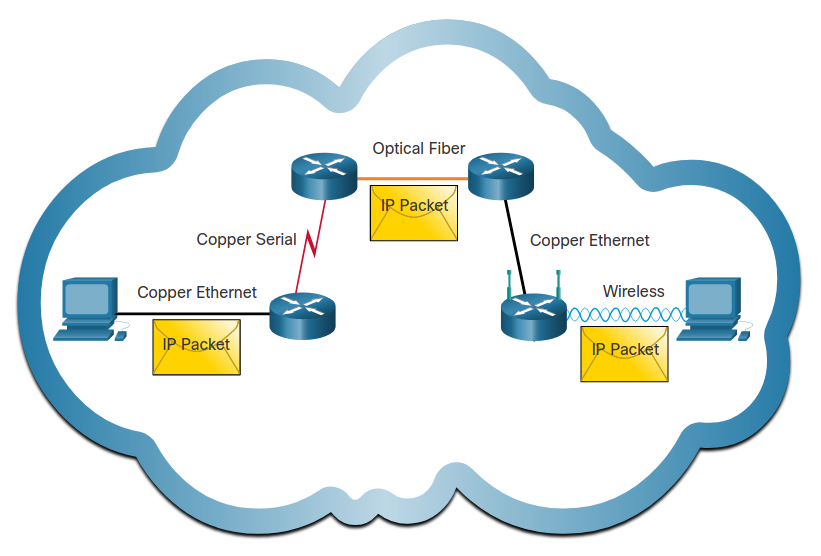

# Network Layer Characteristics
## 8.1.1 The Network Layer
La capa de red o *capa 3 del modelo OSI*, provee servicios a dispostivos finales para compartir datos através de la red.

Como se muestra en la figura, IPv4 e IPv6 son los protocolos más comunes de comunicación.
Otros Protocolos de red inculyen el *Open Shortest Path First* (OSPF) y protocolos de mensajes como el *Internet Control Message Protocol* (ICMP).

### Network Layer Protocols

	

Para lograr la comunicación punto a punto a través de la red, la capa de red hace cuatro operaciones basicas.
* **Addressing end Devices** - Los dispositivos finales deben ser configurados con una IP única para identificarse en la red.
* **Encapsulation** - La capa de red encapsula el *Protocol Data Unit* (PDU) en un paquete. 
El proceso de encapsulación agrega información al header IP, como la direcciones IP de salida y de destino.
Este proceso es realizado por el dispositivo de salida del paquete.
* **Routing** - La capa de red provee servicios para direccionar los paquetes a un destino en otra red.
Para viajar a otra red el paquete debe ser procesado por un router.
El rol del router es seleccionar el mejor camino hasta el destino del paquete en un proceso llamado enrutamiento.
Un paquete puede pasar por varios routers, cada parada es llamada *hop*, salto.
* **De-encapsulation** - Cuando el paquete llega a su destino, la capa de red checa el header IP de el paquete.
Si la IP en el header coincide con la del destino el header es eliminado del paquete.
Después de que el paquete es De-encapsulado por la capa de red el PDU resultante es mandado al servicio apropiado de la capa de red.

A diferencia de la capa de transporte (capa 4 OSI), que se encarga de el transporte entre cada host.
La capa de tranporte especifican la estructura del paquete y el proceso usado para mover los datos de un lado a otro.

## 8.1.2 IP Encapsulation
IP encapsula el segmento de la capa de transporte o otro tipo de datos añadiendo un header IP.
Este es usado para entregar el paquete a el host destino.

La figura ilustra como la capa de transporte *PDU* es encapsulada en la capa de res *PDU* para crear un paquete IP.

	

El proceso de encapsular los datos capa por capa permite que los servicios de diferentes capas escalen sin afectar otras capas.
Esto permite que los segmentos de la capa de transporte puedan ser empaquetados sin emportar el Protocolo.

El header IP es examiado por equipos capa 3 (Routers y switches capa 3) mientras viaja a través de la red hasta su destino.

Routers implementan protocolos de enrutamiento entre redes.
Este enrutamiento realizado por dispositivos intermediarios examina la capa de red en el header del paquete.
Los datos encapsulados permanecen sin cambios durante el proceso de la capa de red.

## 8.1.3 Characteristics of IP
IP fue diseñado como un protocolo con baja complejidad.
Provee solo las funciones que son necesarias para entregar un paquete de la fuente hasta el destino. 
Este protocolo no fue diseñadop para manejar el flujo de los paquetes, esta tarea es hecha por otros 
protocolos en otras capas, como TCP en la capa 4.

Las caracteristicas de IP son:
* **Conecctionless** - No hay conexión con el destino antes de mandar los paquetes de datos.
* **Best Effort** - IP es inherentemente desconfiable porque la entrega de paquetes no es garantizada.
* **Media Independent** - La operación es independiente del medio (cobre, fibra, wi-fi,etc.) 

## 8.1.4 Connectionless
Esto significa que no hay una conexión dedicada de extremo a extremo creada por IP.
Esto es fundamentalmente parecido a mandar una carta a alguien sin notificar al recipiente.

### Connectionless - Analogy

	

Las comunicaciónes de datos sin conexión trabajan con el mismo principio. 
Como se muestra en la figura, IP no requiere ningún intercambio inicial para establecer la conexión.

	

## 8.1.5 Best Effort
IP no requiere campos adicionales en el header para mantener una conexión establecida.
Este proceso reduce la complejidad de IP.
Sin embargo sin una concexión extremo a extremo los host no tienen mandera de comprobar si el paquete ha sido entregado.

IP no garantiza que los paquetes sean entregados, por eso se le llama de *best-effort como se muestra en la imagen.

	

## 8.1.6 Media Independent 
IP no tiene la capacidad de manejar o recuperarse de paquetes perdidos o corruptos.
Los paquetes pueden llegar a su destino corruptos, en desorden o no llegar.
Es el rol de protocolos como el TCP de la capa de transporte encargarse de eso.

Como se muestra en la figura IP opera independientemente del medio en el que se transportan los datos.

	

La capa de *data-link* del modelo OSI es responsable por tomar un paquete IP y prepararlo para su viaje a través de  un medio.

Sin embargo hay una caracteristica que la capad de red considera:
El tamaño maximo de un *PDU* que cada medio puede transportar.
Esta caracteristica es llamada *Maximum transmission unit* (MTU).
Parte de la comunicación entre la capa de data-link y la capa de red es establecer un tamaño máximo para el paquete.

En algunos casos, el dispositivo intermediario, usalmente un router debe dividir un paquete IPv4 cuando
manda un paquete de un medio a otro con un MTU más pequeño, lo cual causa latencia.

