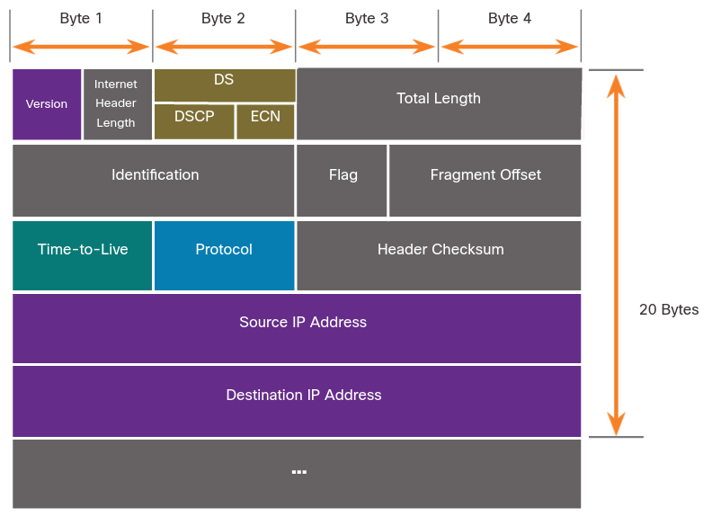

# IPv4 Packet
## 8.2.1  IPv4 Packet Header

IPv4 es uno de los principales protocolos de comunicación de la capa de red.
El header de un paquete IPv4 es usado para asegurarse que el paquete es entregado a su siguiente hop.

Un header IPv4 consiste en campos de información importante sobre el paquete.
Estos contiene numeros bienarios los cuales son examinandos por los procesos de la capa 3.

## 8.2.2 IPv4 Packet Header Fields
Los valores binarios en cada campo identifican diferentes ajustes de el paquete IP.

### Fields in the IPv4 Packet Header

	

Los campos importantes en el header IPv4 inluyen:
* **Version** - Contiene un valor binario de 4 bits (0100) que lo identifica como un paquete IPv4.
* **Differentiated Services or DiffServ (DS)** - Formalmente llamado *type of service* (Tos) 
El campo DS es un campo de 8 bits usado para determinar la prioridad de cada mensaje.
* **Header Checksum** - Es usado para detectar corrupción en el header IPv4.
* **Time to Live** - TTL contiene un valor de 8 bits que es usado para limitar el tiempo de vida de un paquete.
* **Protocol** - Es usado para identificar el protocolo del sigiente nivel.
Valores comunes son (1) ICMP (6) TCP y (17) UDP.
* **Source IPv4 Address** - Contiene un valor de 32 bits que representa la IPv4 de salida.
* **Destination IPv4 Address** - Contiene un valor de 32 bits que representa la IPv4 de destino.

